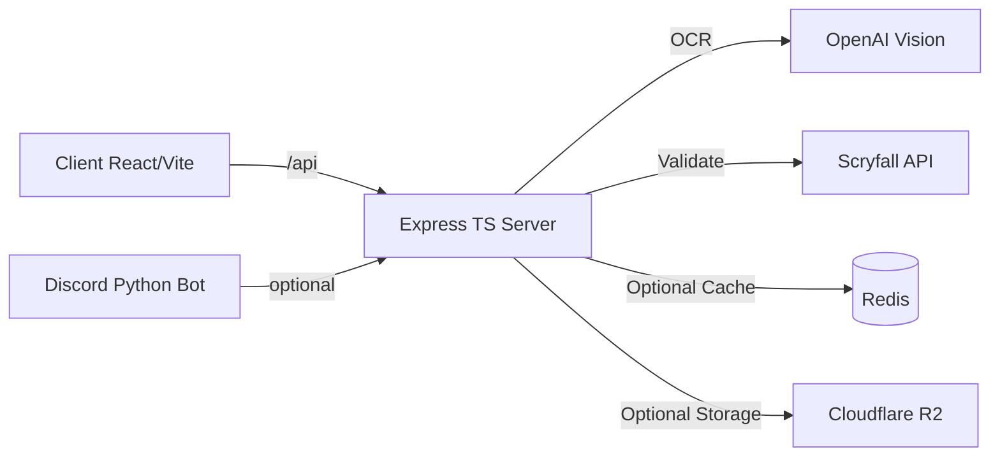

System context

- Users interact via Web UI (React/Vite) and optionally Discord bot.
- Backend API (Express/TypeScript) exposes:
  - `/api/ocr` (image upload / base64 processing)
  - `/api/cards` (Scryfall search/validate/random)
  - `/api/export` (formats: mtga, moxfield, archidekt, tappedout, txt)
  - `/api/health` (health)
- External services: OpenAI Vision (OCR), Scryfall API (card data), optional Redis, Cloudflare R2, Supabase.

Component diagram (Mermaid)

Backend modules

- `routes/ocr.ts`: uploads, async processing, status tracking (in-memory), uses `ocrService` and `scryfallService`.
- `services/ocrService.ts`: OpenAI Vision flow, image optimization with `sharp`.
- `services/enhanced-ocr*.ts`: parallel pipelines (OpenAI + EasyOCR subprocess), Scryfall validation helpers.
- `services/scryfallService.ts`: axios client + caching + rate limiting helpers.
- `middleware/*`: error handler, rate limiter; `utils/validateEnv.ts` enforces required envs.

Data model (simplified)

- MTGCard: `{ name: string; quantity: number; ...enrichedByScryfall }`
- OCRResult: `{ success: boolean; cards: MTGCard[]; confidence: number; processing_time: number; warnings?: string[]; errors?: string[] }`

Runtime

- Dev: `npm run dev` (concurrently starts server and client). Client proxies `/api` to `http://localhost:3001`.
- Docker: compose spins up `web-api`, `web-frontend`, `discord-bot`, `redis`, `nginx` (optional). Minimal Dockerfiles added for `server/` and `client/`.
