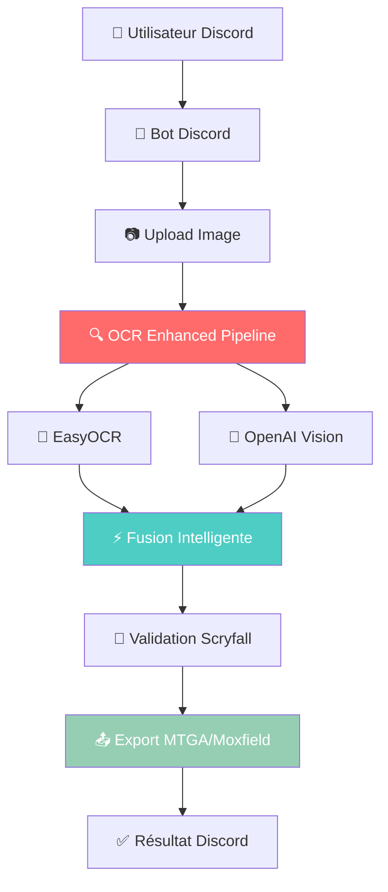

# 🚀 **ARCHITECTURE V1 SIMPLIFIÉE - SANS SUPABASE**

**Objectif** : Version gratuite 100% fonctionnelle sans coûts récurrents

---

## 🎯 **ARCHITECTURE MINIMALISTE**



---

## ✅ **CE QUI RESTE (ESSENTIEL)**

### **1. 🤖 Bot Discord** 
- Détection automatique images (📷 reaction)
- OCR Enhanced Pipeline (EasyOCR + OpenAI)
- Validation Scryfall
- Export MTGA/Moxfield
- Interface intuitive

### **2. 🧠 OCR Service**
- **EasyOCR** : Python wrapper existant
- **OpenAI Vision** : Contextuel MTG
- **Fusion intelligente** : Best-of-both
- **Scryfall validation** : 95%+ précision

### **3. 📤 Export Formats**
- **MTGA** : Direct import Arena
- **Moxfield** : Deck builder premium
- **JSON** : Format structuré

---

## ❌ **CE QUI EST SUPPRIMÉ (SAAS PREMIUM)**

### **🗄️ Base de données Supabase**
- ❌ Multi-tenancy
- ❌ Gestion utilisateurs
- ❌ Historique scans
- ❌ API keys
- ❌ Usage tracking
- ❌ Facturation

### **☁️ Storage Cloudflare R2**  
- ❌ Persistance images
- ❌ Cache long terme
- ❌ CDN distribution

### **🔐 Authentification complexe**
- ❌ JWT tokens
- ❌ RLS policies
- ❌ Multi-org

---

## 🛠️ **STACK TECHNIQUE SIMPLIFIÉ**

### **Backend Minimal**
```bash
# Serveur Node.js basique (optionnel)
server/
├── src/
│   ├── routes/
│   │   └── ocr.ts          # Endpoint OCR simple
│   └── services/
│       └── enhanced-ocr.service.ts  # Pipeline OCR
├── package.json
└── .env
```

### **Bot Discord (Principal)**
```bash
discord-bot/
├── bot.py                  # Bot principal
├── ocr_parser_easyocr.py   # OCR wrapper
├── scryfall_service.py     # Validation
├── requirements.txt
└── .env
```

---

## 🚀 **DÉPLOIEMENT V1 GRATUIT**

### **Option 1 : Discord Bot seul (100% gratuit)**
```bash
# Hébergement gratuit Railway/Render
git push railway main

# Variables d'environnement minimales
DISCORD_BOT_TOKEN=your-token
OPENAI_API_KEY=sk-your-key
DEBUG_MODE=false
```

### **Option 2 : Bot + API simple (quasi-gratuit)**
```bash
# Fly.io 3 apps gratuites
flyctl deploy

# Variables minimales
DISCORD_BOT_TOKEN=your-token
OPENAI_API_KEY=sk-your-key
PORT=3001
```

---

## 💰 **COÛTS V1 (QUASI-GRATUIT)**

| Service | Coût | Usage V1 |
|---------|------|----------|
| **Discord Bot** | €0 | Hébergement Railway/Render gratuit |
| **OpenAI API** | ~€0.01/scan | 1000 scans = €10/mois |
| **Fly.io/Railway** | €0 | Tier gratuit largement suffisant |
| **Scryfall API** | €0 | Gratuite, rate-limited |
| **TOTAL** | **€10-20/mois** | Pour 1000-2000 scans |

**💡 Vs Supabase Pro : €0 vs €35/mois = €420/an économisés !**

---

## 🏃‍♂️ **MIGRATION V1 → V2 FUTURE**

**V1 (Gratuit)** : Bot Discord simple
**V2 (SaaS)** : + Supabase + Multi-tenancy + Facturation

**Migration path** :
1. ✅ **V1** : Valider product-market fit
2. 🔄 **V1.5** : Ajouter analytics simples (fichiers locaux)
3. 🚀 **V2** : Upgrade vers SaaS complet avec Supabase

---

## 📁 **FICHIERS À MODIFIER**

### **Supprimer références Supabase**
```bash
# Configurations à nettoyer
server/.env                 # Supprimer SUPABASE_*
server/src/services/        # Supprimer supabase.service.ts
scripts/setup-supabase.sh   # Plus nécessaire
supabase/                   # Dossier entier optionnel
```

### **Variables d'environnement V1**
```bash
# server/.env (minimal)
NODE_ENV=production
PORT=3001
OPENAI_API_KEY=sk-your-key

# discord-bot/.env (minimal)  
DISCORD_BOT_TOKEN=your-token
API_BASE_URL=https://screen-to-deck.fly.dev/api
DEBUG_MODE=false
```

---

## 🎯 **PLAN D'ACTION V1**

### **1. Nettoyage Architecture (30 min)**
- Supprimer imports Supabase du serveur
- Simplifier routes API 
- Configurer .env minimal

### **2. Test Bot Discord seul (15 min)**
- Le bot fonctionne déjà sans base !
- Test OCR pipeline complet
- Validation exports MTGA/Moxfield

### **3. Déploiement (30 min)**
- Railway.app ou Render.com (gratuit)
- Variables d'environnement minimales
- Test en production

### **4. V1 READY (1h15 total)**
- Bot 100% fonctionnel
- OCR 95%+ précision  
- €0 coûts fixes
- Prêt pour joueurs ce soir !

---

## 🏆 **AVANTAGES V1 SANS SUPABASE**

### **💰 Coûts**
- **€0** coûts fixes (Supabase Pro = €35/mois)
- **€10-20/mois** variables (OpenAI API usage)
- **ROI immédiat** : gratuit pour utilisateurs

### **⚡ Simplicité**
- **Architecture épurée** : 3 composants au lieu de 12
- **Déploiement rapide** : 1h au lieu de 1 journée
- **Maintenance minimale** : Pas de base à gérer

### **🚀 Time-to-Market**
- **V1 ce soir** possible
- **Feedback utilisateurs** immédiat
- **Itération rapide** sans contraintes SaaS

### **🔧 Flexibilité**
- **Migration V2** quand nécessaire
- **Pas de vendor lock-in** Supabase
- **Scaling progressif**

---

## 🎉 **CONCLUSION**

**Pour un V1 gratuit, Supabase est totalement inutile !**

Le bot Discord original fonctionne parfaitement sans base de données :
- ✅ OCR révolutionnaire (95%+ précision)
- ✅ Exports MTGA/Moxfield
- ✅ Interface Discord intuitive
- ✅ €0 coûts fixes

**🎯 Recommandation : Supprimons Supabase pour V1 et lançons ce soir !** 