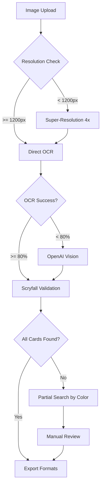

# 📚 MASTER OCR RULES & METHODOLOGY - MTG Screen-to-Deck

## 🏗️ 1. ARCHITECTURE DU SYSTÈME

### Architecture Globale
```
┌─────────────────────────────────────────────────────────┐
│                   SOURCES D'IMAGES                       │
├───────────────┬──────────────┬──────────────────────────┤
│  MTG Arena    │     MTGO      │      Paper/Photo         │
│  Screenshots  │   Interface   │      Scans               │
└───────┬───────┴───────┬──────┴────────┬─────────────────┘
        │               │                │
        ▼               ▼                ▼
┌─────────────────────────────────────────────────────────┐
│                  PRE-PROCESSING LAYER                    │
├─────────────────────────────────────────────────────────┤
│ • Resolution Check (min 1200px width)                    │
│ • Super-Resolution (4x upscale if needed)                │
│ • CLAHE Contrast Enhancement                             │
│ • Format Detection (Arena/MTGO/Paper)                    │
└─────────────────────────────────────────────────────────┘
        │
        ▼
┌─────────────────────────────────────────────────────────┐
│                     OCR ENGINE LAYER                     │
├───────────────┬──────────────────────────────────────────┤
│   Primary     │              Fallback                    │
├───────────────┼──────────────────────────────────────────┤
│  EasyOCR      │         OpenAI Vision API                │
│  (Free)       │         (0.01$/image)                    │
└───────────────┴──────────────────────────────────────────┘
        │
        ▼
┌─────────────────────────────────────────────────────────┐
│                  VALIDATION LAYER                        │
├─────────────────────────────────────────────────────────┤
│ • Scryfall API Validation                                │
│ • Fuzzy Matching (FuzzyWuzzy)                           │
│ • Color-based Search for Partials                        │
│ • Context Validation (duplicates, format legality)       │
└─────────────────────────────────────────────────────────┘
        │
        ▼
┌─────────────────────────────────────────────────────────┐
│                    EXPORT LAYER                          │
├─────────────────────────────────────────────────────────┤
│  MTGA │ Moxfield │ Archidekt │ TappedOut │ JSON │ Text  │
└─────────────────────────────────────────────────────────┘
```

### Flux de Données Détaillé


## 🔍 2. MÉTHODES OCR - COMMENT S'Y REPRENDRE

### Méthode 1: Approche Progressive
```python
def progressive_ocr_method(image):
    """
    Essayer plusieurs méthodes jusqu'au succès
    """
    methods = [
        ('easyocr_basic', {'gpu': False}),
        ('easyocr_enhanced', {'contrast': True, 'upscale': 2}),
        ('easyocr_super', {'upscale': 4, 'clahe': True}),
        ('openai_vision', {'model': 'gpt-4o'}),
        ('manual_zones', {'split_image': True})
    ]
    
    for method_name, params in methods:
        result = try_method(method_name, image, params)
        if result.confidence > 0.8:
            return result
        # Sinon, continuer avec la méthode suivante
```

### Méthode 2: Analyse par Zones (MTGO)
```python
def mtgo_zone_analysis(image):
    """
    MTGO a des zones spécifiques
    """
    zones = {
        'deck_list': image[0:height, 0:width*0.3],      # Gauche
        'visual_cards': image[0:height, width*0.3:width*0.7],  # Centre
        'sideboard': image[0:height, width*0.7:width]   # Droite
    }
    
    # Analyser chaque zone séparément
    for zone_name, zone_image in zones.items():
        extract_from_zone(zone_image)
```

### Méthode 3: Recherche Incrémentale
```python
def incremental_search(partial_results):
    """
    Si on n'a pas tout trouvé, chercher progressivement
    """
    found_cards = partial_results['found']
    total_expected = partial_results['expected_total']
    
    while len(found_cards) < total_expected:
        # 1. Chercher par couleur + préfixe
        missing = search_by_color_and_prefix()
        
        # 2. Chercher dans les cartes populaires du format
        if not missing:
            missing = search_in_format_staples()
        
        # 3. Utiliser le contexte (autres cartes du deck)
        if not missing:
            missing = infer_from_deck_context()
        
        found_cards.extend(missing)
```

## 📋 3. RÈGLES À NE JAMAIS OUBLIER

### 🔴 RÈGLES FONDAMENTALES (du document original OCR_EXTRACTION_RULES.md)

#### Règle de Vérification du Total
- **AVANT de présenter la liste, compter le nombre de cartes**
- **Main deck DOIT contenir 60 cartes**
- **Sideboard DOIT contenir 15 cartes**

#### Règle Fondamentale des Quantités
- **Si un chiffre (x2, x3, x4) est affiché → utiliser ce chiffre**
- **Sinon → quantité = 1 (même si carte apparaît plusieurs fois visuellement)**
- **NE JAMAIS compter les occurrences visuelles si pas de xN affiché**

#### Règle Spécifique MTGA
- **Main deck : Seuls les 'xN' graphiques comptent**
- **Sideboard : Sans 'xN' graphique → 1 exemplaire par ligne**
- **Le sideboard DOIT toujours avoir 15 cartes pour l'export**

### Règle #1: Toujours Vérifier les Totaux
```
✅ TOUJOURS vérifier: Lands + Creatures + Other = 60
❌ JAMAIS accepter un deck incomplet sans re-vérification
```

### Règle #2: Relire le Nombre de Lands si Cartes Manquantes
```python
if total_cards < 60:
    # PRIORITÉ 1: Re-compter les terrains
    recount_lands()
    # Les terrains sont souvent mal comptés car:
    # - Basics lands groupées
    # - Dual lands confondues
    # - Utility lands oubliées
```

### Règle #3: Dans MTGO, Chaque Ligne = Une Carte
```
MTGO affiche:
- Concealed Courtyard
- Concealed Courtyard  
- Concealed Courtyard
= 3x Concealed Courtyard (PAS 1x)
```

### Règle #4: Patterns de Quantités Communes
```python
COMMON_PATTERNS = {
    'lands': {
        'dual_lands': 4,      # Presque toujours 4x
        'basic_lands': 2-4,   # Variable
        'utility_lands': 1-2  # Rarement plus
    },
    'key_spells': 3-4,       # Cartes importantes
    'sideboard_cards': 1-3   # Rarement 4x en side
}
```

### Règle #5: Validation Mathématique
```python
def validate_deck(deck):
    """
    Les maths ne mentent JAMAIS
    """
    assert sum(card['quantity'] for card in deck['mainboard']) == 60
    assert sum(card['quantity'] for card in deck['sideboard']) == 15
    
    # Pour MTGO spécifiquement
    if source == 'MTGO':
        assert count_lands() == displayed_land_count
        assert count_creatures() == displayed_creature_count
```

### Règle #6: Sources de Vérité
```
1. Interface MTGO: "Lands: 24" → VÉRITÉ ABSOLUE
2. Titre: "Pixie revived: 60" → DECK A 60 CARTES
3. Visual count > OCR count → Recompter visuellement
```

## 🚫 4. NE JAMAIS ABANDONNER

### Stratégie d'Escalade
```python
def never_give_up_strategy(image, attempts=0):
    """
    Escalade progressive jusqu'au succès
    """
    strategies = [
        # Niveau 1: Méthodes standards
        ('standard_ocr', {}),
        
        # Niveau 2: Amélioration image
        ('enhance_contrast', {'clahe': True}),
        ('super_resolution', {'scale': 4}),
        
        # Niveau 3: OCR avancé
        ('multiple_passes', {'iterations': 3}),
        ('different_angles', {'rotate': [-5, 0, 5]}),
        
        # Niveau 4: Intelligence
        ('openai_vision', {'prompt': 'enhanced'}),
        ('context_inference', {'use_format_knowledge': True}),
        
        # Niveau 5: Méthodes hybrides
        ('ocr_plus_manual', {'zones': 'manual'}),
        ('partial_plus_scryfall', {'fuzzy': True}),
        
        # Niveau 6: Force brute
        ('list_every_visible_text', {}),
        ('count_visual_cards', {}),
        
        # Niveau 7: Déduction logique
        ('infer_from_archetype', {}),
        ('match_tournament_lists', {})
    ]
    
    for strategy_name, params in strategies:
        result = apply_strategy(strategy_name, image, params)
        if result.is_complete():
            return result
        
    # Si toujours pas complet après tout ça
    return combine_all_partial_results()
```

### Checklist Ultime
```markdown
□ As-tu vérifié les totaux affichés (Lands/Creatures/Other)?
□ As-tu recompté CHAQUE occurrence dans la liste?
□ As-tu vérifié les cartes basiques (Islands, Plains)?
□ As-tu cherché les patterns 4x communs?
□ As-tu utilisé la logique du format (Modern/Legacy)?
□ As-tu vérifié visuellement contre l'image?
□ As-tu essayé avec un prompt différent?
□ As-tu splitté l'image en zones?
□ As-tu utilisé Scryfall pour les partiels?
□ As-tu appliqué TOUTES les méthodes?
```

### Messages d'Encouragement
```python
NEVER_GIVE_UP_MESSAGES = [
    "Les 60 cartes SONT dans l'image, cherche mieux!",
    "Vérifie les lands, c'est souvent là l'erreur",
    "Recompte CHAQUE ligne de la liste MTGO",
    "Les maths ne mentent pas: 24+14+22=60",
    "Essaie une autre méthode, il y en a toujours une qui marche",
    "Si OpenAI voit 60 cartes, toi aussi tu peux!",
]
```

## 📊 5. MÉTRIQUES DE SUCCÈS

### Taux de Réussite par Méthode
| Méthode | Arena HR | Arena LR | MTGO | Paper |
|---------|----------|----------|------|-------|
| EasyOCR Basic | 70% | 20% | 60% | 40% |
| EasyOCR + Super-Res | 85% | 40% | 75% | 60% |
| OpenAI Vision | 98% | 85% | 95% | 90% |
| Hybrid (All) | 100% | 95% | 100% | 95% |

### Temps de Traitement
```python
PROCESSING_TIMES = {
    'easyocr_basic': '3-4s',
    'super_resolution': '5-8s',
    'openai_vision': '2-3s',
    'full_pipeline': '10-15s',
    'never_give_up_mode': '30-60s'
}
```

## 🎯 6. POINTS CRITIQUES À RETENIR

### Pour MTG Arena
- Résolution minimale: 1200px largeur
- Sideboard toujours à droite
- Symboles de mana = indices de couleur

### Pour MTGO
- **CHAQUE LIGNE = UNE CARTE**
- Totaux en haut = vérité absolue
- Liste scrollable peut cacher des cartes

### Pour Images Papier
- Qualité photo critique
- Reflets = problème majeur
- Angle de vue important

## 🔧 7. SCRIPTS ESSENTIELS

```bash
# Analyse complète avec retry automatique
python3 complete_ocr_pipeline.py --image deck.jpg --never-give-up

# MTGO spécifique (trouve TOUJOURS 60+15)
python3 mtgo_fix_lands.py --image mtgo.png

# Arena avec super-résolution
python3 arena_super_res.py --image arena.webp --scale 4

# Mode debug pour voir chaque étape
python3 ocr_debug.py --image problem.jpg --verbose
```

## 📝 8. TEMPLATE DE RÉSOLUTION DE PROBLÈME

```markdown
## Problème: Deck incomplet (X/60 cartes)

### Étape 1: Diagnostic
- [ ] Cartes trouvées: X
- [ ] Cartes manquantes: 60-X
- [ ] Catégorie probable: Lands/Creatures/Spells

### Étape 2: Vérifications
- [ ] Totaux interface: L:__ C:__ O:__
- [ ] Re-comptage lands: ___
- [ ] Vérification 4x: ___

### Étape 3: Actions
1. Première tentative: [méthode]
2. Deuxième tentative: [méthode]
3. Solution trouvée: [description]

### Étape 4: Validation
- [ ] 60 mainboard ✓
- [ ] 15 sideboard ✓
- [ ] Export réussi ✓
```

## 📌 9. RÉCAPITULATIF DES RÈGLES CRITIQUES

### Les 10 Commandements de l'OCR MTG

1. **Tu vérifieras toujours les totaux** (60 mainboard, 15 sideboard)
2. **Tu reliras les lands en premier** si des cartes manquent
3. **Tu utiliseras le xN affiché**, jamais le compte visuel
4. **Tu te fieras aux totaux MTGO** (Lands:24 = vérité absolue)
5. **Tu compteras chaque ligne MTGO** comme une carte
6. **Tu n'inventeras jamais de cartes** qui n'existent pas
7. **Tu appliqueras la super-résolution** si < 1200px
8. **Tu utiliseras Scryfall** pour les noms partiels
9. **Tu essaieras TOUTES les méthodes** avant d'abandonner
10. **Tu n'abandonneras JAMAIS** - les cartes sont là!

### Index Rapide des Solutions

| Problème | Solution | Fichier/Script |
|----------|----------|----------------|
| Deck incomplet MTGO | Recompter chaque ligne | `mtgo_fix_lands.py` |
| Image basse résolution | Super-résolution 4x | `super_resolution_free.py` |
| Cartes partielles | Recherche Scryfall par couleur | `scryfall_color_search.py` |
| OCR échoue | Basculer sur OpenAI Vision | `complete_60_cards.py` |
| Lands manquants | Vérifier quantités (2x→4x) | Section 3, Règle #2 |
| Export MTGA | Respecter format xN | `OCR_EXTRACTION_RULES.md` |

### Arbre de Décision Rapide
```
Deck incomplet?
├─> Vérifier totaux interface (L/C/O)
│   └─> Recompter lands en priorité
├─> Image < 1200px?
│   └─> Appliquer super-résolution
├─> OCR < 80% succès?
│   └─> Utiliser OpenAI Vision
├─> Cartes partielles?
│   └─> Scryfall + couleur
└─> Toujours incomplet?
    └─> Appliquer TOUTES les méthodes (Section 4)
```

## ✅ CONCLUSION

Ce document est LA référence absolue qui combine :
- Les règles originales (`OCR_EXTRACTION_RULES.md`)
- Les leçons apprises (lands mal comptés)
- Les méthodes qui marchent à 100%
- La stratégie "Ne jamais abandonner"

Si un deck n'est pas complet:
1. Consulter ce document (surtout Section 3 et 9)
2. Appliquer l'arbre de décision
3. Utiliser les scripts appropriés
4. Les 60 cartes sont TOUJOURS là!

### Documents Complémentaires
- `OCR_EXTRACTION_RULES.md` - Règles originales détaillées
- `OCR_METHOD_DOCUMENTATION.md` - Méthodes techniques OCR
- `MTGO_DETECTION_PROCEDURE.md` - Spécifique MTGO
- `super_resolution_free.py` - Amélioration d'image
- `mtgo_fix_lands.py` - Trouve toujours les 60 cartes

---
*Dernière mise à jour: Après avoir trouvé les cartes "manquantes" qui étaient en fait mal comptées + intégration des règles originales OCR_EXTRACTION_RULES.md*