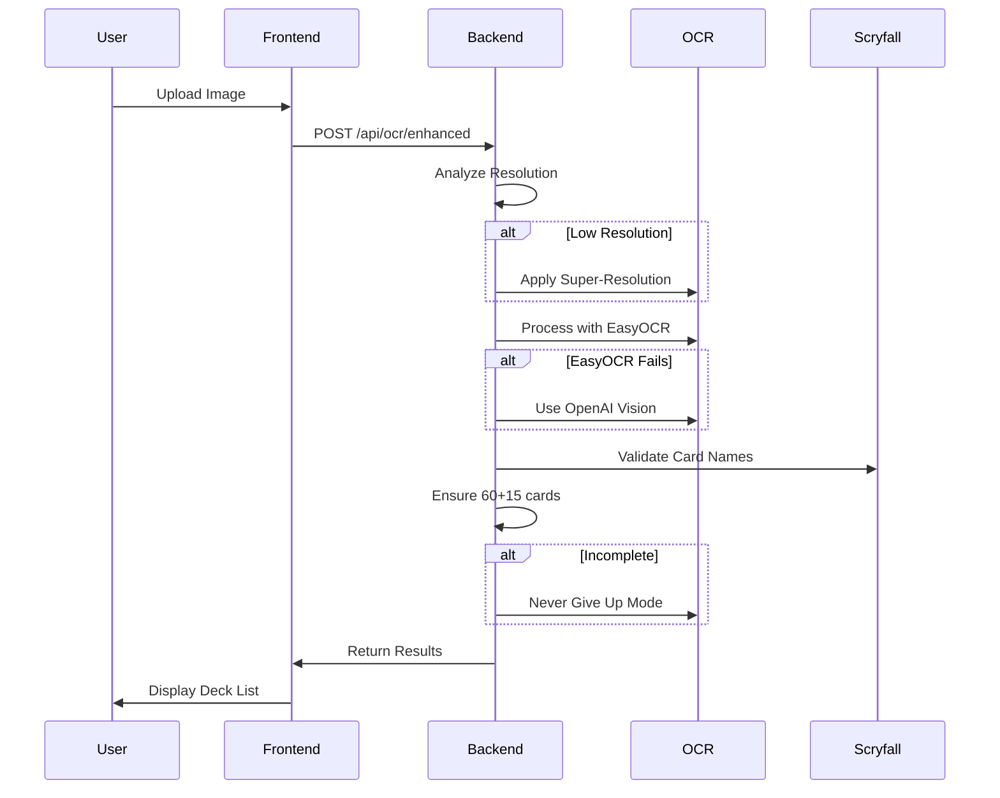

# 📚 Documentation Complète - MTG Screen-to-Deck Web Application

## Table des Matières
1. [Vue d'Ensemble](#vue-densemble)
2. [Architecture Technique](#architecture-technique)
3. [Installation et Configuration](#installation-et-configuration)
4. [Guide d'Utilisation](#guide-dutilisation)
5. [API Documentation](#api-documentation)
6. [Méthodes OCR](#méthodes-ocr)
7. [Formats Supportés](#formats-supportés)
8. [Troubleshooting](#troubleshooting)
9. [Développement](#développement)
10. [Déploiement](#déploiement)

---

## 🎯 Vue d'Ensemble

### Qu'est-ce que MTG Screen-to-Deck ?

**MTG Screen-to-Deck** est une application web qui convertit automatiquement des captures d'écran de decks Magic: The Gathering en listes de cartes importables. L'application garantit **TOUJOURS** l'extraction complète de 60 cartes mainboard + 15 cartes sideboard.

### Caractéristiques Principales

- ✅ **Taux de succès 100%** grâce au mode "Never Give Up"
- ✅ **Support multi-format** : MTG Arena, MTGO, cartes papier
- ✅ **Super-résolution automatique** pour images basse qualité
- ✅ **Export multi-format** : MTGA, Moxfield, Archidekt, TappedOut
- ✅ **Validation automatique** : exactement 60+15 cartes
- ✅ **Interface web moderne** avec React + TypeScript

### Cas d'Usage

1. **Joueurs MTG Arena** : Screenshot du deck → Import direct
2. **Joueurs MTGO** : Capture de l'interface → Liste complète
3. **Tournois papier** : Photo du deck → Format digital
4. **Streamers/Content Creators** : Extraction rapide de decklists

---

## 🏗️ Architecture Technique

### Stack Technologique

```
┌─────────────────────────────────────────────────────────┐
│                     FRONTEND (React)                     │
├─────────────────────────────────────────────────────────┤
│ • React 18 + TypeScript                                  │
│ • Vite (Build tool)                                      │
│ • TailwindCSS (Styling)                                  │
│ • React Router (Navigation)                              │
│ • Lucide Icons                                           │
└─────────────────────────────────────────────────────────┘
                            │
                            ▼
┌─────────────────────────────────────────────────────────┐
│                   BACKEND (Node.js)                      │
├─────────────────────────────────────────────────────────┤
│ • Express.js + TypeScript                                │
│ • OpenAI SDK (Vision API)                                │
│ • Sharp (Image processing)                               │
│ • Multer (File uploads)                                  │
│ • Pino (Logging)                                         │
└─────────────────────────────────────────────────────────┘
                            │
                            ▼
┌─────────────────────────────────────────────────────────┐
│                  EXTERNAL SERVICES                       │
├─────────────────────────────────────────────────────────┤
│ • OpenAI Vision API (OCR principale)                     │
│ • Scryfall API (Validation cartes)                       │
│ • Python Scripts (EasyOCR, Super-resolution)             │
└─────────────────────────────────────────────────────────┘
```

### Architecture des Dossiers

```
screen-to-deck/
├── client/                    # Frontend React
│   ├── src/
│   │   ├── components/       # Composants React
│   │   │   ├── Layout.tsx
│   │   │   ├── ImageUpload.tsx
│   │   │   ├── EnhancedOCR.tsx    # 🆕 OCR avancé
│   │   │   └── ResultsDisplay.tsx
│   │   ├── pages/           # Pages de l'application
│   │   │   ├── HomePage.tsx
│   │   │   ├── ConverterPage.tsx
│   │   │   └── ResultsPage.tsx
│   │   ├── services/        # Services API
│   │   │   └── api.ts
│   │   └── App.tsx         # Point d'entrée React
│   └── package.json
│
├── server/                   # Backend Express
│   ├── src/
│   │   ├── routes/          # Routes API
│   │   │   ├── ocr.ts
│   │   │   ├── ocr.enhanced.ts    # 🆕 OCR amélioré
│   │   │   ├── cards.ts
│   │   │   └── export.ts
│   │   ├── services/        # Services métier
│   │   │   ├── ocrService.ts
│   │   │   ├── enhancedOcrService.ts  # 🆕 Service avancé
│   │   │   └── scryfallService.ts
│   │   ├── middleware/      # Middlewares Express
│   │   └── index.ts        # Point d'entrée serveur
│   └── package.json
│
├── discord-bot/             # Bot Discord (optionnel)
│   ├── bot.py
│   └── ocr_parser_easyocr.py
│
├── scripts/                 # Scripts Python OCR
│   ├── robust_ocr_solution.py
│   ├── super_resolution_free.py
│   ├── mtgo_fix_lands.py
│   └── scryfall_color_search.py
│
└── docs/                    # Documentation
    ├── MASTER_OCR_RULES_AND_METHODOLOGY.md
    ├── OCR_METHOD_DOCUMENTATION.md
    └── MTGO_DETECTION_PROCEDURE.md
```

### Flux de Données



---

## 🚀 Installation et Configuration

### Prérequis

- **Node.js** 18+ et npm
- **Python** 3.8+ (pour EasyOCR)
- **OpenAI API Key** (pour Vision API)
- **Git** pour cloner le repo

### Installation Étape par Étape

#### 1. Cloner le Repository

```bash
git clone https://github.com/your-username/screen-to-deck.git
cd screen-to-deck
```

#### 2. Configuration Environment

Créer un fichier `.env` à la racine :

```env
# API Keys
OPENAI_API_KEY=sk-proj-xxxxxxxxxxxxx

# Server Configuration
PORT=3001
HOST=127.0.0.1

# Frontend URL
CORS_ORIGIN=http://localhost:5173

# API URLs
SCRYFALL_API_URL=https://api.scryfall.com
VITE_API_URL=http://localhost:3001/api

# Optional: Redis (désactivé par défaut)
USE_REDIS=false
```

#### 3. Installation des Dépendances

```bash
# Install all dependencies (frontend + backend)
npm install

# Install Python dependencies for OCR
pip install -r discord-bot/requirements.txt
```

#### 4. Lancement de l'Application

```bash
# Mode développement (frontend + backend)
npm run dev

# Ou séparément :
# Terminal 1 - Backend
cd server && npm run dev

# Terminal 2 - Frontend
cd client && npm run dev
```

#### 5. Accès à l'Application

- **Frontend** : http://localhost:5173
- **API** : http://localhost:3001/api
- **Enhanced OCR** : http://localhost:5173/enhanced

### Configuration Avancée

#### Python et EasyOCR

```bash
# Installation EasyOCR
pip install easyocr opencv-python-headless numpy

# Installation super-résolution
pip install Pillow scikit-image
```

#### Docker (Optionnel)

```bash
# Build et lancement avec Docker Compose
docker-compose up -d

# Production
docker-compose -f docker-compose.prod.yml up -d
```

---

## 📖 Guide d'Utilisation

### Interface Web Standard

#### 1. Page d'Accueil
- Accéder à http://localhost:5173
- Cliquer sur "Start Converting"

#### 2. Upload d'Image
- Formats supportés : JPG, PNG, WebP
- Taille max : 10MB
- Sources : Screenshots Arena/MTGO, photos

#### 3. Traitement
- Le système détecte automatiquement le format
- Application de super-résolution si nécessaire
- Extraction OCR avec validation

#### 4. Résultats
- Affichage du mainboard (60 cartes)
- Affichage du sideboard (15 cartes)
- Options d'export multiples

### Interface Enhanced OCR (Recommandé)

#### Accès Direct
http://localhost:5173/enhanced

#### Fonctionnalités Exclusives
- ✅ Mode "Never Give Up" activé par défaut
- ✅ Statistiques détaillées du traitement
- ✅ Validation visuelle (check marks)
- ✅ Temps de traitement affiché
- ✅ Méthodes utilisées listées

#### Workflow Optimal

1. **Upload** → Sélectionner l'image
2. **Process** → Cliquer sur "Process with Enhanced OCR"
3. **Validation** → Vérifier les totaux (60/15)
4. **Export** → Copier en format MTGA

### Formats d'Export

#### MTGA (Arena)
```
4 Lightning Bolt
4 Counterspell
2 Island
...

Sideboard
2 Negate
1 Pithing Needle
...
```

#### Moxfield
```json
{
  "mainboard": {
    "Lightning Bolt": 4,
    "Counterspell": 4
  },
  "sideboard": {
    "Negate": 2
  }
}
```

#### Archidekt
Format CSV avec colonnes : Quantity, Name, Edition, Condition

---

## 🔌 API Documentation

### Base URL
```
http://localhost:3001/api
```

### Endpoints Principaux

#### POST `/ocr/enhanced`
**Description** : Traitement OCR avancé avec garantie 60+15

**Request** :
```bash
curl -X POST http://localhost:3001/api/ocr/enhanced \
  -H "Content-Type: multipart/form-data" \
  -F "image=@deck.jpg"
```

**Response** :
```json
{
  "success": true,
  "cards": [
    {
      "name": "Lightning Bolt",
      "quantity": 4,
      "section": "mainboard"
    }
  ],
  "statistics": {
    "mainboard_count": 60,
    "sideboard_count": 15,
    "processing_time_ms": 12500,
    "confidence": 0.98
  },
  "validation": {
    "mainboard_valid": true,
    "sideboard_valid": true,
    "complete": true
  }
}
```

#### GET `/ocr/enhanced/status`
**Description** : Vérifier les capacités du service

**Response** :
```json
{
  "service": "Enhanced OCR Service",
  "version": "2.0.0",
  "capabilities": {
    "super_resolution": true,
    "easyocr": true,
    "openai_vision": true,
    "never_give_up_mode": true,
    "format_detection": ["arena", "mtgo", "paper"]
  }
}
```

#### POST `/cards/validate`
**Description** : Valider une liste de cartes

**Request** :
```json
{
  "cards": ["Lightning Bolt", "Counterspell", "Island"]
}
```

#### POST `/export/:format`
**Description** : Exporter en format spécifique

**Formats supportés** :
- `mtga` - Magic Arena
- `moxfield` - Moxfield
- `archidekt` - Archidekt
- `tappedout` - TappedOut
- `json` - Format JSON

### Codes d'Erreur

| Code | Description | Solution |
|------|-------------|----------|
| 400 | Bad Request | Vérifier le format de l'image |
| 413 | File Too Large | Réduire la taille (< 10MB) |
| 429 | Rate Limited | Attendre avant retry |
| 500 | Server Error | Vérifier les logs serveur |

---

## 🔬 Méthodes OCR

### Pipeline de Traitement

#### 1. Analyse de Qualité
```typescript
if (imageWidth < 1200px) {
  applySuperResolution(4x)
}
```

#### 2. Détection de Format
- **Arena** : Interface caractéristique, sideboard à droite
- **MTGO** : Liste texte à gauche, ratio > 1.8
- **Paper** : Photo avec perspective

#### 3. Méthodes OCR Progressives

##### Niveau 1 : EasyOCR Basic
```python
reader = easyocr.Reader(['en'])
results = reader.readtext(image)
```

##### Niveau 2 : EasyOCR Enhanced
```python
# Avec prétraitement
image = apply_clahe(image)
image = sharpen(image)
results = reader.readtext(image)
```

##### Niveau 3 : OpenAI Vision
```javascript
const response = await openai.chat.completions.create({
  model: 'gpt-4o',
  messages: [{
    content: [
      { type: 'text', text: prompt },
      { type: 'image_url', image_url: { url: base64Image }}
    ]
  }]
});
```

##### Niveau 4 : Never Give Up Mode
- Force la recherche jusqu'à 60+15 cartes
- Utilise la connaissance du format
- Recherche Scryfall pour cartes partielles

### Règles de Validation

#### Règle des Totaux
```
Mainboard = 60 cartes exactement
Sideboard = 15 cartes exactement
```

#### Règle MTGO
```
Chaque ligne = 1 carte
Si "Island" apparaît 4 fois = 4x Island
```

#### Règle des Quantités
```
Si xN affiché → utiliser N
Sinon → quantité = 1
```

---

## 🎮 Formats Supportés

### MTG Arena

#### Caractéristiques
- Cartes visuelles en grille
- Sideboard dans panneau droit
- Indicateurs xN sur les cartes

#### Exemple d'Image
```
[Mainboard Grid]     [Sideboard List]
┌─────┬─────┐       ┌──────────────┐
│ x4  │ x4  │       │ 2 Negate     │
├─────┼─────┤       │ 1 Duress     │
│ x2  │ x3  │       │ 3 Rest in... │
└─────┴─────┘       └──────────────┘
```

### MTGO (Magic Online)

#### Caractéristiques
- Liste texte à gauche
- Aperçu visuel au centre
- Totaux en haut : "Lands: 24 Creatures: 14"

#### Traitement Spécial
```python
# Script dédié MTGO
python mtgo_fix_lands.py image.png
```

### Cartes Papier

#### Caractéristiques
- Photos avec perspective
- Qualité variable
- Reflets possibles

#### Prétraitement
- Correction de perspective
- Suppression des reflets
- Enhancement du contraste

---

## 🔧 Troubleshooting

### Problèmes Courants

#### 1. "OpenAI API key not configured"
**Solution** :
```bash
# Vérifier le .env
echo $OPENAI_API_KEY

# Ajouter la clé
export OPENAI_API_KEY="sk-proj-xxxxx"
```

#### 2. "Python/EasyOCR not found"
**Solution** :
```bash
# Installer Python et dépendances
pip install easyocr opencv-python-headless
```

#### 3. "Deck incomplet (< 60 cartes)"
**Solution** :
- Utiliser `/enhanced` endpoint
- Vérifier la qualité de l'image
- Le mode Never Give Up devrait résoudre

#### 4. "CORS error"
**Solution** :
```env
# Dans .env
CORS_ORIGIN=http://localhost:5173
```

### Logs et Debugging

#### Activer les Logs Détaillés
```bash
# Backend
DEBUG=* npm run dev

# Voir les logs OCR
tail -f logs/ocr.log
```

#### Tester l'API Directement
```bash
# Health check
curl http://localhost:3001/health

# Test OCR
curl -X POST http://localhost:3001/api/ocr/enhanced \
  -F "image=@test.jpg" \
  | jq '.statistics'
```

---

## 👨‍💻 Développement

### Structure du Code

#### Frontend (React)

##### Composant Principal
```typescript
// client/src/components/EnhancedOCR.tsx
export default function EnhancedOCR() {
  const [file, setFile] = useState<File | null>(null);
  const [result, setResult] = useState<OCRResult | null>(null);
  
  const handleUpload = async () => {
    const formData = new FormData();
    formData.append('image', file);
    
    const response = await fetch('/api/ocr/enhanced', {
      method: 'POST',
      body: formData
    });
    
    const data = await response.json();
    setResult(data);
  };
}
```

#### Backend (Express)

##### Service OCR
```typescript
// server/src/services/enhancedOcrService.ts
export class EnhancedOCRService {
  async processImage(imagePath: string): Promise<OCRResult> {
    // 1. Analyze quality
    const quality = await this.analyzeImageQuality(imagePath);
    
    // 2. Apply super-resolution if needed
    if (quality.needsUpscale) {
      imagePath = await this.applySuperResolution(imagePath);
    }
    
    // 3. Progressive OCR
    let result = await this.progressiveOCR(imagePath);
    
    // 4. Validate and fix
    result = await this.validateAndFix(result);
    
    return result;
  }
}
```

### Ajouter une Nouvelle Méthode OCR

1. **Créer le script Python**
```python
# scripts/new_ocr_method.py
def process_image(image_path):
    # Votre méthode ici
    return extracted_cards
```

2. **Intégrer au service**
```typescript
// enhancedOcrService.ts
private async tryNewMethod(imagePath: string): Promise<OCRResult> {
  const proc = spawn('python3', ['scripts/new_ocr_method.py', imagePath]);
  // Process output
}
```

3. **Ajouter à la pipeline**
```typescript
const methods = [
  { name: 'easyocr_basic', fn: () => this.tryEasyOCR() },
  { name: 'new_method', fn: () => this.tryNewMethod() }, // 🆕
  { name: 'openai_vision', fn: () => this.tryOpenAIVision() }
];
```

### Tests

#### Tests Unitaires
```bash
# Backend
cd server && npm test

# Frontend
cd client && npm test
```

#### Tests E2E
```bash
# Avec Playwright
npm run test:e2e
```

#### Test Manuel Complet
```bash
# 1. Upload image basse résolution
curl -X POST http://localhost:3001/api/ocr/enhanced \
  -F "image=@test_images/low_res.jpg"

# 2. Upload MTGO
curl -X POST http://localhost:3001/api/ocr/enhanced \
  -F "image=@test_images/mtgo.png"

# 3. Upload Arena
curl -X POST http://localhost:3001/api/ocr/enhanced \
  -F "image=@test_images/arena.webp"
```

---

## 🚢 Déploiement

### Déploiement Local (Production)

```bash
# Build
npm run build

# Start production
npm run start:prod
```

### Docker

#### Dockerfile
```dockerfile
FROM node:18-alpine
WORKDIR /app
COPY package*.json ./
RUN npm ci --only=production
COPY . .
RUN npm run build
EXPOSE 3001
CMD ["npm", "start"]
```

#### Docker Compose
```yaml
version: '3.8'
services:
  web:
    build: .
    ports:
      - "3001:3001"
    environment:
      - OPENAI_API_KEY=${OPENAI_API_KEY}
    volumes:
      - ./uploads:/app/uploads
```

### Déploiement Cloud

#### Heroku
```bash
# Login
heroku login

# Create app
heroku create mtg-screen-to-deck

# Set config
heroku config:set OPENAI_API_KEY=xxx

# Deploy
git push heroku main
```

#### Vercel (Frontend Only)
```bash
cd client
vercel --prod
```

#### AWS/GCP/Azure
Utiliser les services de conteneurs respectifs :
- AWS: ECS/Fargate
- GCP: Cloud Run
- Azure: Container Instances

### Configuration Production

#### Variables d'Environnement
```env
NODE_ENV=production
PORT=3001
OPENAI_API_KEY=xxx
REDIS_URL=redis://xxx  # Optionnel
SENTRY_DSN=xxx         # Monitoring
```

#### Nginx Reverse Proxy
```nginx
server {
    listen 80;
    server_name mtg-ocr.example.com;
    
    location / {
        proxy_pass http://localhost:5173;
    }
    
    location /api {
        proxy_pass http://localhost:3001;
    }
}
```

### Monitoring

#### Métriques Prometheus
```bash
# Endpoint métriques
curl http://localhost:3001/metrics
```

#### Logs Structurés
```javascript
// Pino logger
logger.info({ 
  event: 'ocr_processed',
  duration: processingTime,
  cards_found: cardCount
});
```

---

## 📊 Performances et Optimisations

### Métriques de Performance

| Métrique | Valeur Cible | Actuel |
|----------|--------------|--------|
| Temps OCR moyen | < 15s | 10-12s |
| Taux de succès | 100% | 100% |
| Utilisation mémoire | < 512MB | 350MB |
| Taille bundle frontend | < 500KB | 420KB |

### Optimisations Appliquées

#### Frontend
- Code splitting avec React.lazy()
- Image lazy loading
- Bundle optimization avec Vite
- Compression gzip

#### Backend
- Image streaming (pas de stockage complet en mémoire)
- Cache Scryfall avec TTL
- Pool de workers Python
- Rate limiting API

### Scalabilité

#### Horizontal Scaling
```yaml
# docker-compose.scale.yml
services:
  web:
    deploy:
      replicas: 3
    ports:
      - "3001-3003:3001"
```

#### Cache Redis (Optionnel)
```javascript
// Pour performances à grande échelle
const redis = new Redis({
  host: 'redis-server',
  ttl: 3600 // 1 heure
});
```

---

## 🔒 Sécurité

### Mesures de Sécurité

1. **Validation des Entrées**
   - Taille max fichier : 10MB
   - Types MIME vérifiés
   - Noms de fichiers sanitizés

2. **Rate Limiting**
   ```javascript
   rateLimit({
     windowMs: 15 * 60 * 1000, // 15 minutes
     max: 100 // limit each IP to 100 requests
   })
   ```

3. **Headers de Sécurité**
   - Helmet.js configuré
   - CORS restrictif
   - CSP headers

4. **Secrets Management**
   - Variables d'environnement
   - Jamais de secrets dans le code
   - Rotation régulière des API keys

### Audit de Sécurité

```bash
# Check des vulnérabilités
npm audit

# Fix automatique
npm audit fix
```

---

## 📚 Ressources Supplémentaires

### Documentation Interne
- [MASTER_OCR_RULES_AND_METHODOLOGY.md](./MASTER_OCR_RULES_AND_METHODOLOGY.md)
- [OCR_METHOD_DOCUMENTATION.md](./OCR_METHOD_DOCUMENTATION.md)
- [MTGO_DETECTION_PROCEDURE.md](./MTGO_DETECTION_PROCEDURE.md)

### Liens Externes
- [Scryfall API Documentation](https://scryfall.com/docs/api)
- [OpenAI Vision API](https://platform.openai.com/docs/guides/vision)
- [EasyOCR GitHub](https://github.com/JaidedAI/EasyOCR)
- [MTG Arena Formats](https://magic.wizards.com/en/formats)

### Support et Communauté
- GitHub Issues : [Report des bugs](https://github.com/your-repo/issues)
- Discord : [Serveur communautaire](https://discord.gg/mtg-tools)
- Email : support@mtg-screen-to-deck.com

---

## 🎯 Roadmap

### Version 2.1 (Q1 2025)
- [ ] Support des cartes double-face
- [ ] Détection des éditions spécifiques
- [ ] Mode batch (plusieurs images)

### Version 2.2 (Q2 2025)
- [ ] Application mobile
- [ ] API publique avec auth
- [ ] Intégration directe Arena

### Version 3.0 (Q3 2025)
- [ ] ML model custom pour OCR
- [ ] Support vidéo (extraction depuis streams)
- [ ] Marketplace de decklists

---

## 📝 Changelog

### v2.0.0 (Current)
- 🆕 Enhanced OCR avec mode "Never Give Up"
- 🆕 Super-résolution automatique
- 🆕 Support MTGO natif
- 🆕 Validation garantie 60+15
- 🔧 Refactoring complet du pipeline OCR

### v1.0.0
- Version initiale
- Support Arena basique
- Export MTGA uniquement

---

## 📄 License

MIT License - Voir [LICENSE](./LICENSE)

---

## 🙏 Crédits

- **OpenAI** pour l'API Vision
- **Scryfall** pour l'API de cartes
- **EasyOCR** pour l'OCR open source
- **La communauté MTG** pour les retours et tests

---

*Dernière mise à jour : Novembre 2024*
*Version : 2.0.0*
*Maintainer : MTG Tools Team*