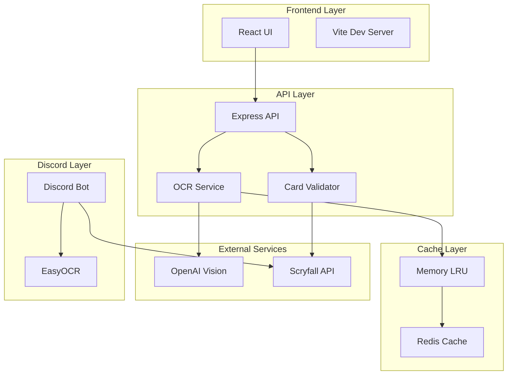

# 🔧 Guide Administrateur Complet - MTG Screen-to-Deck v2.1.0

**Guide technique pour l'installation, la configuration, le déploiement et la maintenance de MTG Screen-to-Deck**

---

## 📋 Table des Matières

1. [Prérequis Système](#prérequis-système)
2. [Installation Complète](#installation-complète)
3. [Configuration Avancée](#configuration-avancée)
4. [Déploiement Production](#déploiement-production)
5. [Monitoring et Logs](#monitoring-et-logs)
6. [Maintenance et Optimisation](#maintenance-et-optimisation)
7. [Sécurité](#sécurité)
8. [Troubleshooting Avancé](#troubleshooting-avancé)
9. [Architecture Technique](#architecture-technique)
10. [API et Intégrations](#api-et-intégrations)

---

## 🖥️ Prérequis Système

### Configuration Minimale

| Composant | Minimum | Recommandé | Production |
|-----------|---------|------------|------------|
| **CPU** | 2 cores | 4 cores | 8+ cores |
| **RAM** | 2 GB | 4 GB | 8+ GB |
| **Stockage** | 1 GB | 5 GB | 20+ GB SSD |
| **OS** | Ubuntu 20.04+ / macOS 11+ / Windows 10+ | Ubuntu 22.04 LTS | Ubuntu 22.04 LTS |
| **Node.js** | 20.0.0 | 20.x LTS | 20.x LTS |
| **Python** | 3.8+ | 3.10+ | 3.10+ |
| **Docker** | Optional | 20.10+ | 24.0+ |

### Dépendances Logicielles

```bash
# Vérification des prérequis
node --version        # >= 20.0.0
npm --version         # >= 9.0.0
python3 --version     # >= 3.8
redis-cli --version   # >= 6.0 (optionnel mais recommandé)
docker --version      # >= 20.10 (pour déploiement Docker)
```

### Ports Réseau Requis

| Port | Service | Description |
|------|---------|-------------|
| 3001 | API Backend | Express.js API server |
| 5173 | Frontend Dev | Vite dev server |
| 3000 | Frontend Prod | Production build |
| 6379 | Redis | Cache service (optionnel) |
| 8080 | Discord Bot | Health check endpoint |
| 9090 | Prometheus | Metrics (optionnel) |
| 3100 | Grafana | Dashboard (optionnel) |

---

## 📦 Installation Complète

### 1. Installation depuis les Sources

```bash
# Cloner le repository
git clone https://github.com/screentodeck/screen-to-deck.git
cd screen-to-deck

# Installer les dépendances Node.js
npm install

# Installer les dépendances Python pour le bot Discord
cd discord-bot
python3 -m venv venv
source venv/bin/activate  # Linux/Mac
# ou: venv\Scripts\activate  # Windows
pip install -r requirements.txt

# Télécharger les modèles OCR (première fois seulement)
python3 -c "import easyocr; easyocr.Reader(['en'])"
```

### 2. Configuration des Variables d'Environnement

#### Backend API (`server/.env`)

```bash
# Copier le template
cp server/env.example server/.env

# Éditer server/.env
cat > server/.env << 'EOF'
# OBLIGATOIRE - OpenAI API
OPENAI_API_KEY=sk-your-actual-key-here

# Configuration du serveur
NODE_ENV=production
PORT=3001
HOST=0.0.0.0

# CORS (adapter selon votre domaine)
CORS_ORIGIN=http://localhost:5173,https://yourdomain.com

# Redis Cache (fortement recommandé)
REDIS_URL=redis://localhost:6379
CACHE_ENABLED=true
CACHE_TTL=3600

# Scryfall API
SCRYFALL_API_URL=https://api.scryfall.com
SCRYFALL_CACHE_TTL=86400
SCRYFALL_RATE_LIMIT=10

# OCR Configuration
OCR_MIN_WIDTH_THRESHOLD=1200
OCR_UPSCALE_FACTOR=4
OCR_ENABLE_SUPER_RESOLUTION=true
OCR_ENABLE_ZONE_DETECTION=true
OCR_ENABLE_PARALLEL=true
OCR_MAX_WORKERS=4
OCR_NEVER_GIVE_UP=true
OCR_MAX_ATTEMPTS=5

# MTGO Specific
MTGO_ENABLE_LAND_FIX=true
MTGO_VALIDATE_60_15=true

# Monitoring (optionnel)
METRICS_ENABLED=true
LOG_LEVEL=info
LOG_FILE=/var/log/mtg-api.log

# Limites
MAX_IMAGE_SIZE=10485760
RATE_LIMIT_REQUESTS=100
RATE_LIMIT_WINDOW=60000
EOF
```

#### Discord Bot (`discord-bot/.env`)

```bash
# Créer le fichier de configuration
cat > discord-bot/.env << 'EOF'
# Discord Configuration
DISCORD_TOKEN=your-bot-token-here
DISCORD_APPLICATION_ID=your-app-id
DISCORD_GUILD_ID=your-test-guild-id

# API Configuration
API_BASE_URL=http://localhost:3001/api
USE_LOCAL_OCR=true

# OCR Configuration
EASYOCR_MODELS_PATH=./models
OCR_CONFIDENCE_THRESHOLD=0.7
OCR_GPU_ENABLED=false

# Cache Configuration  
CACHE_TYPE=memory
CACHE_TTL=3600
MAX_CACHE_SIZE=1000

# Performance
MAX_WORKERS=4
ASYNC_TIMEOUT=30
BATCH_SIZE=10

# Features
CLIPBOARD_ENABLED=true
AUTO_EXPORT_FORMAT=mtga
FUZZY_MATCHING_THRESHOLD=0.8

# Limits
MAX_IMAGE_SIZE=10485760
RATE_LIMIT_PER_USER=3
DAILY_SCAN_LIMIT=100

# Logging
LOG_LEVEL=INFO
LOG_FILE=./logs/bot.log
EOF
```

### 3. Configuration de Redis (Recommandé)

```bash
# Installation Redis (Ubuntu/Debian)
sudo apt update
sudo apt install redis-server

# Configuration Redis
sudo nano /etc/redis/redis.conf
# Modifier:
# maxmemory 256mb
# maxmemory-policy allkeys-lru

# Démarrer Redis
sudo systemctl enable redis-server
sudo systemctl start redis-server

# Vérifier
redis-cli ping
# Devrait retourner: PONG
```

### 4. Configuration Nginx (Production)

```nginx
# /etc/nginx/sites-available/screentodeck
server {
    listen 80;
    server_name screentodeck.com www.screentodeck.com;
    
    # Redirect to HTTPS
    return 301 https://$server_name$request_uri;
}

server {
    listen 443 ssl http2;
    server_name screentodeck.com;
    
    # SSL Configuration
    ssl_certificate /etc/letsencrypt/live/screentodeck.com/fullchain.pem;
    ssl_certificate_key /etc/letsencrypt/live/screentodeck.com/privkey.pem;
    
    # Security Headers
    add_header X-Frame-Options "SAMEORIGIN" always;
    add_header X-Content-Type-Options "nosniff" always;
    add_header X-XSS-Protection "1; mode=block" always;
    
    # Frontend
    location / {
        proxy_pass http://localhost:3000;
        proxy_http_version 1.1;
        proxy_set_header Upgrade $http_upgrade;
        proxy_set_header Connection 'upgrade';
        proxy_set_header Host $host;
        proxy_cache_bypass $http_upgrade;
    }
    
    # API Backend
    location /api {
        proxy_pass http://localhost:3001;
        proxy_http_version 1.1;
        proxy_set_header X-Real-IP $remote_addr;
        proxy_set_header X-Forwarded-For $proxy_add_x_forwarded_for;
        proxy_set_header Host $host;
        
        # Timeouts pour OCR
        proxy_connect_timeout 60s;
        proxy_send_timeout 60s;
        proxy_read_timeout 60s;
        
        # Upload size pour images
        client_max_body_size 10M;
    }
    
    # WebSocket pour hot reload (dev only)
    location /ws {
        proxy_pass http://localhost:5173;
        proxy_http_version 1.1;
        proxy_set_header Upgrade $http_upgrade;
        proxy_set_header Connection "upgrade";
    }
}
```

---

## ⚙️ Configuration Avancée

### Optimisation des Performances OCR

```javascript
// server/config/ocr.config.js
module.exports = {
  // Pipeline Configuration
  pipeline: {
    stages: [
      'quality_check',
      'super_resolution',
      'zone_detection',
      'parallel_extraction',
      'validation',
      'never_give_up'
    ],
    parallelism: 4,
    timeout: 30000
  },
  
  // Super Resolution Settings
  superResolution: {
    enabled: true,
    minWidth: 1200,
    upscaleFactor: 4,
    method: 'ESRGAN', // ou 'bicubic' pour plus rapide
    enhanceContrast: true,
    denoise: true
  },
  
  // Zone Detection
  zoneDetection: {
    mtga: {
      mainboard: { x: 0.1, y: 0.15, width: 0.65, height: 0.7 },
      sideboard: { x: 0.75, y: 0.15, width: 0.2, height: 0.7 }
    },
    mtgo: {
      mainboard: { x: 0.05, y: 0.15, width: 0.4, height: 0.6 },
      sideboard: { x: 0.5, y: 0.15, width: 0.4, height: 0.3 }
    }
  },
  
  // Never Give Up Mode
  neverGiveUp: {
    enabled: true,
    maxAttempts: 5,
    strategies: [
      'standard_ocr',
      'enhanced_zones',
      'super_resolution',
      'manual_correction',
      'force_60_15'
    ]
  }
};
```

### Configuration du Cache Multi-Niveaux

```javascript
// server/config/cache.config.js
module.exports = {
  // Level 1: Memory Cache (LRU)
  memory: {
    enabled: true,
    maxSize: 1000,
    ttl: 300, // 5 minutes
    checkPeriod: 60
  },
  
  // Level 2: Redis Cache
  redis: {
    enabled: true,
    host: 'localhost',
    port: 6379,
    ttl: 3600, // 1 hour
    keyPrefix: 'mtg:',
    maxRetriesPerRequest: 3
  },
  
  // Level 3: Database Cache (optional)
  database: {
    enabled: false,
    type: 'postgres',
    connectionString: process.env.DATABASE_URL,
    ttl: 86400 // 24 hours
  },
  
  // Preloaded Popular Cards
  preload: {
    enabled: true,
    file: './data/popular_cards.json',
    refreshInterval: 3600000 // 1 hour
  }
};
```

### Configuration de Monitoring

```yaml
# docker-compose.monitoring.yml
version: '3.8'

services:
  prometheus:
    image: prom/prometheus:latest
    volumes:
      - ./prometheus.yml:/etc/prometheus/prometheus.yml
      - prometheus_data:/prometheus
    ports:
      - "9090:9090"
    command:
      - '--config.file=/etc/prometheus/prometheus.yml'
      - '--storage.tsdb.path=/prometheus'
    
  grafana:
    image: grafana/grafana:latest
    volumes:
      - grafana_data:/var/lib/grafana
      - ./grafana/dashboards:/etc/grafana/provisioning/dashboards
    ports:
      - "3100:3000"
    environment:
      - GF_SECURITY_ADMIN_PASSWORD=admin
      - GF_INSTALL_PLUGINS=redis-datasource
    
  node-exporter:
    image: prom/node-exporter:latest
    ports:
      - "9100:9100"
    volumes:
      - /proc:/host/proc:ro
      - /sys:/host/sys:ro
      - /:/rootfs:ro
    command:
      - '--path.procfs=/host/proc'
      - '--path.sysfs=/host/sys'
      - '--collector.filesystem.mount-points-exclude=^/(sys|proc|dev|host|etc)($$|/)'

volumes:
  prometheus_data:
  grafana_data:
```

---

## 🚀 Déploiement Production

### 1. Déploiement avec PM2

```bash
# Installation PM2
npm install -g pm2

# Configuration PM2
cat > ecosystem.config.js << 'EOF'
module.exports = {
  apps: [
    {
      name: 'mtg-api',
      script: './server/dist/index.js',
      instances: 'max',
      exec_mode: 'cluster',
      env: {
        NODE_ENV: 'production',
        PORT: 3001
      },
      error_file: './logs/api-error.log',
      out_file: './logs/api-out.log',
      log_date_format: 'YYYY-MM-DD HH:mm:ss Z'
    },
    {
      name: 'mtg-frontend',
      script: 'serve',
      args: '-s client/dist -l 3000',
      env: {
        NODE_ENV: 'production'
      }
    },
    {
      name: 'mtg-discord-bot',
      script: './discord-bot/bot.py',
      interpreter: 'python3',
      env: {
        PYTHON_ENV: 'production'
      }
    }
  ]
};
EOF

# Démarrer les services
pm2 start ecosystem.config.js

# Sauvegarder la configuration
pm2 save

# Auto-démarrage au boot
pm2 startup
```

### 2. Déploiement Docker Production

```bash
# Build des images production
docker-compose -f docker-compose.prod.yml build

# Démarrer les services
docker-compose -f docker-compose.prod.yml up -d

# Vérifier les logs
docker-compose -f docker-compose.prod.yml logs -f

# Mise à jour rolling
docker-compose -f docker-compose.prod.yml up -d --no-deps --build web-api
```

### 3. Déploiement Kubernetes

```yaml
# k8s/deployment.yaml
apiVersion: apps/v1
kind: Deployment
metadata:
  name: mtg-screentodeck
spec:
  replicas: 3
  selector:
    matchLabels:
      app: mtg-screentodeck
  template:
    metadata:
      labels:
        app: mtg-screentodeck
    spec:
      containers:
      - name: api
        image: screentodeck/api:2.1.0
        ports:
        - containerPort: 3001
        env:
        - name: OPENAI_API_KEY
          valueFrom:
            secretKeyRef:
              name: api-secrets
              key: openai-key
        resources:
          requests:
            memory: "512Mi"
            cpu: "500m"
          limits:
            memory: "1Gi"
            cpu: "1000m"
        livenessProbe:
          httpGet:
            path: /health
            port: 3001
          initialDelaySeconds: 30
          periodSeconds: 10
        readinessProbe:
          httpGet:
            path: /api/health
            port: 3001
          initialDelaySeconds: 5
          periodSeconds: 5
---
apiVersion: v1
kind: Service
metadata:
  name: mtg-screentodeck-service
spec:
  selector:
    app: mtg-screentodeck
  ports:
  - protocol: TCP
    port: 80
    targetPort: 3001
  type: LoadBalancer
```

### 4. CI/CD avec GitHub Actions

```yaml
# .github/workflows/deploy.yml
name: Deploy to Production

on:
  push:
    branches: [main]
    
jobs:
  test:
    runs-on: ubuntu-latest
    steps:
    - uses: actions/checkout@v3
    - uses: actions/setup-node@v3
      with:
        node-version: '20'
    - run: npm ci
    - run: npm test
    - run: npm run validate:all
    
  deploy:
    needs: test
    runs-on: ubuntu-latest
    steps:
    - uses: actions/checkout@v3
    
    - name: Build Docker images
      run: |
        docker build -t screentodeck/api:${{ github.sha }} ./server
        docker build -t screentodeck/frontend:${{ github.sha }} ./client
        
    - name: Push to Registry
      run: |
        echo ${{ secrets.DOCKER_PASSWORD }} | docker login -u ${{ secrets.DOCKER_USERNAME }} --password-stdin
        docker push screentodeck/api:${{ github.sha }}
        docker push screentodeck/frontend:${{ github.sha }}
        
    - name: Deploy to Server
      uses: appleboy/ssh-action@master
      with:
        host: ${{ secrets.HOST }}
        username: ${{ secrets.USERNAME }}
        key: ${{ secrets.SSH_KEY }}
        script: |
          cd /opt/screentodeck
          docker-compose pull
          docker-compose up -d --no-deps web-api web-frontend
          docker system prune -f
```

---

## 📊 Monitoring et Logs

### Configuration des Logs

```javascript
// server/config/logging.js
const winston = require('winston');

const logger = winston.createLogger({
  level: process.env.LOG_LEVEL || 'info',
  format: winston.format.combine(
    winston.format.timestamp(),
    winston.format.errors({ stack: true }),
    winston.format.splat(),
    winston.format.json()
  ),
  defaultMeta: { service: 'mtg-api' },
  transports: [
    // Console pour développement
    new winston.transports.Console({
      format: winston.format.combine(
        winston.format.colorize(),
        winston.format.simple()
      )
    }),
    // Fichiers pour production
    new winston.transports.File({ 
      filename: 'logs/error.log', 
      level: 'error',
      maxsize: 5242880, // 5MB
      maxFiles: 5
    }),
    new winston.transports.File({ 
      filename: 'logs/combined.log',
      maxsize: 5242880, // 5MB
      maxFiles: 5
    })
  ]
});

// Intégration Sentry (optionnel)
if (process.env.SENTRY_DSN) {
  const Sentry = require('@sentry/node');
  Sentry.init({ dsn: process.env.SENTRY_DSN });
  logger.add(new Sentry.Transports.Winston());
}
```

### Métriques Prometheus

```javascript
// server/metrics.js
const promClient = require('prom-client');

// Métriques personnalisées
const httpRequestDuration = new promClient.Histogram({
  name: 'http_request_duration_seconds',
  help: 'Duration of HTTP requests in seconds',
  labelNames: ['method', 'route', 'status']
});

const ocrProcessingTime = new promClient.Histogram({
  name: 'ocr_processing_duration_seconds',
  help: 'OCR processing time',
  buckets: [0.5, 1, 2, 5, 10, 30]
});

const cacheHitRate = new promClient.Counter({
  name: 'cache_hits_total',
  help: 'Total number of cache hits',
  labelNames: ['cache_level']
});

const activeOcrJobs = new promClient.Gauge({
  name: 'active_ocr_jobs',
  help: 'Number of active OCR jobs'
});

// Endpoint de métriques
app.get('/metrics', async (req, res) => {
  res.set('Content-Type', promClient.register.contentType);
  res.end(await promClient.register.metrics());
});
```

### Dashboard Grafana

```json
{
  "dashboard": {
    "title": "MTG Screen-to-Deck Monitoring",
    "panels": [
      {
        "title": "OCR Success Rate",
        "targets": [{
          "expr": "rate(ocr_success_total[5m]) / rate(ocr_attempts_total[5m])"
        }]
      },
      {
        "title": "Average Processing Time",
        "targets": [{
          "expr": "histogram_quantile(0.95, ocr_processing_duration_seconds)"
        }]
      },
      {
        "title": "Cache Hit Ratio",
        "targets": [{
          "expr": "increase(cache_hits_total[5m]) / increase(cache_requests_total[5m])"
        }]
      },
      {
        "title": "API Request Rate",
        "targets": [{
          "expr": "rate(http_requests_total[1m])"
        }]
      }
    ]
  }
}
```

---

## 🔧 Maintenance et Optimisation

### Maintenance Régulière

```bash
#!/bin/bash
# maintenance.sh - Script de maintenance hebdomadaire

echo "🔧 Démarrage de la maintenance..."

# 1. Backup de la base de données
echo "📦 Backup des données..."
pg_dump -U postgres mtg_db > backup_$(date +%Y%m%d).sql

# 2. Nettoyer les logs anciens
echo "🗑️ Nettoyage des logs..."
find ./logs -name "*.log" -mtime +30 -delete

# 3. Vider le cache Redis
echo "💾 Optimisation du cache..."
redis-cli FLUSHDB

# 4. Mettre à jour les dépendances
echo "📚 Mise à jour des dépendances..."
npm update
cd discord-bot && pip install --upgrade -r requirements.txt

# 5. Analyser les performances
echo "📊 Analyse des performances..."
npm run analyze:performance

# 6. Vérifier l'espace disque
echo "💿 Vérification espace disque..."
df -h

# 7. Redémarrer les services
echo "🔄 Redémarrage des services..."
pm2 restart all

echo "✅ Maintenance terminée!"
```

### Optimisation des Performances

```javascript
// Optimisations recommandées
const optimizations = {
  // 1. Compression Gzip
  compression: {
    level: 6,
    threshold: 1024,
    filter: (req, res) => {
      if (req.headers['x-no-compression']) return false;
      return compression.filter(req, res);
    }
  },
  
  // 2. Rate Limiting
  rateLimit: {
    windowMs: 60 * 1000, // 1 minute
    max: 100, // 100 requêtes par minute
    message: 'Too many requests',
    standardHeaders: true,
    legacyHeaders: false
  },
  
  // 3. Database Connection Pool
  database: {
    min: 2,
    max: 10,
    idleTimeoutMillis: 30000,
    connectionTimeoutMillis: 2000
  },
  
  // 4. Image Processing
  imageProcessing: {
    maxWidth: 2400,
    maxHeight: 1600,
    quality: 85,
    format: 'webp'
  }
};
```

### Tuning Redis

```bash
# redis.conf optimizations
maxmemory 512mb
maxmemory-policy allkeys-lru
save ""  # Désactiver persistence pour performance
tcp-keepalive 60
timeout 300
tcp-backlog 511
```

---

## 🔒 Sécurité

### Checklist de Sécurité

- [ ] **HTTPS obligatoire** en production
- [ ] **API Keys** stockées en variables d'environnement
- [ ] **Rate limiting** configuré
- [ ] **CORS** restrictif
- [ ] **CSP headers** configurés
- [ ] **Input validation** sur toutes les entrées
- [ ] **SQL injection** protection (si DB utilisée)
- [ ] **XSS protection** activée
- [ ] **Dependency scanning** régulier
- [ ] **Secrets rotation** tous les 90 jours

### Configuration de Sécurité

```javascript
// server/security.js
const helmet = require('helmet');
const rateLimit = require('express-rate-limit');

// Helmet pour headers de sécurité
app.use(helmet({
  contentSecurityPolicy: {
    directives: {
      defaultSrc: ["'self'"],
      styleSrc: ["'self'", "'unsafe-inline'"],
      scriptSrc: ["'self'"],
      imgSrc: ["'self'", "data:", "https:"],
    },
  },
  hsts: {
    maxAge: 31536000,
    includeSubDomains: true,
    preload: true
  }
}));

// Rate limiting par IP
const limiter = rateLimit({
  windowMs: 15 * 60 * 1000, // 15 minutes
  max: 100,
  standardHeaders: true,
  legacyHeaders: false,
  handler: (req, res) => {
    res.status(429).json({
      error: 'Too many requests, please try again later.'
    });
  }
});

app.use('/api/', limiter);

// Validation des uploads
const fileFilter = (req, file, cb) => {
  const allowedTypes = ['image/png', 'image/jpeg', 'image/webp'];
  if (allowedTypes.includes(file.mimetype)) {
    cb(null, true);
  } else {
    cb(new Error('Invalid file type'), false);
  }
};
```

---

## 🐛 Troubleshooting Avancé

### Problèmes Courants et Solutions

#### 1. Memory Leak Node.js

```bash
# Diagnostic
node --inspect server/dist/index.js
# Ouvrir chrome://inspect dans Chrome

# Solution: Augmenter la heap size
node --max-old-space-size=4096 server/dist/index.js
```

#### 2. Redis Connection Timeout

```javascript
// Vérifier la connexion
const redis = require('redis');
const client = redis.createClient({
  socket: {
    connectTimeout: 5000,
    reconnectStrategy: (retries) => {
      if (retries > 10) return new Error('Redis connection failed');
      return Math.min(retries * 100, 3000);
    }
  }
});

client.on('error', (err) => console.error('Redis Error:', err));
client.on('connect', () => console.log('Redis connected'));
```

#### 3. OCR Timeout sur Grandes Images

```javascript
// Configuration timeout personnalisée
const ocrConfig = {
  timeout: 60000, // 60 secondes
  maxRetries: 3,
  retryDelay: 2000,
  
  // Stratégie de retry
  shouldRetry: (error, attempt) => {
    if (attempt >= 3) return false;
    if (error.code === 'ETIMEDOUT') return true;
    if (error.statusCode === 503) return true;
    return false;
  }
};
```

#### 4. Discord Bot Rate Limited

```python
# discord-bot/rate_limit_handler.py
import asyncio
from datetime import datetime, timedelta

class RateLimitHandler:
    def __init__(self):
        self.buckets = {}
        
    async def check_rate_limit(self, user_id):
        now = datetime.now()
        if user_id not in self.buckets:
            self.buckets[user_id] = []
        
        # Nettoyer les anciennes entrées
        self.buckets[user_id] = [
            t for t in self.buckets[user_id] 
            if now - t < timedelta(minutes=1)
        ]
        
        # Vérifier la limite
        if len(self.buckets[user_id]) >= 3:
            wait_time = 60 - (now - self.buckets[user_id][0]).seconds
            raise RateLimitException(f"Please wait {wait_time} seconds")
        
        self.buckets[user_id].append(now)
```

### Scripts de Diagnostic

```bash
#!/bin/bash
# diagnose.sh - Script de diagnostic complet

echo "🔍 Diagnostic du système MTG Screen-to-Deck"

# 1. Vérifier les services
echo -e "\n📡 État des services:"
systemctl status nginx redis postgresql || echo "Services non systemd"
pm2 status

# 2. Vérifier les ports
echo -e "\n🔌 Ports en écoute:"
netstat -tulpn | grep -E "3001|5173|6379|8080"

# 3. Tester les endpoints
echo -e "\n🌐 Test des endpoints:"
curl -s http://localhost:3001/health | jq '.'
curl -s http://localhost:3001/api/health | jq '.'

# 4. Vérifier l'espace disque
echo -e "\n💾 Espace disque:"
df -h | grep -E "/$|/var|/tmp"

# 5. Vérifier la mémoire
echo -e "\n🧠 Utilisation mémoire:"
free -h

# 6. Analyser les logs d'erreur
echo -e "\n📝 Dernières erreurs:"
tail -n 20 logs/error.log 2>/dev/null || echo "Pas de logs d'erreur"

# 7. Vérifier les variables d'environnement
echo -e "\n🔐 Variables d'environnement:"
[ -f server/.env ] && echo "✅ server/.env présent" || echo "❌ server/.env manquant"
[ -f discord-bot/.env ] && echo "✅ discord-bot/.env présent" || echo "❌ discord-bot/.env manquant"

# 8. Test OCR rapide
echo -e "\n🖼️ Test OCR:"
if [ -f test-image.png ]; then
  time curl -X POST -F "image=@test-image.png" http://localhost:3001/api/ocr
else
  echo "Image de test non trouvée"
fi

echo -e "\n✅ Diagnostic terminé"
```

---

## 🏗️ Architecture Technique

### Vue d'Ensemble



### Flux de Données

1. **Upload** → Image reçue par l'API
2. **Prétraitement** → Analyse qualité, super-résolution si nécessaire
3. **Détection** → Identification format (MTGA/MTGO)
4. **Extraction** → OCR avec zones parallèles
5. **Validation** → Vérification Scryfall avec fuzzy matching
6. **Correction** → Application règles spécifiques (MTGO lands)
7. **Cache** → Stockage multi-niveaux des résultats
8. **Export** → Génération formats multiples
9. **Clipboard** → Copie automatique

---

## 🔌 API et Intégrations

### Endpoints Principaux

```bash
# OCR Processing
POST   /api/ocr                 # Upload et traitement
GET    /api/ocr/status/:jobId   # Statut du job

# Card Operations  
POST   /api/cards/validate      # Validation batch
GET    /api/cards/search        # Recherche Scryfall
GET    /api/cards/:id           # Détails carte

# Export
POST   /api/export              # Export multi-formats
GET    /api/export/formats      # Formats disponibles

# Health & Monitoring
GET    /health                  # Health check basique
GET    /api/health              # Health check détaillé
GET    /metrics                 # Métriques Prometheus
```

### Exemple d'Intégration

```javascript
// SDK JavaScript
class ScreenToDeckClient {
  constructor(apiKey, baseUrl = 'https://api.screentodeck.com') {
    this.apiKey = apiKey;
    this.baseUrl = baseUrl;
  }
  
  async scanImage(imagePath) {
    const formData = new FormData();
    formData.append('image', fs.createReadStream(imagePath));
    
    const response = await fetch(`${this.baseUrl}/api/ocr`, {
      method: 'POST',
      headers: {
        'X-API-Key': this.apiKey
      },
      body: formData
    });
    
    const { jobId } = await response.json();
    return this.waitForCompletion(jobId);
  }
  
  async waitForCompletion(jobId, maxAttempts = 30) {
    for (let i = 0; i < maxAttempts; i++) {
      const response = await fetch(
        `${this.baseUrl}/api/ocr/status/${jobId}`
      );
      const data = await response.json();
      
      if (data.status === 'completed') {
        return data.result;
      } else if (data.status === 'failed') {
        throw new Error(data.error);
      }
      
      await new Promise(resolve => setTimeout(resolve, 1000));
    }
    throw new Error('Timeout waiting for OCR completion');
  }
}
```

---

## 📚 Ressources et Documentation

### Documentation Technique
- [Architecture Complète](../03_ARCHITECTURE/README.md)
- [Règles OCR Détaillées](../02_OCR_RULES/MASTER_OCR_RULES.md)
- [API Specification](../03_ARCHITECTURE/API_SPECIFICATION.md)
- [Discord Bot Spec](../03_ARCHITECTURE/DISCORD_BOT_SPECIFICATION.md)

### Scripts Utiles
- `npm run validate:all` - Valider avec les 14 decks de test
- `npm run benchmark` - Tester les performances
- `npm run analyze` - Analyser le bundle
- `npm run security:check` - Audit de sécurité

### Support
- GitHub Issues: [github.com/screentodeck/issues](https://github.com/screentodeck/issues)
- Discord Dev: [discord.gg/screentodeck-dev](https://discord.gg/screentodeck-dev)
- Email Tech: admin@screentodeck.com

---

*Guide Administrateur v2.1.0 - Dernière mise à jour : Août 2025*  
*Pour l'utilisation finale, consultez le [Guide Utilisateur](./USER_GUIDE.md)*