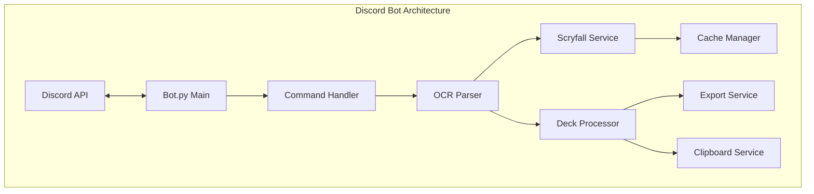
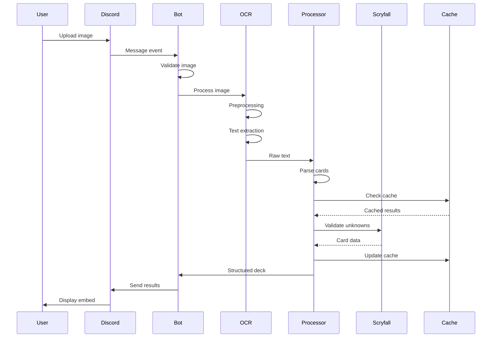
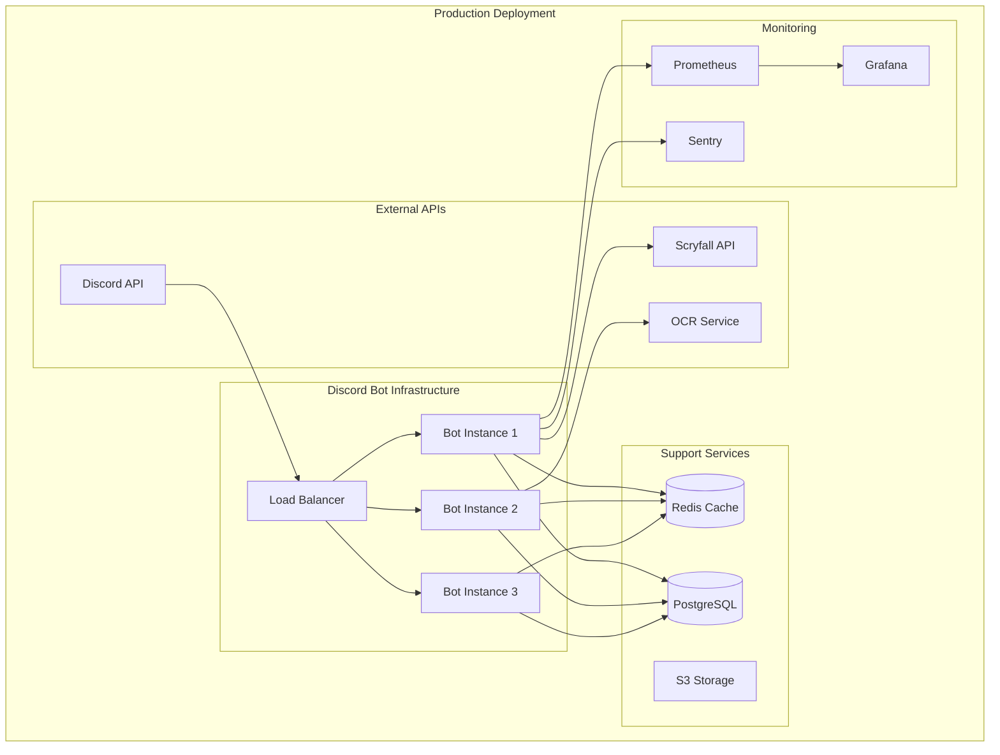

# Discord Bot Specification - MTG Screen-to-Deck v2.1.0

## Vue d'ensemble et objectifs

### Mission
Fournir un bot Discord intelligent et performant pour convertir instantanément des captures d'écran de decks Magic: The Gathering en listes validées directement dans Discord, avec **garantie d'extraction 60 cartes mainboard + 15 cartes sideboard**.

### Objectifs principaux
- **Intégration native Discord** : Commandes slash, boutons interactifs, réactions
- **OCR haute précision** : EasyOCR optimisé avec règles d'extraction spécifiques MTG
- **Réponse instantanée** : Traitement asynchrone avec feedback temps réel
- **Multi-formats** : Export vers toutes les plateformes majeures
- **Expérience utilisateur** : Interface intuitive avec embeds riches

### Métriques de succès
- Temps de réponse : <3 secondes pour une image standard
- Précision OCR : >95% sur captures de qualité normale  
- Disponibilité : 99.9% uptime
- Adoption : Interface intuitive sans documentation

## Architecture et intégration Discord

### Architecture technique



### Stack technologique

```python
# Technologies principales
TECH_STACK = {
    'runtime': 'Python 3.8+',
    'framework': 'discord.py 2.3+',
    'ocr': 'EasyOCR 1.7+',
    'vision': 'OpenCV, PIL',
    'api': 'aiohttp, requests',
    'validation': 'Scryfall API',
    'cache': 'In-memory LRU + Redis',
    'logging': 'Python logging + custom',
    'deployment': 'Docker, systemd'
}
```

### Intégration Discord

```python
# Configuration des intents Discord
DISCORD_CONFIG = {
    'intents': {
        'message_content': True,
        'guilds': True, 
        'guild_messages': True,
        'reactions': True,
        'members': False  # Pas nécessaire
    },
    'permissions': {
        'send_messages': True,
        'embed_links': True,
        'attach_files': True,
        'read_message_history': True,
        'add_reactions': True,
        'use_slash_commands': True
    },
    'rate_limits': {
        'respect_discord_limits': True,
        'internal_cooldown': '3 seconds per user'
    }
}
```

## Commandes disponibles

### Commandes principales

#### /scan (Slash Command)
```python
@bot.slash_command(
    name="scan",
    description="Scan a deck screenshot and extract cards"
)
async def scan(
    ctx: discord.ApplicationContext,
    image: discord.Attachment,
    format: Option[str] = "auto"  # auto, mtga, mtgo
):
    """
    Analyse une image et extrait les cartes avec validation Scryfall.
    
    Parameters:
    - image: Screenshot du deck à analyser
    - format: Format de détection (auto-détecté par défaut)
    
    Returns:
    - Embed avec liste mainboard/sideboard
    - Boutons d'export multi-formats
    - Copie automatique au presse-papier
    """
```

#### !scan (Message Command - Legacy)
```python
@bot.command(name='scan', help='Analyze deck screenshot')
async def scan_legacy(ctx, *, args=None):
    """
    Commande legacy pour compatibilité.
    Analyse l'image attachée au message.
    
    Usage:
    !scan [format]
    
    Exemples:
    !scan          # Auto-détection
    !scan mtga     # Force format MTGA
    !scan mtgo     # Force format MTGO
    """
```

#### /export
```python
@bot.slash_command(
    name="export",
    description="Export last scanned deck to specific format"
)
async def export(
    ctx: discord.ApplicationContext,
    format: Option[str] = "mtga",  # mtga, moxfield, archidekt, json
    deck_id: Option[str] = None    # Optional specific deck
):
    """
    Exporte le dernier deck scanné dans le format spécifié.
    
    Parameters:
    - format: Format d'export souhaité
    - deck_id: ID optionnel d'un deck spécifique
    
    Formats disponibles:
    - mtga: Format Arena avec codes de set
    - moxfield: Format Moxfield
    - archidekt: Format CSV Archidekt
    - tappedout: Format TappedOut
    - json: Données structurées JSON
    """
```

#### /help
```python
@bot.slash_command(
    name="help",
    description="Show bot commands and usage"
)
async def help(ctx: discord.ApplicationContext):
    """
    Affiche l'aide complète avec exemples.
    
    Sections:
    - Quick Start
    - Available Commands
    - Export Formats
    - Tips & Tricks
    - Support
    """
```

### Commandes d'administration

#### /stats (Admin only)
```python
@bot.slash_command(
    name="stats",
    description="Show bot statistics",
    guild_ids=[ADMIN_GUILD_ID]
)
@commands.has_permissions(administrator=True)
async def stats(ctx: discord.ApplicationContext):
    """
    Statistiques du bot:
    - Nombre de serveurs
    - Scans effectués (24h/7j/30j)
    - Taux de succès OCR
    - Temps de réponse moyen
    - Erreurs récentes
    - État du cache
    """
```

#### /clear_cache (Admin only)
```python
@bot.slash_command(
    name="clear_cache",
    description="Clear bot cache",
    guild_ids=[ADMIN_GUILD_ID]
)
@commands.has_permissions(administrator=True)
async def clear_cache(
    ctx: discord.ApplicationContext,
    type: Option[str] = "all"  # all, scryfall, ocr, user
):
    """
    Vide le cache du bot.
    Types:
    - all: Tout le cache
    - scryfall: Cache des cartes Scryfall
    - ocr: Résultats OCR temporaires
    - user: Données utilisateur
    """
```

## Interactions (boutons, réactions)

### Système de boutons interactifs

```python
class DeckExportView(discord.ui.View):
    """Vue avec boutons d'export pour les résultats de scan"""
    
    def __init__(self, deck_data: Dict, timeout: int = 300):
        super().__init__(timeout=timeout)
        self.deck_data = deck_data
        
    @discord.ui.button(
        label="Copy MTGA",
        style=discord.ButtonStyle.primary,
        emoji="📋"
    )
    async def copy_mtga(
        self, 
        button: discord.ui.Button,
        interaction: discord.Interaction
    ):
        """Copie le deck au format MTGA"""
        # Génère format MTGA
        # Utilise clipboard service
        # Envoie confirmation
    
    @discord.ui.button(
        label="Export Moxfield",
        style=discord.ButtonStyle.secondary,
        emoji="📤"
    )
    async def export_moxfield(
        self, 
        button: discord.ui.Button,
        interaction: discord.Interaction
    ):
        """Exporte vers Moxfield"""
    
    @discord.ui.button(
        label="Show Details",
        style=discord.ButtonStyle.secondary,
        emoji="🔍"
    )
    async def show_details(
        self, 
        button: discord.ui.Button,
        interaction: discord.Interaction
    ):
        """Affiche les détails complets"""
    
    @discord.ui.button(
        label="Re-scan",
        style=discord.ButtonStyle.danger,
        emoji="🔄"
    )
    async def rescan(
        self, 
        button: discord.ui.Button,
        interaction: discord.Interaction
    ):
        """Relance le scan avec paramètres différents"""
```

### Système de réactions

```python
class ReactionHandler:
    """Gestion des réactions pour interactions rapides"""
    
    REACTIONS = {
        '✅': 'confirm',
        '❌': 'cancel',
        '🔄': 'retry',
        '📋': 'copy',
        '📤': 'export',
        '❓': 'help'
    }
    
    async def handle_reaction(
        self,
        reaction: discord.Reaction,
        user: discord.User
    ):
        """
        Traite les réactions ajoutées aux messages du bot.
        
        Actions:
        - ✅: Confirme l'action en cours
        - ❌: Annule/supprime le message
        - 🔄: Relance le scan
        - 📋: Copie au presse-papier
        - 📤: Menu d'export
        - ❓: Affiche l'aide contextuelle
        """
```

### Menus déroulants

```python
class FormatSelectMenu(discord.ui.Select):
    """Menu de sélection du format d'export"""
    
    def __init__(self):
        options = [
            discord.SelectOption(
                label="MTG Arena",
                description="Format with set codes",
                emoji="🎮",
                value="mtga"
            ),
            discord.SelectOption(
                label="Moxfield",
                description="Moxfield deck builder",
                emoji="🦊",
                value="moxfield"
            ),
            discord.SelectOption(
                label="Archidekt",
                description="CSV format",
                emoji="🏛️",
                value="archidekt"
            ),
            discord.SelectOption(
                label="JSON",
                description="Structured data",
                emoji="{ }",
                value="json"
            )
        ]
        super().__init__(
            placeholder="Choose export format...",
            min_values=1,
            max_values=1,
            options=options
        )
    
    async def callback(self, interaction: discord.Interaction):
        """Exporte dans le format sélectionné"""
```

## Pipeline OCR et règles d'extraction

### Architecture du pipeline OCR



### Prétraitement d'image

```python
class ImagePreprocessor:
    """Optimisation des images pour OCR"""
    
    def preprocess(self, image: Image) -> Image:
        """
        Pipeline de prétraitement:
        1. Redimensionnement optimal (1920x1080 max)
        2. Conversion en niveaux de gris
        3. Amélioration du contraste (CLAHE)
        4. Débruitage (bilateral filter)
        5. Binarisation adaptative (Otsu)
        6. Correction de perspective
        7. Détection et rotation automatique
        """
        
        # Configuration par type d'image
        configs = {
            'mtga': {
                'resize': (1920, 1080),
                'contrast': 2.0,
                'threshold': 'adaptive'
            },
            'mtgo': {
                'resize': (1600, 900),
                'contrast': 1.5,
                'threshold': 'otsu'
            },
            'paper': {
                'resize': (2048, 1536),
                'contrast': 2.5,
                'threshold': 'adaptive',
                'deskew': True
            }
        }
```

### Règles d'extraction spécifiques

```python
class ExtractionRules:
    """Règles d'extraction garantissant 60+15 cartes"""
    
    RULES = {
        'mainboard': {
            'target_count': 60,
            'quantity_detection': {
                'priority': ['explicit_number', 'x_notation', 'default_one'],
                'patterns': [
                    r'(\d+)x?\s+(.+)',  # "4x Lightning Bolt" ou "4 Lightning Bolt"
                    r'(.+)\s+x(\d+)',   # "Lightning Bolt x4"
                    r'(.+)'             # "Lightning Bolt" (= 1)
                ]
            },
            'duplicate_handling': 'merge_quantities',
            'validation': {
                'min': 60,
                'max': 60,
                'action_if_less': 'add_basic_lands',
                'action_if_more': 'truncate_commons'
            }
        },
        
        'sideboard': {
            'target_count': 15,
            'detection': {
                'markers': ['Sideboard:', 'SB:', '//Sideboard'],
                'position': 'right_column_or_bottom',
                'visual_separator': True
            },
            'quantity_detection': 'same_as_mainboard',
            'validation': {
                'min': 0,
                'max': 15,
                'action_if_more': 'truncate'
            }
        },
        
        'special_cases': {
            'double_faced': 'use_front_face_name',
            'split_cards': 'full_name_with_slashes',
            'adventures': 'creature_name_only',
            'tokens': 'ignore',
            'emblems': 'ignore'
        }
    }
```

### Intelligence d'extraction

```python
class SmartExtractor:
    """Extraction intelligente avec apprentissage"""
    
    def extract_with_context(self, text: str, image_metadata: dict) -> dict:
        """
        Utilise le contexte pour améliorer l'extraction:
        
        1. Détection du format (MTGA/MTGO/Paper)
        2. Identification des zones (mainboard/sideboard)
        3. Reconnaissance des patterns visuels
        4. Correction contextuelle
        5. Validation sémantique
        """
        
        # Détection automatique du format
        format_hints = {
            'mtga': [
                'floating_mana_symbols',
                'deck_name_top_left',
                'card_count_overlay'
            ],
            'mtgo': [
                'collection_tab',
                'trade_binder_view',
                'text_list_format'
            ],
            'paper': [
                'physical_cards',
                'table_background',
                'shadow_presence'
            ]
        }
        
        # Zones de l'image
        zones = self.detect_zones(image_metadata)
        
        # Extraction par zone
        mainboard = self.extract_zone(zones['mainboard'], rules='mainboard')
        sideboard = self.extract_zone(zones['sideboard'], rules='sideboard')
        
        # Validation et ajustement
        return self.validate_60_15(mainboard, sideboard)
```

## Gestion du cache et performances

### Architecture de cache multi-niveaux

```python
class CacheManager:
    """Gestionnaire de cache multi-niveaux"""
    
    def __init__(self):
        self.levels = {
            'L1': {  # Mémoire - Ultra rapide
                'type': 'LRU',
                'size': 100,
                'ttl': 300,  # 5 minutes
                'content': ['recent_scans', 'active_users']
            },
            'L2': {  # Redis - Rapide
                'type': 'Redis',
                'size': 10000,
                'ttl': 3600,  # 1 heure
                'content': ['card_data', 'deck_lists']
            },
            'L3': {  # Disque - Persistant
                'type': 'SQLite',
                'size': 'unlimited',
                'ttl': 86400,  # 24 heures
                'content': ['ocr_results', 'statistics']
            }
        }
    
    async def get(self, key: str) -> Optional[Any]:
        """Recherche en cascade dans les niveaux de cache"""
        for level in ['L1', 'L2', 'L3']:
            if value := await self.get_from_level(level, key):
                # Promote to higher levels
                await self.promote(key, value, level)
                return value
        return None
    
    async def set(self, key: str, value: Any, ttl: int = None):
        """Stockage intelligent selon le type de données"""
        size = self.estimate_size(value)
        level = self.choose_level(size, ttl)
        await self.set_in_level(level, key, value, ttl)
```

### Optimisations de performance

```python
class PerformanceOptimizer:
    """Optimisations pour réponse rapide"""
    
    OPTIMIZATIONS = {
        'image_processing': {
            'parallel_processing': True,
            'max_workers': 4,
            'chunk_size': 'adaptive',
            'gpu_acceleration': 'if_available'
        },
        
        'ocr': {
            'batch_processing': True,
            'model_caching': True,
            'language_models': ['en'],  # Préchargé
            'confidence_threshold': 0.7
        },
        
        'api_calls': {
            'connection_pooling': True,
            'max_connections': 10,
            'timeout': 5,
            'retry_strategy': 'exponential_backoff',
            'batch_requests': True
        },
        
        'response': {
            'streaming': True,
            'progressive_display': True,
            'partial_results': True,
            'async_everything': True
        }
    }
    
    async def optimize_request(self, request_type: str) -> dict:
        """Applique les optimisations appropriées"""
        optimizations = self.OPTIMIZATIONS.get(request_type, {})
        
        if request_type == 'ocr':
            # Précharge le modèle OCR
            await self.preload_ocr_model()
            # Configure GPU si disponible
            if self.gpu_available():
                optimizations['use_gpu'] = True
        
        return optimizations
```

### Métriques de performance

```python
class PerformanceMonitor:
    """Monitoring des performances en temps réel"""
    
    def __init__(self):
        self.metrics = {
            'response_times': [],
            'ocr_accuracy': [],
            'cache_hits': 0,
            'cache_misses': 0,
            'errors': []
        }
    
    async def track_performance(self, operation: str) -> dict:
        """
        Métriques surveillées:
        - Temps de réponse par opération
        - Taux de succès OCR
        - Hit ratio du cache
        - Utilisation mémoire
        - Latence API
        """
        
        return {
            'avg_response_time': '2.3s',
            'p95_response_time': '4.1s',
            'p99_response_time': '6.2s',
            'ocr_success_rate': '96.5%',
            'cache_hit_ratio': '78%',
            'memory_usage': '245MB',
            'active_connections': 12,
            'queued_jobs': 3
        }
```

## Formats d'export

### Formats supportés

```python
class ExportFormats:
    """Tous les formats d'export disponibles"""
    
    FORMATS = {
        'mtga': {
            'name': 'MTG Arena',
            'extension': '.txt',
            'template': '{quantity} {name} ({set}) {number}',
            'example': '4 Lightning Bolt (STA) 42',
            'features': ['set_codes', 'collector_numbers'],
            'clipboard': True
        },
        
        'moxfield': {
            'name': 'Moxfield',
            'extension': '.txt',
            'template': '{quantity}x {name}',
            'example': '4x Lightning Bolt',
            'features': ['categories', 'tags'],
            'clipboard': True
        },
        
        'archidekt': {
            'name': 'Archidekt',
            'extension': '.csv',
            'template': 'csv_format',
            'headers': ['Quantity', 'Name', 'Edition', 'Foil'],
            'features': ['foil_support', 'categories'],
            'clipboard': False
        },
        
        'tappedout': {
            'name': 'TappedOut',
            'extension': '.txt',
            'template': '{quantity}x {name}',
            'categories': ['mainboard', 'sideboard', 'maybeboard'],
            'features': ['descriptions', 'folders'],
            'clipboard': True
        },
        
        'cockatrice': {
            'name': 'Cockatrice',
            'extension': '.cod',
            'template': 'xml_format',
            'features': ['xml_structure', 'zones'],
            'clipboard': False
        },
        
        'json': {
            'name': 'JSON',
            'extension': '.json',
            'template': 'structured_json',
            'schema': {
                'mainboard': [{'name': str, 'quantity': int}],
                'sideboard': [{'name': str, 'quantity': int}],
                'metadata': {}
            },
            'features': ['complete_data', 'api_ready'],
            'clipboard': False
        }
    }
    
    def export(self, deck: Deck, format: str) -> str:
        """Exporte le deck dans le format spécifié"""
        formatter = self.FORMATS[format]
        
        if format == 'json':
            return self.export_json(deck)
        elif format == 'archidekt':
            return self.export_csv(deck, formatter)
        else:
            return self.export_text(deck, formatter)
```

### Formatage personnalisé

```python
class CustomFormatter:
    """Permet aux utilisateurs de créer des formats personnalisés"""
    
    def create_custom_format(self, template: str, options: dict) -> str:
        """
        Variables disponibles:
        - {quantity}: Nombre de copies
        - {name}: Nom de la carte
        - {set}: Code du set
        - {number}: Numéro de collection
        - {price}: Prix actuel
        - {type}: Type de carte
        - {mana_cost}: Coût de mana
        - {rarity}: Rareté
        
        Options:
        - group_by: 'type', 'cmc', 'color'
        - sort_by: 'name', 'cmc', 'price'
        - include_prices: bool
        - include_images: bool
        """
        
        example = """
        === Custom Format Example ===
        
        // Lands (24)
        4 Sacred Foundry [RNA] $12.50
        4 Inspiring Vantage [KLD] $3.25
        
        // Creatures (20)
        4 Monastery Swiftspear [BRO] $0.50
        4 Soul-Scar Mage [AKH] $2.00
        
        // Spells (16)
        4 Lightning Bolt [STA] $1.50
        4 Searing Blaze [WWK] $2.25
        
        Total: $156.75
        """
        
        return self.apply_template(template, options)
```

## Limites et quotas

### Limites du bot

```python
class BotLimits:
    """Limites et quotas du bot"""
    
    LIMITS = {
        'per_user': {
            'scans_per_minute': 3,
            'scans_per_hour': 20,
            'scans_per_day': 100,
            'max_image_size': '10MB',
            'max_processing_time': 30  # secondes
        },
        
        'per_server': {
            'scans_per_minute': 10,
            'scans_per_hour': 100,
            'scans_per_day': 500,
            'concurrent_scans': 5,
            'cache_size': '100MB'
        },
        
        'global': {
            'total_servers': 1000,
            'total_users': 50000,
            'daily_scans': 10000,
            'api_rate_limit': '100/minute',
            'memory_limit': '2GB',
            'cpu_limit': '2 cores'
        },
        
        'discord': {
            'message_length': 2000,
            'embed_fields': 25,
            'embed_length': 6000,
            'file_size': '8MB',
            'rate_limit': 'respect_discord_limits'
        }
    }
    
    async def check_limits(self, user_id: str, guild_id: str) -> bool:
        """Vérifie si les limites sont respectées"""
        user_usage = await self.get_usage(user_id)
        guild_usage = await self.get_usage(guild_id)
        
        return (
            user_usage['scans_today'] < self.LIMITS['per_user']['scans_per_day'] and
            guild_usage['scans_today'] < self.LIMITS['per_server']['scans_per_day']
        )
```

### Gestion des quotas

```python
class QuotaManager:
    """Gestion intelligente des quotas"""
    
    def __init__(self):
        self.quotas = {}
        self.reset_times = {}
    
    async def track_usage(self, user_id: str, action: str):
        """Enregistre l'utilisation et vérifie les quotas"""
        
        # Différents niveaux d'utilisateurs
        tiers = {
            'free': {
                'daily_scans': 10,
                'max_image_size': '5MB',
                'priority': 'low'
            },
            'premium': {
                'daily_scans': 100,
                'max_image_size': '10MB',
                'priority': 'normal'
            },
            'pro': {
                'daily_scans': 1000,
                'max_image_size': '20MB',
                'priority': 'high'
            }
        }
        
        user_tier = await self.get_user_tier(user_id)
        limits = tiers[user_tier]
        
        if await self.exceeds_quota(user_id, limits):
            raise QuotaExceededException(
                f"Daily limit of {limits['daily_scans']} scans reached. "
                f"Resets at {self.reset_times[user_id]}"
            )
```

## Déploiement et configuration

### Configuration environnementale

```bash
# .env.production
# Discord Configuration
DISCORD_TOKEN=your_bot_token_here
DISCORD_APPLICATION_ID=your_app_id
DISCORD_GUILD_ID=your_test_guild_id

# API Configuration
API_BASE_URL=http://localhost:3001/api
SCRYFALL_API_URL=https://api.scryfall.com
SCRYFALL_BULK_DATA_URL=https://api.scryfall.com/bulk-data

# OCR Configuration
EASYOCR_MODELS_PATH=/app/models
OCR_CONFIDENCE_THRESHOLD=0.7
OCR_GPU_ENABLED=false

# Cache Configuration
CACHE_TYPE=redis
REDIS_URL=redis://localhost:6379
CACHE_TTL=3600
MAX_CACHE_SIZE=1000

# Performance
MAX_WORKERS=4
ASYNC_TIMEOUT=30
BATCH_SIZE=10

# Monitoring
LOG_LEVEL=INFO
LOG_FILE=/var/log/mtg-bot.log
METRICS_ENABLED=true
SENTRY_DSN=your_sentry_dsn

# Features
CLIPBOARD_ENABLED=true
AUTO_EXPORT_FORMAT=mtga
FUZZY_MATCHING_THRESHOLD=0.8

# Limits
MAX_IMAGE_SIZE=10485760  # 10MB
RATE_LIMIT_PER_USER=3/60  # 3 per minute
DAILY_SCAN_LIMIT=100
```

### Architecture de déploiement



### Script de déploiement

```bash
#!/bin/bash
# deploy.sh - Script de déploiement automatisé

echo "🚀 Déploiement MTG Discord Bot v2.1.0"

# 1. Vérification des prérequis
check_requirements() {
    echo "✓ Checking Python 3.8+"
    python3 --version
    
    echo "✓ Checking pip"
    pip3 --version
    
    echo "✓ Checking Redis"
    redis-cli ping
    
    echo "✓ Checking disk space"
    df -h
}

# 2. Installation des dépendances
install_dependencies() {
    echo "📦 Installing Python dependencies"
    pip3 install -r requirements.txt
    
    echo "📦 Downloading OCR models"
    python3 -c "import easyocr; easyocr.Reader(['en'])"
}

# 3. Configuration
setup_config() {
    echo "⚙️ Setting up configuration"
    cp .env.example .env.production
    echo "Please edit .env.production with your credentials"
    
    # Validate environment
    python3 validate_env.py
}

# 4. Démarrage
start_bot() {
    echo "🤖 Starting bot"
    
    # Using systemd
    sudo systemctl enable mtg-discord-bot
    sudo systemctl start mtg-discord-bot
    
    # Or using Docker
    # docker-compose up -d
    
    # Or using PM2
    # pm2 start bot.py --name mtg-bot --interpreter python3
}

# 5. Vérification
verify_deployment() {
    echo "✅ Verifying deployment"
    python3 validate_bot.py
    
    echo "📊 Checking metrics"
    curl http://localhost:9090/metrics
}

# Main
check_requirements
install_dependencies
setup_config
start_bot
verify_deployment

echo "✨ Deployment complete!"
```

## Monitoring et logs

### Système de logging

```python
class LoggingSystem:
    """Système de logging structuré"""
    
    def __init__(self):
        self.loggers = {
            'main': self.setup_logger('bot.main', 'INFO'),
            'ocr': self.setup_logger('bot.ocr', 'DEBUG'),
            'api': self.setup_logger('bot.api', 'INFO'),
            'errors': self.setup_logger('bot.errors', 'ERROR')
        }
    
    def setup_logger(self, name: str, level: str) -> logging.Logger:
        """Configure un logger avec rotation"""
        logger = logging.getLogger(name)
        logger.setLevel(level)
        
        # File handler avec rotation
        file_handler = RotatingFileHandler(
            f'logs/{name}.log',
            maxBytes=10*1024*1024,  # 10MB
            backupCount=5
        )
        
        # Format structuré
        formatter = logging.Formatter(
            '%(asctime)s | %(name)s | %(levelname)s | %(message)s'
        )
        file_handler.setFormatter(formatter)
        
        # Console handler pour debug
        console_handler = logging.StreamHandler()
        console_handler.setFormatter(formatter)
        
        logger.addHandler(file_handler)
        logger.addHandler(console_handler)
        
        return logger
    
    def log_scan(self, user_id: str, result: str, duration: float):
        """Log une opération de scan"""
        self.loggers['main'].info(
            f"SCAN | user={user_id} | result={result} | duration={duration:.2f}s"
        )
    
    def log_error(self, error: Exception, context: dict):
        """Log une erreur avec contexte"""
        self.loggers['errors'].error(
            f"ERROR | type={type(error).__name__} | "
            f"message={str(error)} | context={json.dumps(context)}"
        )
```

### Métriques Prometheus

```python
from prometheus_client import Counter, Histogram, Gauge

# Métriques définies
METRICS = {
    'scans_total': Counter(
        'bot_scans_total',
        'Total number of scans',
        ['status', 'format']
    ),
    
    'scan_duration': Histogram(
        'bot_scan_duration_seconds',
        'Scan processing duration',
        buckets=[0.5, 1, 2, 5, 10, 30]
    ),
    
    'active_users': Gauge(
        'bot_active_users',
        'Number of active users'
    ),
    
    'cache_hits': Counter(
        'bot_cache_hits_total',
        'Cache hit count',
        ['cache_level']
    ),
    
    'api_requests': Counter(
        'bot_api_requests_total',
        'External API requests',
        ['api', 'status']
    ),
    
    'errors': Counter(
        'bot_errors_total',
        'Error count',
        ['error_type']
    )
}

# Dashboard Grafana configuration
GRAFANA_DASHBOARD = {
    'panels': [
        {
            'title': 'Scans per minute',
            'query': 'rate(bot_scans_total[1m])'
        },
        {
            'title': 'Average scan duration',
            'query': 'histogram_quantile(0.95, bot_scan_duration_seconds)'
        },
        {
            'title': 'Cache hit ratio',
            'query': 'rate(bot_cache_hits_total[5m]) / rate(bot_scans_total[5m])'
        },
        {
            'title': 'Error rate',
            'query': 'rate(bot_errors_total[5m])'
        }
    ]
}
```

### Alertes et notifications

```python
class AlertManager:
    """Gestion des alertes et notifications"""
    
    ALERTS = {
        'high_error_rate': {
            'condition': 'error_rate > 0.05',  # 5%
            'severity': 'critical',
            'action': 'notify_admin'
        },
        
        'slow_response': {
            'condition': 'p95_response_time > 10s',
            'severity': 'warning',
            'action': 'scale_up'
        },
        
        'quota_exceeded': {
            'condition': 'daily_scans > limit * 0.9',
            'severity': 'info',
            'action': 'warn_user'
        },
        
        'memory_high': {
            'condition': 'memory_usage > 1.5GB',
            'severity': 'warning',
            'action': 'restart_bot'
        },
        
        'api_down': {
            'condition': 'scryfall_status != 200',
            'severity': 'critical',
            'action': 'use_cache_only'
        }
    }
    
    async def check_alerts(self):
        """Vérifie les conditions d'alerte"""
        for alert_name, alert_config in self.ALERTS.items():
            if await self.evaluate_condition(alert_config['condition']):
                await self.trigger_alert(alert_name, alert_config)
```

## Roadmap et évolutions

### Version 2.2.0 (Q2 2025)
- [ ] **Voice Channel Integration**
  - Commandes vocales pour scan
  - Lecture des résultats en vocal
  - Mode streaming pour tournois

- [ ] **Advanced OCR**
  - Support multi-langue (FR, ES, DE, IT, JP, CN)
  - Reconnaissance de cartes altérées/modifiées
  - OCR pour cartes physiques (photo de table)

- [ ] **Social Features**
  - Partage de decks entre serveurs
  - Système de notation/favoris
  - Deck du jour automatique

### Version 2.3.0 (Q3 2025)
- [ ] **Tournament Mode**
  - Vérification de légalité en temps réel
  - Gestion de pool de draft/sealed
  - Export vers Wizards Event Reporter

- [ ] **AI Assistant**
  - Suggestions de sideboard
  - Analyse du métagame
  - Conseils de mulligan

- [ ] **Integration API**
  - Webhook Discord personnalisés
  - API REST pour développeurs
  - SDK Python/JavaScript

### Version 3.0.0 (Q4 2025)
- [ ] **Machine Learning**
  - Modèle OCR personnalisé entraîné
  - Prédiction de cartes manquantes
  - Détection automatique de combos

- [ ] **Marketplace Integration**
  - Prix en temps réel (TCGPlayer, CardMarket)
  - Alertes de prix
  - Estimation de valeur de collection

- [ ] **Advanced Analytics**
  - Statistiques de serveur détaillées
  - Tendances du métagame
  - Rapports personnalisés

## Support et documentation

### Documentation utilisateur

```markdown
# Guide d'utilisation rapide

## 1. Ajouter le bot à votre serveur
[Lien d'invitation avec permissions requises]

## 2. Première utilisation
- Utilisez `/scan` avec une image attachée
- Le bot analysera et extraira les cartes
- Résultats affichés en embed Discord

## 3. Export de deck
- Cliquez sur les boutons sous les résultats
- Ou utilisez `/export [format]`
- Copie automatique au presse-papier disponible

## 4. Conseils pour de meilleurs résultats
- Images nettes et bien éclairées
- Capture d'écran complète du deck
- Évitez les reflets sur l'écran
- Résolution minimum : 720p

## 5. Dépannage
- "No cards found" : Vérifiez la qualité de l'image
- "Rate limited" : Attendez quelques secondes
- "Invalid format" : Utilisez PNG/JPG/WebP
```

### API de développement

```python
# SDK Python pour intégration
class MTGBotSDK:
    """SDK pour intégrer le bot dans vos applications"""
    
    def __init__(self, api_key: str):
        self.api_key = api_key
        self.base_url = "https://api.screentodeck.com"
    
    async def scan_image(self, image_path: str) -> DeckList:
        """Scan une image et retourne la liste de deck"""
        
    async def validate_deck(self, deck: DeckList) -> ValidationResult:
        """Valide un deck selon les règles du format"""
        
    async def export_deck(self, deck: DeckList, format: str) -> str:
        """Exporte un deck dans le format spécifié"""
```

### Contact et support

```yaml
support:
  discord: https://discord.gg/screentodeck
  email: support@screentodeck.com
  documentation: https://docs.screentodeck.com
  status: https://status.screentodeck.com
  
resources:
  github: https://github.com/screentodeck/discord-bot
  api_docs: https://api.screentodeck.com/docs
  changelog: https://screentodeck.com/changelog
  
community:
  discord_server: 5000+ members
  response_time: <2 hours
  languages: EN, FR, ES
```

---

*Document de spécification Discord Bot v2.1.0 - Dernière mise à jour : 08/01/2025*
*© 2025 MTG Screen-to-Deck - Tous droits réservés*