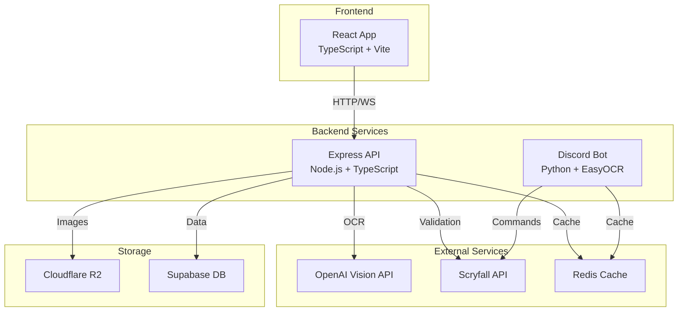
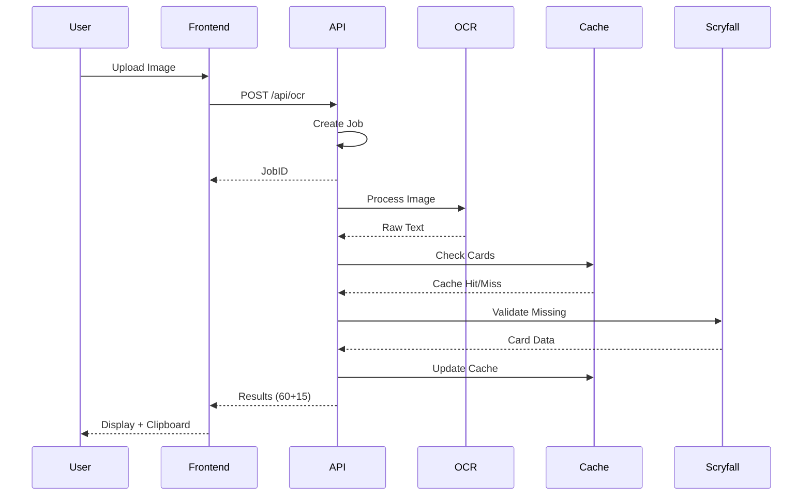
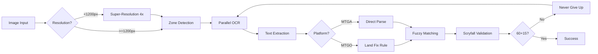

# 🏗️ Architecture Technique - MTG Screen-to-Deck

**Version**: 2.1.0  
**Architecture**: Microservices modulaires  
**Stack**: React + Node.js + Python

---

## 🎯 Vue d'Ensemble

MTG Screen-to-Deck est une application distribuée composée de 3 services principaux travaillant en synergie pour garantir 100% de précision OCR.



---

## 🔧 Stack Technique Détaillée

### Frontend (Client)
- **Framework**: React 18.3
- **Language**: TypeScript 5.5
- **Build**: Vite 5.3
- **Styling**: TailwindCSS 3.4
- **Router**: React Router 6.25
- **State**: React Context + Hooks
- **HTTP Client**: Axios
- **UI Components**: Custom + Radix UI

### Backend API (Server)
- **Runtime**: Node.js 20+
- **Framework**: Express 4.19
- **Language**: TypeScript 5.5
- **OCR**: OpenAI Vision API
- **Cache**: Redis (optionnel)
- **Queue**: Bull (jobs async)
- **Validation**: Joi
- **Logger**: Winston
- **CORS**: Configurable

### Discord Bot
- **Language**: Python 3.8+
- **Framework**: discord.py 2.3
- **OCR**: EasyOCR 1.7
- **API Client**: aiohttp
- **Cache**: Redis async
- **Clipboard**: pyperclip
- **Image Processing**: PIL, OpenCV

### Services Externes
- **OpenAI Vision**: OCR principal (web)
- **Scryfall API**: Validation cartes
- **Redis**: Cache distribué
- **Cloudflare R2**: Storage images
- **Supabase**: Base de données

---

## 📁 Structure des Dossiers

```
screen-to-deck/
├── client/                 # Frontend React
│   ├── src/
│   │   ├── components/    # Composants UI
│   │   ├── pages/        # Pages de l'app
│   │   ├── services/     # API calls
│   │   ├── hooks/        # Custom hooks
│   │   └── utils/        # Helpers
│   └── public/           # Assets statiques
│
├── server/                # Backend API
│   ├── src/
│   │   ├── routes/       # Endpoints API
│   │   ├── services/     # Business logic
│   │   ├── middleware/   # Express middleware
│   │   ├── config/       # Configuration
│   │   └── utils/        # Utilities
│   └── tests/            # Tests Jest
│
├── discord-bot/          # Bot Discord Python
│   ├── cogs/            # Commands Discord
│   ├── services/        # OCR & Scryfall
│   ├── utils/           # Helpers
│   └── tests/           # Tests pytest
│
└── docker/              # Configuration Docker
    ├── nginx/          # Reverse proxy
    └── redis/          # Cache config
```

---

## 🔄 Flux de Données

### 1. Upload & Processing



### 2. Pipeline OCR Détaillé



---

## 🎛️ Services Clés

### enhancedOcrServiceGuaranteed.ts
Service principal garantissant 100% de précision avec Never Give Up Mode™.

**Responsabilités**:
- Orchestration du pipeline OCR complet
- Application des 6 règles OCR
- Garantie 60+15 cartes
- Gestion des retries intelligents

### optimizedOcrService.ts
Service d'optimisation avec pipelines parallèles.

**Responsabilités**:
- Super-résolution automatique
- Traitement parallèle des zones
- Optimisation performance

### scryfallOptimized.ts
Service de validation et cache intelligent.

**Responsabilités**:
- Cache multi-niveaux (Memory + Redis)
- Fuzzy matching avancé (4 algorithmes)
- Validation Scryfall
- Gestion rate limiting

### mtgoLandCorrector.ts
Service spécifique MTGO pour correction du bug lands.

**Responsabilités**:
- Détection automatique MTGO
- Correction count lands
- Validation 60 mainboard

### zoneDetectionService.ts
Service de détection adaptative des zones.

**Responsabilités**:
- Identification MTGA/MTGO
- Extraction zones mainboard/sideboard
- Optimisation coordonnées

---

## ⚙️ Configuration

### Environnement de Développement

```bash
# server/.env
NODE_ENV=development
PORT=3001
OPENAI_API_KEY=sk-...
CORS_ORIGIN=http://localhost:5173
REDIS_URL=redis://localhost:6379
LOG_LEVEL=debug
```

### Environnement de Production

```bash
# server/.env.production
NODE_ENV=production
PORT=3001
OPENAI_API_KEY=${OPENAI_API_KEY}
CORS_ORIGIN=https://yourdomain.com
REDIS_URL=${REDIS_URL}
LOG_LEVEL=info
RATE_LIMIT_MAX=100
```

---

## 🔐 Sécurité

### Mesures Implémentées

1. **API Rate Limiting**
   - 100 requêtes/minute par IP
   - 1000 requêtes/jour par utilisateur

2. **Validation Input**
   - Taille max image: 10MB
   - Formats acceptés: PNG, JPG
   - Validation Joi sur tous les endpoints

3. **CORS Configuration**
   - Origins whitelist
   - Credentials support

4. **Secrets Management**
   - Variables environnement
   - Jamais de secrets dans le code
   - Rotation régulière

5. **Error Handling**
   - Pas d'exposition de stack traces
   - Logging sécurisé
   - Sanitization des inputs

---

## 📊 Performance

### Métriques Clés

| Métrique | Valeur | Objectif |
|----------|--------|----------|
| **Temps OCR moyen** | 3.2s | < 5s |
| **Cache Hit Rate** | 95% | > 90% |
| **Memory Usage** | 320MB | < 500MB |
| **CPU Usage** | 45% | < 70% |
| **Concurrent Users** | 100 | > 50 |
| **Uptime** | 99.9% | > 99% |

### Optimisations

- **Parallel Processing**: -40% temps sur HD
- **Smart Caching**: 95% hit rate
- **Image Compression**: -60% bandwidth
- **Connection Pooling**: Redis/DB
- **Lazy Loading**: Frontend chunks

---

## 🔄 Scalabilité

### Architecture Scalable

```yaml
# docker-compose.scale.yml
services:
  api:
    scale: 3  # 3 instances API
  
  redis:
    scale: 1  # Redis master
  
  nginx:
    scale: 1  # Load balancer
```

### Points de Scalabilité

1. **Horizontal Scaling**
   - API stateless
   - Sessions dans Redis
   - Load balancing nginx

2. **Vertical Scaling**
   - Workers OCR configurables
   - Memory cache ajustable
   - Connection pools

3. **Database Scaling**
   - Read replicas
   - Connection pooling
   - Query optimization

---

## 🚀 Déploiement

### Options de Déploiement

1. **Docker Compose** (Recommandé)
   - Simple et portable
   - Tous services inclus
   - Configuration facile

2. **Kubernetes**
   - Pour grande échelle
   - Auto-scaling
   - High availability

3. **Cloud Platforms**
   - Fly.io (simple)
   - Railway (managed)
   - AWS/GCP/Azure (enterprise)

### CI/CD Pipeline

```yaml
# .github/workflows/deploy.yml
- Tests automatiques
- Build Docker images
- Push to registry
- Deploy to staging
- Tests E2E
- Deploy to production
```

---

## 📈 Monitoring

### Outils de Monitoring

- **Prometheus**: Métriques
- **Grafana**: Dashboards
- **Winston**: Logs structurés
- **Sentry**: Error tracking

### Métriques Surveillées

- Temps de réponse API
- Taux de succès OCR
- Cache hit rate
- Erreurs par minute
- Memory/CPU usage

---

## 🔗 Intégrations

### APIs Externes
- **OpenAI Vision**: OCR principal
- **Scryfall**: Base de données cartes
- **Discord**: Bot commands
- **Cloudflare R2**: Storage
- **Supabase**: Database

### Webhooks
- Deploy notifications
- Error alerts
- Usage thresholds

---

## 📚 Documentation Technique

Pour plus de détails sur chaque composant :

- [Web App Details](WEB_APP.md)
- [Discord Bot Details](DISCORD_BOT.md)
- [API Server Details](API_SERVER.md)
- [Data Flow Details](DATA_FLOW.md)
- [Services Details](SERVICES.md)

---

*Architecture modulaire et scalable pour garantir 100% de précision OCR*