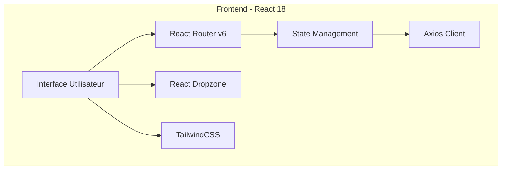
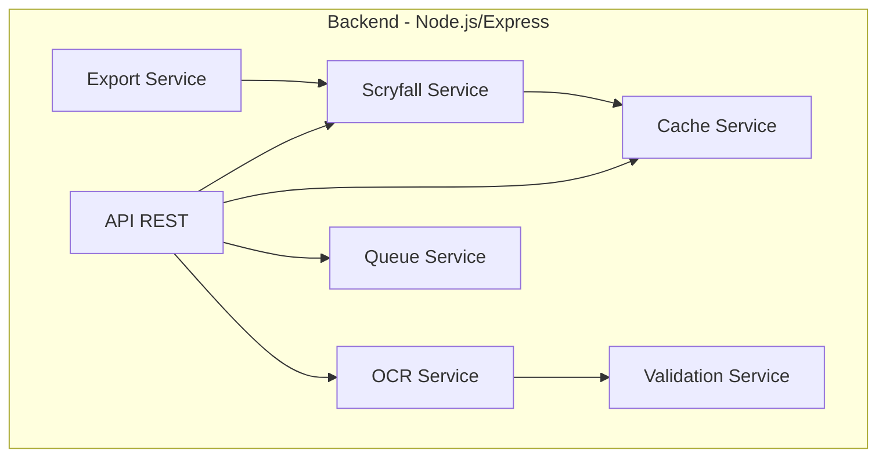
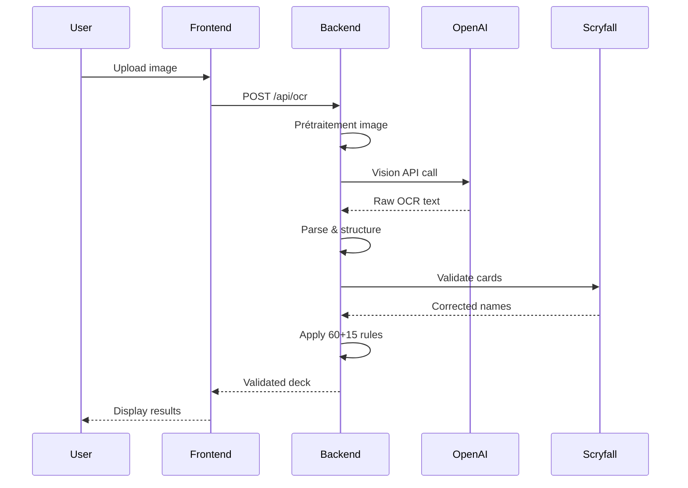
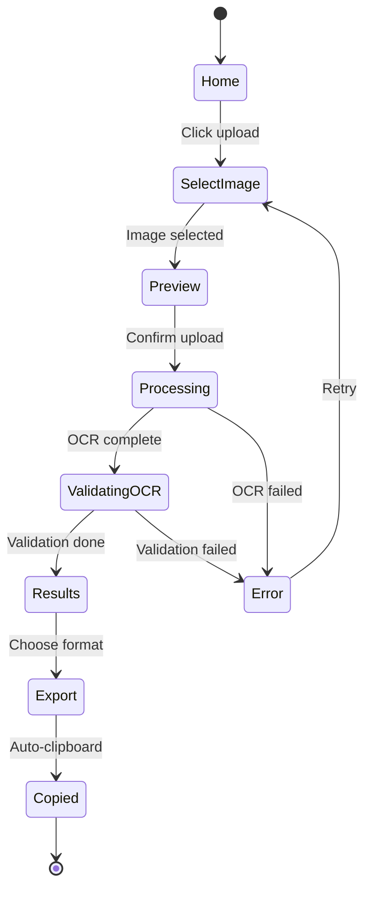
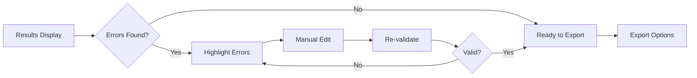
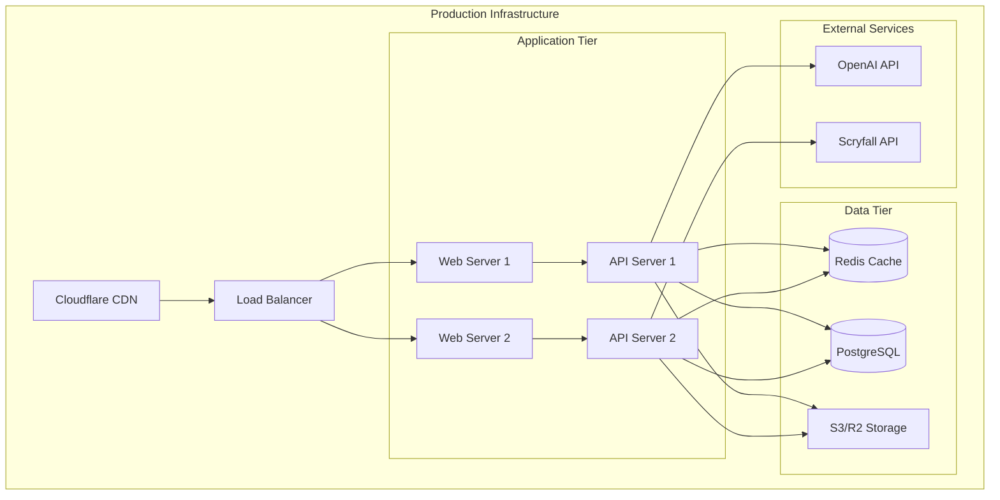

# Web Application Specification - MTG Screen-to-Deck v2.1.0

## Vue d'ensemble et objectifs

### Mission
Fournir une application web moderne et intuitive pour convertir automatiquement des captures d'écran de decks Magic: The Gathering en listes de decks validées et exportables, avec une **garantie de conversion 60 cartes mainboard + 15 cartes sideboard**.

### Objectifs principaux
- **Précision OCR maximale** : Extraction garantie de 60+15 cartes via OpenAI Vision API
- **Validation automatique** : Vérification et correction via l'API Scryfall
- **Performance optimale** : Traitement parallèle et mise en cache intelligente
- **Expérience utilisateur fluide** : Interface responsive avec feedback temps réel
- **Formats multiples** : Export vers MTGA, Moxfield, Archidekt, TappedOut

### Métriques de succès
- Taux de réussite OCR : >95% sur images de qualité standard
- Temps de traitement : <5 secondes pour une image standard
- Taux de validation Scryfall : 100% des cartes reconnues
- Satisfaction utilisateur : Interface intuitive sans courbe d'apprentissage

## Architecture technique

### Stack Frontend


**Technologies clés :**
- **Framework** : React 18 avec TypeScript
- **Build Tool** : Vite 4.5
- **Styling** : TailwindCSS 3.3 + HeadlessUI
- **HTTP Client** : Axios 1.6
- **Routing** : React Router DOM v6
- **Animations** : Framer Motion 10
- **Upload** : React Dropzone 14
- **Notifications** : React Hot Toast 2.4

### Stack Backend


**Technologies clés :**
- **Runtime** : Node.js avec TypeScript
- **Framework** : Express 4.19
- **OCR** : OpenAI Vision API
- **Validation** : Scryfall API avec fuzzy matching
- **Cache** : Redis + LRU Cache en mémoire
- **Queue** : BullMQ pour traitement asynchrone
- **Storage** : Cloudflare R2 / Supabase (optionnel)
- **Monitoring** : Pino logger + Prometheus metrics

## Fonctionnalités détaillées

### 1. Upload et traitement d'images

#### User Story
```
En tant qu'utilisateur,
Je veux pouvoir uploader une capture d'écran de mon deck,
Pour obtenir automatiquement une liste de cartes validée et exportable.
```

#### Implémentation
```typescript
interface UploadFeature {
  methods: ['drag-drop', 'file-select', 'paste'];
  formats: ['png', 'jpg', 'jpeg', 'gif', 'webp'];
  maxSize: '10MB';
  preview: boolean;
  multipleFiles: false;
  validation: {
    type: 'image/*';
    dimensions: { min: '100x100', max: '4096x4096' };
    aspectRatio: 'any';
  };
}
```

#### Workflow
1. **Sélection** : Drag & drop ou sélection de fichier
2. **Prévisualisation** : Affichage de l'image avec contrôles de zoom
3. **Validation** : Vérification format/taille côté client
4. **Upload** : Envoi avec barre de progression
5. **Traitement** : OCR + validation en arrière-plan
6. **Résultat** : Affichage des cartes reconnues

### 2. Reconnaissance OCR avec garantie 60+15

#### User Story
```
En tant qu'utilisateur,
Je veux que le système reconnaisse exactement 60 cartes mainboard et 15 sideboard,
Pour avoir un deck légal et complet.
```

#### Pipeline OCR


#### Règles OCR spécifiques
```typescript
interface OCRRules {
  mainboard: {
    target: 60;
    handling: {
      'x2-x4': 'respect multipliers';
      'noMultiplier': 'count as 1';
      'duplicates': 'merge quantities';
    };
  };
  sideboard: {
    target: 15;
    detection: 'right column or labeled section';
    handling: 'same as mainboard';
  };
  validation: {
    fuzzyMatching: true;
    similarity: 0.8;
    autocorrect: true;
  };
}
```

### 3. Validation et correction automatique

#### User Story
```
En tant qu'utilisateur,
Je veux que les noms de cartes mal orthographiés soient corrigés automatiquement,
Pour obtenir une liste valide sans intervention manuelle.
```

#### Système de validation
```typescript
interface ValidationSystem {
  services: {
    primary: 'Scryfall API';
    fallback: 'Local database cache';
  };
  algorithms: {
    exact: 'Direct match';
    fuzzy: 'Levenshtein distance < 3';
    phonetic: 'Soundex/Metaphone';
    contextual: 'Set/format aware';
  };
  corrections: {
    typos: 'Auto-fix common mistakes';
    abbreviations: 'Expand known shortcuts';
    versions: 'Select most recent printing';
  };
}
```

### 4. Export multi-formats

#### User Story
```
En tant qu'utilisateur,
Je veux exporter mon deck dans différents formats,
Pour l'utiliser sur différentes plateformes.
```

#### Formats supportés
```typescript
enum ExportFormat {
  MTGA = 'Arena format with set codes',
  Moxfield = 'Moxfield importable list',
  Archidekt = 'Archidekt CSV format',
  TappedOut = 'TappedOut text format',
  JSON = 'Structured JSON data',
  CSV = 'Excel-compatible CSV'
}

interface ExportOptions {
  includeSetCodes: boolean;
  includePrices: boolean;
  includeImages: boolean;
  groupByType: boolean;
  sortAlphabetically: boolean;
}
```

### 5. Copie automatique au presse-papier

#### User Story
```
En tant qu'utilisateur,
Je veux copier ma liste de deck en un clic,
Pour la coller directement dans MTGA ou autre plateforme.
```

#### Implémentation
```typescript
interface ClipboardFeature {
  autoClipboard: {
    enabled: true;
    format: 'MTGA';
    notification: 'toast';
  };
  manualCopy: {
    buttons: ['Copy MTGA', 'Copy Moxfield', 'Copy All'];
    feedback: 'visual + haptic';
  };
  formats: {
    MTGA: 'quantity cardname (set) number';
    simple: 'quantity cardname';
    detailed: 'full card data';
  };
}
```

## API Endpoints détaillés

### OCR Endpoints

#### POST /api/ocr
**Description** : Lance l'analyse OCR d'une image
```typescript
// Request
{
  method: 'POST',
  headers: {
    'Content-Type': 'multipart/form-data'
  },
  body: {
    image: File, // Image file (max 10MB)
    options?: {
      format?: 'MTGA' | 'MTGO',
      enhance?: boolean,
      language?: 'en' | 'fr' | 'es'
    }
  }
}

// Response - Success
{
  status: 200,
  data: {
    jobId: string,
    status: 'processing',
    estimatedTime: number, // seconds
    message: 'OCR job created successfully'
  }
}

// Response - Error
{
  status: 400,
  error: {
    code: 'INVALID_IMAGE',
    message: 'Image format not supported',
    details: string[]
  }
}
```

#### GET /api/ocr/status/:jobId
**Description** : Récupère le statut et les résultats d'un job OCR
```typescript
// Response - Processing
{
  status: 200,
  data: {
    jobId: string,
    status: 'processing',
    progress: 75, // percentage
    currentStep: 'Validating cards with Scryfall'
  }
}

// Response - Completed
{
  status: 200,
  data: {
    jobId: string,
    status: 'completed',
    result: {
      mainboard: {
        count: 60,
        cards: [
          {
            name: 'Lightning Bolt',
            quantity: 4,
            validated: true,
            set?: 'MH2',
            collectorNumber?: '401'
          }
        ]
      },
      sideboard: {
        count: 15,
        cards: [...]
      },
      metadata: {
        processingTime: 3.2, // seconds
        confidence: 0.95,
        corrections: 2
      }
    }
  }
}
```

### Card Validation Endpoints

#### POST /api/cards/validate
**Description** : Valide une liste de noms de cartes
```typescript
// Request
{
  method: 'POST',
  body: {
    cards: string[], // Array of card names
    options?: {
      fuzzyMatch?: boolean,
      autoCorrect?: boolean,
      format?: 'standard' | 'modern' | 'legacy'
    }
  }
}

// Response
{
  status: 200,
  data: {
    validated: [
      {
        input: 'Lightming Bolt', // Typo
        corrected: 'Lightning Bolt',
        valid: true,
        confidence: 0.92,
        scryfallId: 'abc123'
      }
    ],
    invalid: ['Unknown Card Name'],
    statistics: {
      total: 75,
      valid: 74,
      corrected: 5,
      invalid: 1
    }
  }
}
```

#### GET /api/cards/search
**Description** : Recherche de cartes via Scryfall
```typescript
// Request
GET /api/cards/search?q=lightning&limit=10&fuzzy=true

// Response
{
  status: 200,
  data: {
    results: [
      {
        name: 'Lightning Bolt',
        manaCost: '{R}',
        type: 'Instant',
        oracle: 'Lightning Bolt deals 3 damage to any target.',
        imageUrl: 'https://...',
        prices: {
          usd: '1.50',
          eur: '1.20'
        }
      }
    ],
    totalResults: 42,
    hasMore: true
  }
}
```

### Export Endpoints

#### POST /api/export
**Description** : Exporte un deck dans le format spécifié
```typescript
// Request
{
  method: 'POST',
  body: {
    deck: {
      mainboard: [{name: string, quantity: number}],
      sideboard: [{name: string, quantity: number}]
    },
    format: 'MTGA' | 'Moxfield' | 'JSON' | 'CSV',
    options?: {
      includeSetCodes?: boolean,
      includePrices?: boolean
    }
  }
}

// Response - MTGA Format
{
  status: 200,
  data: {
    format: 'MTGA',
    content: '4 Lightning Bolt (MH2) 401\n2 Counterspell (MH2) 267\n...',
    statistics: {
      mainboard: 60,
      sideboard: 15,
      uniqueCards: 32,
      estimatedPrice: {
        usd: 250.00,
        eur: 220.00
      }
    }
  }
}
```

## Flux utilisateur complets

### Flux principal : Upload → OCR → Export



### Flux de correction manuelle



## Règles métier

### Règle des 60+15 cartes

```typescript
class DeckValidationRules {
  validateMainboard(cards: Card[]): ValidationResult {
    const total = cards.reduce((sum, card) => sum + card.quantity, 0);
    
    if (total === 60) {
      return { valid: true };
    } else if (total < 60) {
      return {
        valid: false,
        action: 'fill_with_basics',
        message: `Missing ${60 - total} cards`
      };
    } else {
      return {
        valid: false,
        action: 'trim_excess',
        message: `${total - 60} cards over limit`
      };
    }
  }
  
  validateSideboard(cards: Card[]): ValidationResult {
    const total = cards.reduce((sum, card) => sum + card.quantity, 0);
    
    if (total === 15) {
      return { valid: true };
    } else if (total === 0) {
      return {
        valid: true,
        warning: 'No sideboard detected'
      };
    } else {
      return {
        valid: false,
        action: 'adjust_sideboard',
        message: `Sideboard has ${total} cards, should be 15`
      };
    }
  }
}
```

### Règles d'extraction OCR

1. **Détection des quantités**
   - Priorité aux multiplicateurs affichés (x2, x3, x4)
   - Sans multiplicateur = quantité 1
   - Fusion des doublons avec addition des quantités

2. **Séparation mainboard/sideboard**
   - Colonnes distinctes sur l'image
   - Marqueurs textuels ("Sideboard:", "SB:")
   - Position relative (droite = sideboard)

3. **Validation des noms**
   - Fuzzy matching avec seuil 0.8
   - Correction automatique des typos courants
   - Validation contre base Scryfall

## Interface utilisateur et composants

### Architecture des composants

```typescript
// Structure des composants React
interface ComponentArchitecture {
  layout: {
    App: 'Root component with routing',
    Layout: 'Main layout with header/footer',
    Navigation: 'Top navigation bar'
  },
  pages: {
    Home: 'Landing page with upload',
    Scanner: 'OCR processing view',
    Results: 'Deck display and editing',
    Export: 'Export options and formats'
  },
  components: {
    ImageUploader: 'Drag & drop upload zone',
    ProgressBar: 'OCR processing indicator',
    DeckList: 'Card list display',
    CardEditor: 'Manual card editing',
    ExportPanel: 'Format selection and copy',
    NotificationToast: 'Success/error messages'
  }
}
```

### Design System

```typescript
interface DesignSystem {
  colors: {
    primary: '#4F46E5', // Indigo
    secondary: '#EC4899', // Pink
    success: '#10B981', // Green
    warning: '#F59E0B', // Amber
    error: '#EF4444', // Red
    neutral: '#6B7280' // Gray
  },
  typography: {
    fontFamily: 'Inter, system-ui, sans-serif',
    sizes: {
      xs: '0.75rem',
      sm: '0.875rem',
      base: '1rem',
      lg: '1.125rem',
      xl: '1.25rem',
      '2xl': '1.5rem'
    }
  },
  spacing: {
    unit: '0.25rem', // 4px
    scale: [0, 1, 2, 4, 6, 8, 12, 16, 20, 24, 32]
  },
  components: {
    borderRadius: '0.5rem',
    shadow: '0 1px 3px rgba(0,0,0,0.1)',
    transition: 'all 0.2s ease'
  }
}
```

### Responsive Design

```typescript
interface ResponsiveBreakpoints {
  mobile: '640px',   // sm
  tablet: '768px',   // md
  laptop: '1024px',  // lg
  desktop: '1280px', // xl
  wide: '1536px'     // 2xl
}

// Comportement responsive
interface ResponsiveBehavior {
  mobile: {
    layout: 'single-column',
    navigation: 'hamburger-menu',
    cardList: 'condensed-view'
  },
  tablet: {
    layout: 'flexible-grid',
    navigation: 'horizontal-tabs',
    cardList: 'standard-view'
  },
  desktop: {
    layout: 'multi-column',
    navigation: 'full-navbar',
    cardList: 'detailed-view'
  }
}
```

## Gestion des erreurs

### Stratégie de gestion d'erreurs

```typescript
enum ErrorType {
  NETWORK = 'Network connection error',
  OCR_FAIL = 'OCR processing failed',
  VALIDATION = 'Card validation error',
  TIMEOUT = 'Request timeout',
  SERVER = 'Server error',
  CLIENT = 'Client validation error'
}

interface ErrorHandler {
  handleError(error: Error): ErrorResponse {
    switch(error.type) {
      case ErrorType.NETWORK:
        return {
          message: 'Connection lost. Please check your internet.',
          action: 'retry',
          severity: 'warning'
        };
      case ErrorType.OCR_FAIL:
        return {
          message: 'Could not read image. Try a clearer screenshot.',
          action: 'new-upload',
          severity: 'error'
        };
      case ErrorType.TIMEOUT:
        return {
          message: 'Processing taking longer than expected.',
          action: 'wait-or-retry',
          severity: 'info'
        };
      default:
        return {
          message: 'Something went wrong. Please try again.',
          action: 'contact-support',
          severity: 'error'
        };
    }
  }
  
  retryStrategy: {
    maxAttempts: 3,
    backoff: 'exponential',
    delays: [1000, 2000, 4000]
  }
}
```

### Messages d'erreur utilisateur

```typescript
interface UserErrorMessages {
  upload: {
    tooLarge: 'Image size must be under 10MB',
    wrongFormat: 'Please upload PNG, JPG, or WebP images',
    corrupted: 'Image appears to be corrupted',
    tooSmall: 'Image resolution too low for OCR'
  },
  ocr: {
    noText: 'No card names found in image',
    partial: 'Some cards could not be identified',
    quality: 'Image quality too low, please try another'
  },
  validation: {
    unknown: 'Card "{name}" not found in database',
    ambiguous: 'Multiple matches for "{name}"',
    banned: 'Card "{name}" is banned in this format'
  },
  network: {
    offline: 'You appear to be offline',
    slow: 'Connection is slow, this may take longer',
    timeout: 'Request timed out after 30 seconds'
  }
}
```

## Performance et optimisations

### Stratégies d'optimisation

```typescript
interface PerformanceOptimizations {
  frontend: {
    bundling: {
      codeSpitting: true,
      lazyLoading: true,
      treeShaking: true,
      minification: true
    },
    caching: {
      serviceWorker: true,
      localStorage: 'recent-decks',
      sessionStorage: 'current-session'
    },
    rendering: {
      virtualScrolling: 'for-long-lists',
      memoization: 'expensive-computations',
      debouncing: 'user-input'
    }
  },
  backend: {
    caching: {
      redis: 'scryfall-responses',
      memory: 'lru-cache-1000-items',
      ttl: {
        cards: 86400, // 24 hours
        prices: 3600, // 1 hour
        images: 604800 // 7 days
      }
    },
    processing: {
      parallel: 'multiple-ocr-requests',
      queues: 'bullmq-job-processing',
      batching: 'scryfall-api-calls'
    },
    database: {
      indexing: 'card-names',
      connection_pooling: true,
      query_optimization: true
    }
  }
}
```

### Métriques de performance

```typescript
interface PerformanceMetrics {
  targets: {
    firstContentfulPaint: '<1.5s',
    timeToInteractive: '<3s',
    ocrProcessing: '<5s',
    apiResponse: '<500ms',
    exportGeneration: '<1s'
  },
  monitoring: {
    tools: ['Prometheus', 'Grafana'],
    metrics: [
      'response_time_ms',
      'ocr_success_rate',
      'cache_hit_ratio',
      'concurrent_users',
      'error_rate'
    ],
    alerts: {
      errorRate: '>5%',
      responseTime: '>2s',
      availability: '<99.5%'
    }
  }
}
```

## Sécurité et authentification

### Mesures de sécurité

```typescript
interface SecurityMeasures {
  authentication: {
    type: 'optional', // No auth required for basic use
    premium: 'JWT-based', // For premium features
    session: 'httpOnly cookies'
  },
  validation: {
    input: 'zod schemas',
    fileUpload: {
      maxSize: '10MB',
      allowedMimeTypes: ['image/*'],
      virusScanning: false // Optional
    },
    rateLimiting: {
      global: '100 requests/minute',
      ocr: '10 requests/minute',
      export: '50 requests/minute'
    }
  },
  headers: {
    helmet: true,
    cors: {
      origins: ['https://screentodeck.com'],
      credentials: true
    },
    csp: 'strict content security policy'
  },
  encryption: {
    transport: 'HTTPS only',
    storage: 'encrypted at rest',
    sensitive: 'never stored'
  }
}
```

### Protection contre les abus

```typescript
interface AbuseProtection {
  rateLimiting: {
    strategy: 'sliding-window',
    storage: 'redis',
    limits: {
      anonymous: {
        ocr: '10/minute',
        api: '100/minute'
      },
      authenticated: {
        ocr: '30/minute',
        api: '500/minute'
      }
    }
  },
  ddos: {
    cloudflare: true,
    captcha: 'on-suspicious-activity'
  },
  validation: {
    imageSize: 'server-side-check',
    fileType: 'magic-number-validation',
    payload: 'size-limits'
  }
}
```

## Tests et validation

### Stratégie de tests

```typescript
interface TestStrategy {
  unit: {
    framework: 'Jest',
    coverage: '>80%',
    focus: [
      'OCR parsing logic',
      'Card validation',
      'Export formatting',
      'Error handling'
    ]
  },
  integration: {
    framework: 'Jest + Supertest',
    coverage: '>70%',
    focus: [
      'API endpoints',
      'Database operations',
      'External API calls',
      'Cache behavior'
    ]
  },
  e2e: {
    framework: 'Playwright',
    scenarios: [
      'Complete upload flow',
      'Error recovery',
      'Export all formats',
      'Mobile responsiveness'
    ]
  },
  performance: {
    tools: ['Lighthouse', 'WebPageTest'],
    targets: {
      performance: '>90',
      accessibility: '>95',
      bestPractices: '>90',
      seo: '>85'
    }
  }
}
```

### Validation des résultats

```typescript
interface ValidationTests {
  ocr: {
    testImages: 'dataset of 100+ deck screenshots',
    expectedAccuracy: '>95%',
    edgeCases: [
      'Low quality images',
      'Partial screenshots',
      'Non-English cards',
      'Custom card frames'
    ]
  },
  cardValidation: {
    testCases: [
      'Common typos',
      'Abbreviations',
      'Split cards',
      'Double-faced cards',
      'Tokens'
    ],
    expectedSuccess: '100% for valid cards'
  },
  export: {
    formats: ['MTGA', 'Moxfield', 'CSV', 'JSON'],
    validation: 'Import test on target platform',
    compatibility: '100% importable'
  }
}
```

## Déploiement et configuration

### Configuration environnementale

```bash
# .env.production
NODE_ENV=production
PORT=3001
CLIENT_URL=https://screentodeck.com

# API Keys
OPENAI_API_KEY=sk-...
SCRYFALL_API_URL=https://api.scryfall.com

# Cache
REDIS_URL=redis://localhost:6379
CACHE_TTL=86400

# Storage (Optional)
CLOUDFLARE_R2_ACCESS_KEY=...
SUPABASE_URL=https://...
SUPABASE_KEY=...

# Monitoring
SENTRY_DSN=https://...
LOG_LEVEL=info

# Security
RATE_LIMIT_WINDOW=60000
RATE_LIMIT_MAX=100
JWT_SECRET=...
SESSION_SECRET=...
```

### Architecture de déploiement



## Roadmap et évolutions futures

### Version 2.2.0 (Q2 2025)
- [ ] Support multi-langues (FR, ES, DE, IT, JP)
- [ ] Mode offline avec OCR local (Tesseract.js)
- [ ] Historique des decks avec compte utilisateur
- [ ] Analyse de métagame et suggestions

### Version 2.3.0 (Q3 2025)
- [ ] Application mobile native (React Native)
- [ ] API publique avec documentation OpenAPI
- [ ] Intégration avec TcgPlayer pour les prix
- [ ] Mode tournoi avec validation DCI

### Version 3.0.0 (Q4 2025)
- [ ] Intelligence artificielle pour suggestions de deck
- [ ] Reconnaissance vidéo en temps réel
- [ ] Mode collaboratif multi-utilisateurs
- [ ] Marketplace de decks communautaire

---

*Document de spécification v2.1.0 - Dernière mise à jour : 08/01/2025*
*© 2025 MTG Screen-to-Deck - Tous droits réservés*