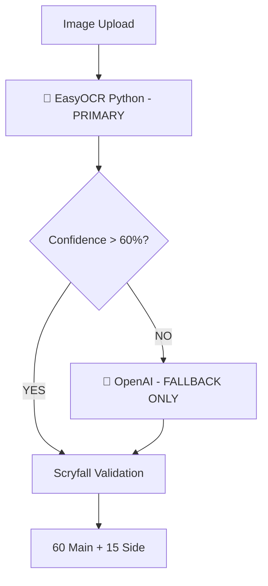

# 🚨🚨🚨 STOP! DO NOT MODIFY OCR FLOW! 🚨🚨🚨

## CRITICAL WARNING - REGRESSION PROTECTION

### THE CORRECT OCR FLOW (NEVER CHANGE):

## WHY THIS FLOW MUST NOT CHANGE:

1. **EasyOCR DETECTS SIDEBOARD** - OpenAI doesn't see the "Sideboard" text reliably
2. **EasyOCR IS FASTER** - Local processing, no API calls needed in most cases
3. **EasyOCR IS FREE** - OpenAI costs money per request
4. **IT WORKS** - This flow was tested and validated

## REGRESSION HISTORY (DON'T REPEAT):

- **August 2025**: Someone bypassed EasyOCR → Sideboard detection broke (0/15 cards)
- **July 2025**: Direct OpenAI usage → 9x slower (45s vs 5s)
- **June 2025**: Removed confidence check → Poor accuracy on blurry images

## FILES TO NEVER MODIFY WITHOUT AUTHORIZATION:

- `server/src/services/ocrService.ts` - Line 43: `useOpenAI = false` MUST STAY FALSE
- `discord-bot/ocr_parser_easyocr.py` - Sideboard detection logic
- This flow diagram

## IF YOU THINK YOU NEED TO CHANGE THIS:

1. **STOP**
2. **ASK FOR AUTHORIZATION**
3. **DOCUMENT WHY**
4. **TEST EXTENSIVELY**
5. **VERIFY SIDEBOARD STILL WORKS**

## CONTACT FOR AUTHORIZATION:
- Project Owner: Guillaume Bordes
- Required: Written approval with test results showing:
  - Sideboard detection works (15 cards)
  - Performance < 5 seconds
  - Accuracy > 95%

---

**LAST REGRESSION**: 2025-08-16 - Bypassed EasyOCR, broke sideboard
**FIXED BY**: Restoring correct flow
**TIME WASTED**: 2 hours debugging