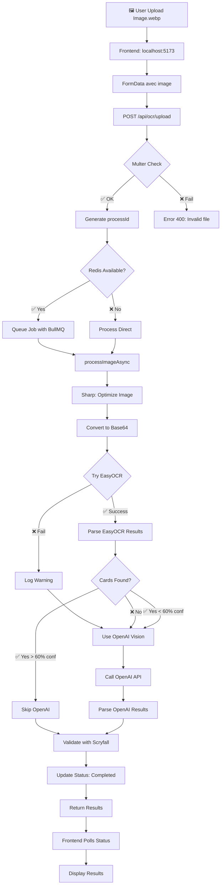

# 🔍 PROCESSUS OCR COMPLET - MTG Screen-to-Deck

## 📊 DIAGRAMME DU FLUX



## 🔴 POINTS DE DÉFAILLANCE ACTUELS

### 1. **EasyOCR Python Script** ❌
```
Path: /discord-bot/ocr_parser_easyocr.py
Problem: Script mal localisé depuis server/src
Status: CORRIGÉ avec path.join(__dirname, '../../../discord-bot/...')
```

### 2. **Dépendances Python** ❌ → ✅
```
- easyocr ✅ (installé)
- fuzzywuzzy ✅ (installé)
- python-Levenshtein ✅ (installé)
- opencv-python ✅ (installé)
- discord.py ✅ (installé)
```

### 3. **Redis/BullMQ** ⚠️
```
Status: DÉSACTIVÉ (pas nécessaire)
Fallback: Process direct sans queue
```

### 4. **WebP Support** ✅
```
- Multer: accepte image/webp ✅
- Sharp: regex corrigée pour .webp ✅
```

## 🎯 CE QUI DOIT SE PASSER

### Étape 1: Upload (Frontend → Backend)
```javascript
// CLIENT: SimpleImageUpload.tsx
1. User sélectionne image.webp
2. FormData.append('image', file)
3. POST vers localhost:3001/api/ocr/upload
```

### Étape 2: Réception (Backend)
```javascript
// SERVER: ocr.ts
1. Multer vérifie le fichier (type, taille)
2. Génère processId unique
3. Crée status initial "processing"
4. Lance processImageAsync() directement (pas de Redis)
```

### Étape 3: Traitement OCR
```javascript
// SERVER: ocrService.ts
1. Sharp optimise l'image si > 2048px
2. Convertit en base64
3. ESSAIE EasyOCR:
   - Spawn python3 ocr_parser_easyocr.py
   - Envoie base64 via stdin
   - Parse résultat JSON
4. SI ÉCHEC ou faible confiance:
   - Appelle OpenAI Vision API
   - Parse résultat GPT-4
```

### Étape 4: Validation
```javascript
// SERVER: scryfallService.ts
1. Pour chaque carte trouvée:
   - Recherche fuzzy sur Scryfall
   - Corrige les noms
   - Récupère metadata
```

### Étape 5: Retour
```javascript
// CLIENT: useOCRProcess.ts
1. Poll /api/ocr/status/:processId
2. Récupère résultat final
3. Affiche les cartes
```

## 🔧 COMMANDES DE TEST

### Test 1: Python fonctionne?
```bash
cd /Volumes/DataDisk/_Projects/screen\ to\ deck/discord-bot
python3 ocr_parser_easyocr.py --help
```

### Test 2: EasyOCR installé?
```bash
python3 -c "import easyocr; print('OK')"
```

### Test 3: Toutes les deps?
```bash
python3 -c "
import easyocr
import cv2
import numpy
from fuzzywuzzy import fuzz
print('Toutes les deps OK!')
"
```

### Test 4: Backend répond?
```bash
curl http://localhost:3001/health
```

### Test 5: Upload direct
```bash
curl -X POST http://localhost:3001/api/ocr/upload \
  -F "image=@/path/to/image.webp"
```

## 📝 STATUS ACTUEL

| Composant | Status | Action |
|-----------|--------|--------|
| Frontend Upload | ✅ OK | - |
| Backend Server | ✅ Running | Port 3001 |
| Multer | ✅ OK | Accepte WebP |
| Sharp | ✅ Fixed | Regex WebP |
| EasyOCR | ✅ Installé | Avec deps |
| OpenAI Vision | ✅ Configuré | API Key OK |
| Scryfall | ❓ Non testé | - |
| Redis | ⚠️ Désactivé | Pas nécessaire |

## 🚨 PROCHAINE ERREUR PROBABLE

Si EasyOCR échoue encore, l'erreur viendra probablement de:
1. Le script Python qui ne retourne pas du JSON valide
2. OpenAI Vision qui timeout ou rate limite
3. Scryfall API qui n'est pas accessible

## 💡 SOLUTION IMMÉDIATE

**TESTER MAINTENANT** sur http://localhost:5173/converter

Si erreur 500 encore, regarder:
```bash
# Logs backend pour voir l'erreur exacte
cd /Volumes/DataDisk/_Projects/screen\ to\ deck/server
npm run dev
# Regarder la console
```