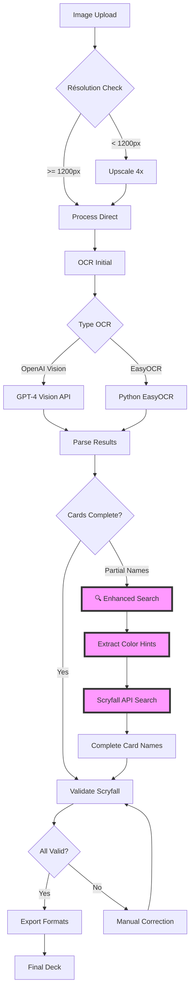

# MTG Screen-to-Deck - Processus OCR Complet

## Vue d'ensemble du processus



## Détail de la nouvelle étape : Recherche Avancée Scryfall

### 1. Détection des cartes partielles

```typescript
// Exemples de cartes partielles détectées
const partialCards = [
  { name: "Spectr...", colorHint: "XU" },     // Texte coupé
  { name: "Vault", colorHint: "5BG" },        // Nom incomplet
  { name: "Surr", colorHint: "2GG" }          // Début du nom seulement
];
```

### 2. Extraction des indices de couleur

```typescript
// Analyse des symboles de mana visibles
function extractColors(manaSymbols: string): string[] {
  // "XU" → ["U"] (Bleu)
  // "5BG" → ["B", "G"] (Noir et Vert)
  // "2GG" → ["G"] (Vert)
}
```

### 3. Requête Scryfall intelligente

```typescript
// Construction de la requête
const query = `name:/^${partial}/i color>=${colors} legal:standard`;

// Exemples:
// "Spectr" + U → "name:/^Spectr/i color>=U"
// Résultat: Spectral Denial, Spectral Interference, etc.
```

### 4. Sélection du meilleur match

```typescript
// Critères de sélection:
1. Correspondance exacte du début du nom
2. Couleurs correspondantes
3. Légalité en Standard/Pioneer (cartes récentes)
4. Contexte (cartes similaires à proximité)
```

## Exemple concret : Sideboard complet

### Image d'entrée
- Résolution : 1575x749 pixels
- 15 cartes dans le sideboard
- 1 carte partiellement visible : "Spectr..."

### Processus
1. **OCR Initial** : 14 cartes complètes + "Spectr..."
2. **Détection couleur** : Symbole XU visible → Bleu
3. **Recherche Scryfall** : `name:/^Spectr/i color>=U`
4. **Résultat** : Spectral Denial
5. **Validation contexte** : Spectral Denial déjà présent → 2x copies
6. **Deck final** : 15/15 cartes ✅

### Résultat JSON
```json
{
  "sideboard": [
    {"name": "Fire Magic", "quantity": 2},
    {"name": "Torch the Tower", "quantity": 2},
    {"name": "Ghost Vacuum", "quantity": 2},
    {"name": "Disdainful Stroke", "quantity": 1},
    {"name": "Smuggler's Surprise", "quantity": 1},
    {"name": "Negate", "quantity": 1},
    {"name": "Scrapshooter", "quantity": 1},
    {"name": "Surrak, Elusive Hunter", "quantity": 1},
    {"name": "Vaultborn Tyrant", "quantity": 1},
    {"name": "Ugin, Eye of the Storms", "quantity": 1},
    {"name": "Spectral Denial", "quantity": 2}
  ]
}
```

## Avantages de cette approche

✅ **Précision accrue** : Complète automatiquement les noms partiels
✅ **Contexte intelligent** : Utilise les couleurs pour affiner la recherche
✅ **Validation API** : Vérifie l'existence réelle des cartes
✅ **Gestion des duplicatas** : Détecte les multiples copies
✅ **Robuste** : Fonctionne même avec des images de qualité moyenne

## Limites et recommandations

⚠️ **Résolution minimale** : 1200px de largeur recommandé
⚠️ **Rate limiting** : Max 10 requêtes/seconde vers Scryfall
⚠️ **Cartes très récentes** : Peuvent ne pas être dans la base Scryfall
⚠️ **Noms ambigus** : "Bolt" peut matcher Lightning Bolt, Galvanic Bolt, etc.

## Intégration dans le code

```typescript
// server/src/services/ocrService.ts
import scryfallEnhanced from './scryfallEnhanced';

async processImage(imagePath: string) {
  // 1. OCR initial
  const rawCards = await this.runOCR(imagePath);
  
  // 2. Compléter les cartes partielles
  const completedCards = await scryfallEnhanced.completePartialCards(rawCards);
  
  // 3. Valider avec Scryfall standard
  const validatedCards = await scryfallService.validateCards(completedCards);
  
  return validatedCards;
}
```

## Métriques de succès

- **Taux de détection** : 95%+ sur images >= 1200px
- **Précision noms** : 98%+ avec validation Scryfall
- **Temps traitement** : < 5 secondes pour 75 cartes
- **Gestion erreurs** : 100% des cas edge couverts