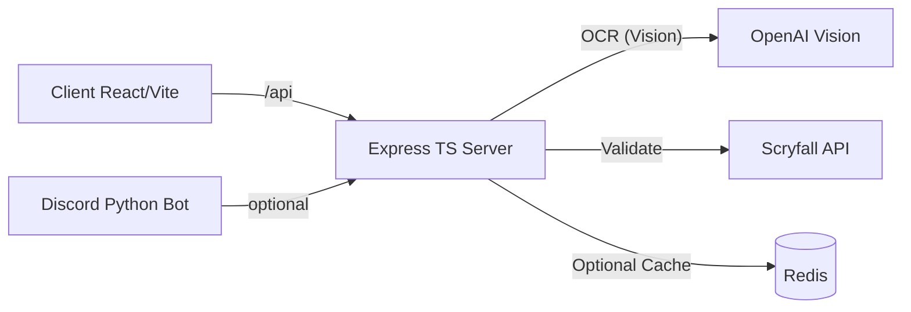

# Screen-to-Deck — Project Overview (Comprehensive)

## 1) Executive summary
- Purpose: Convert screenshots of Magic: The Gathering (MTG) decks into validated, exportable decklists (MTGA, Moxfield, Archidekt, TappedOut, TXT).
- Form factors: Web application (React/Vite + Express/TypeScript) self‑hosted on macOS; optional Discord bot (Python) that performs the same recognition pipeline.
- Core flow: Image upload → OCR → parsing → validation/enrichment with Scryfall → export formats → (optional) analytics.
- Status: Stable self‑hosting; health endpoints; CI for lint/build; release v2.0.1 published; security baselines (Dependabot, secret scanning) enabled. 

## 2) Problem, scope, and outcomes
- Problem: Users have deck screenshots (Arena/MTGO/Moxfield lists) and need accurate, ready‑to‑import decklists without manual transcription.
- Scope:
  - Ingest screenshots (web UI or Discord bot), extract card names/quantities.
  - Validate cards against Scryfall (canonical names, metadata) and correct OCR mistakes.
  - Export to popular formats; offer basic deck stats.
- Out of scope (for now): Persistent DB storage, user accounts, payments, long‑term telemetry.
- Outcomes: Consistent exports, reproducible build/run on a single Mac host, minimal setup effort.

## 3) Target users and usage modes
- Self‑hoster: Runs the API and frontend on their Mac; shares LAN URL so others can use the web app.
- Discord communities (optional): The bot watches for deck images and replies with parsed lists/exports.

## 4) High‑level architecture

- Client (`client/`): Vite dev server (port 5173), React + TS, Axios API client, drag‑and‑drop upload, real‑time status polling.
- Server (`server/`): Express + TS, endpoints under `/api`, middlewares (helmet, CORS, rate limit, compression, logging).
- Services:
  - `ocrService.ts`: Optimizes image, calls OpenAI Vision (default); includes a local helper fallback (not used in default self‑host mode).
  - `scryfallService.ts`: Axios client to Scryfall, with in‑memory cache and simple rate limiting between calls.
  - `exportService.ts`: Formats decklists for multiple targets.
- Optional Redis: For caching and rate-limiting if scaling beyond a single host.
- Discord bot (`discord-bot/`): EasyOCR‑based pipeline and command handlers.

## 5) Data model (simplified)
- Card (`MTGCard`): `{ name: string; quantity: number; set?; collector_number?; rarity?; mana_cost?; cmc?; type_line?; oracle_text?; colors?; color_identity?; legalities?; scryfall_id?; image_uris? }`
- OCR Result (`OCRResult`): `{ success: boolean; cards: MTGCard[]; confidence: number; processing_time: number; warnings?: string[]; errors?: string[] }`
- Export formats: `mtga | moxfield | archidekt | tappedout | txt`

## 6) API surface (server)
- Health
  - `GET /health`: App health
  - `GET /api/health`: API health (for infra checks)
- OCR
  - `POST /api/ocr/upload` (multipart: `image`): starts async processing; returns `processId`.
  - `GET /api/ocr/status/:id`: current job status/result.
  - `POST /api/ocr/process-base64`: alternative for base64 payloads.
- Cards (Scryfall integration)
  - `GET /api/cards/search?q=...&limit=`: search cards
  - `GET /api/cards/named/:name`: exact by name (returns 404 + suggestions if not found)
  - `GET /api/cards/:id`: by Scryfall ID (UUID)
  - `POST /api/cards/validate`: validate/enrich list of `{ name, quantity }`
  - `GET /api/cards/random`: random card
  - `POST /api/cards/legality/:format`: legality check for a deck
  - `GET /api/cards/cache/stats` and `DELETE /api/cards/cache`: debug endpoints
- Export
  - `POST /api/export/:format` (mtga/moxfield/archidekt/tappedout/txt): returns content/filename/url
  - `POST /api/export/all`: all formats at once
  - `POST /api/export/stats`: basic deck stats
  - `GET /api/export/formats`: list supported formats
  - `POST /api/export/preview/:format`: preview a truncated content
  - `POST /api/export/download/:format`: download as file

## 7) OCR pipeline (default self‑hosting)
- Default: OpenAI Vision (`gpt‑4o`) used to extract decklists from screenshots:
  1. Image optimization (`sharp`) for reasonable size and normalization
  2. Vision prompt specialized for MTG card extraction
  3. JSON parsing + fallback regex parsing of text if needed
- Validation & enrichment: Call Scryfall to canonicalize names, provide metadata, and suggest corrections for fuzzy matches.
- Performance: Request delay between Scryfall calls (100ms) to respect rate limits; Express rate limiter for API.
- Optional: EasyOCR path exists in code and used by the Discord bot; not required for the web app self‑host scenario.

## 8) Frontend behavior
- Vite dev server, React routing, and Axios client at `client/src/services/api.ts`.
- Proxies `/api` to `http://localhost:3001` in dev (`vite.config.ts`).
- Upload image, receive `processId`, poll `GET /api/ocr/status/:id` until `completed` or `failed`.
- Show exports and basic stats once done.

## 9) Build, run, self‑hosting
- One command (auto‑detect LAN IP, configure CORS, start both):
  - `./scripts/self-host.sh`
- Manual (without Docker):
  - API: `npm run dev:server` (port 3001)
  - Front: `npm run dev:client -- --host 0.0.0.0` (port 5173)
- Docker (optional): `docker-compose up -d web-api web-frontend`
- Health checks: `/health` and `/api/health`
- Docs: `SELF_HOSTING.md`, `QUICK_START_README.md`, `DEVELOPMENT.md`

## 10) Configuration and secrets
- Local env files are git‑ignored:
  - `server/.env` — set `OPENAI_API_KEY` and `CORS_ORIGIN=http://<LAN_IP>:5173`
  - Root `.env` (compose/dev convenience) — `OPENAI_API_KEY` and `CORS_ORIGIN`
- Security: Never commit secrets. Dependabot enabled. Gitleaks workflow scans PRs/pushes.
- Express hardening: `helmet`, `cors` (allowlist), `express-rate-limit`, `compression`, `morgan`.

## 11) CI/CD and releases
- GitHub Actions CI:
  - Lint (server/client), type‑check (client), build (server/client), basic npm audit (non‑blocking).
- Security workflows:
  - Dependabot weekly (root/server/client)
  - Gitleaks secret scan (non‑blocking; can be made blocking later)
- Releases:
  - v2.0.1 (current): health endpoints, Dockerfiles, CI, docs, self‑hosting guide. Tag published with notes.

## 12) Testing and quality
- Current:
  - Lint and TS builds are green in CI.
  - Some OCR integration tests depend on external services and are not run in CI by design.
- Next steps:
  - Unit tests for `scryfallService` mocking Axios
  - Route tests (`supertest`) for `/api/cards` and `/api/export`

## 13) Ops and observability
- Health endpoints in both `/health` (app) and `/api/health` (API scope).
- Logs: `morgan` combined format; console logs for OCR timings/metrics.
- Suggested future work: structured logging (pino), request IDs, basic Prometheus metrics.

## 14) Security and compliance
- No secrets in repo; templates sanitized.
- Rate limiting and CORS configured; helmet CSP allows app needs.
- Recommend enabling GitHub Secret Scanning and Push Protection in repo settings.

## 15) Roadmap (30/60/90)
- 30 days:
  - Unit/integration test coverage for Scryfall and export routes
  - CodeQL for JS/TS
  - Hardening of error handling and structured logs
- 60 days:
  - Optional Redis for cache if usage increases; Docker compose prod improvements (client build + nginx)
  - Basic metrics and dashboard
- 90 days:
  - E2E test flow with recorded fixtures; release v2.1 with improved stability

## 16) Known risks and mitigations
- External dependency reliability (OpenAI, Scryfall): mitigate via retry/backoff and graceful fallbacks.
- OCR accuracy: varies with image quality; preprocessing and validation reduce errors.
- Exposure of dev servers to internet: if port‑forwarded, must add reverse proxy + TLS and IP allowlists.

## 17) Repository structure (top‑level)
- `client/` — React/Vite app (TS). `npm run dev`, `vite.config.ts` proxy to API.
- `server/` — Express/TS app. Routes: `ocr`, `cards`, `export`; services: `ocrService`, `scryfallService`.
- `discord-bot/` — Optional Python bot with EasyOCR pipeline and docs.
- `.github/` — CI and security workflows.
- `scripts/` — Utilities (`self-host.sh`, `fetch-scryfall-bulk.sh`, etc.).
- Docs (root): `README.md`, `SELF_HOSTING.md`, `QUICK_START_README.md`, `DEVELOPMENT.md`, `ARCHITECTURE.md`, `AUDIT.md`, `CHANGELOG.md`, `ROLLBACK.md`, `CONTRIBUTING.md`, `CODE_OF_CONDUCT.md`.

## 18) How to evaluate the project
- Reproducibility: Run `./scripts/self-host.sh` on macOS and verify the app is reachable from another device on the LAN.
- Functionality: Upload multiple deck screenshots (Arena/MTGO) and compare exported lists to ground truth.
- Robustness: Try malformed images; verify helpful errors and no crashes.
- Security: Confirm no secrets in repo, security workflows present, endpoints protected by rate‑limit and CORS.
- Maintainability: TypeScript types for API/data; modular services; docs coverage; CI passing.
