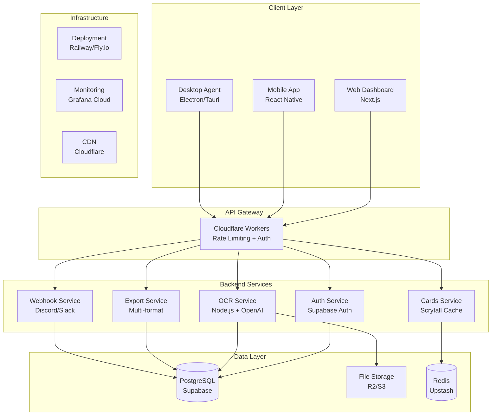

# 🚀 Screen-to-Deck SaaS Migration Plan

## 🎯 Architecture Cible



## 📋 Phase-by-Phase Implementation

### Phase 1: Multi-Tenancy & Auth (5 jours)

**Objectif:** Transformer l'app mono-utilisateur en SaaS multi-tenant

#### 1.1 Database Schema (Jour 1)

- Setup Supabase
- Tables: organizations, users, api_keys, projects, scans
- RLS (Row Level Security)
- Migrations automatiques

#### 1.2 Authentication System (Jour 2-3)

- Supabase Auth integration
- JWT middleware
- Role-based access control
- API key management

#### 1.3 Frontend Updates (Jour 4-5)

- Login/Register pages
- Organization management
- User dashboard
- Billing placeholder

### Phase 2: Cloud Storage & Processing (4 jours)

**Objectif:** Migrer vers storage cloud et optimiser le processing

#### 2.1 Storage Migration (Jour 1-2)

- Cloudflare R2 setup
- Image upload/download services
- CDN configuration
- Migration scripts

#### 2.2 Processing Optimization (Jour 3-4)

- Queue system (Redis/BullMQ)
- Background processing
- Webhook notifications
- Error handling

### Phase 3: API Publique & Rate Limiting (3 jours)

**Objectif:** API publique documentée avec rate limiting

#### 3.1 API Gateway (Jour 1-2)

- OpenAPI/Swagger documentation
- Rate limiting par plan
- API key validation
- Monitoring endpoints

#### 3.2 SDK & Documentation (Jour 3)

- TypeScript SDK
- Python SDK
- Documentation complète
- Exemples d'intégration

### Phase 4: Scaling & Performance (4 jours)

**Objectif:** Performance et scalabilité cloud-native

#### 4.1 Infrastructure (Jour 1-2)

- Railway/Fly.io deployment
- Auto-scaling configuration
- Load balancing
- Health checks

#### 4.2 Monitoring & Observability (Jour 3-4)

- Grafana Cloud setup
- Métriques custom
- Alerting
- Performance tracking

### Phase 5: Advanced Features (6 jours)

**Objectif:** Fonctionnalités SaaS avancées

#### 5.1 Billing & Subscriptions (Jour 1-3)

- Stripe integration
- Plans tarifaires
- Usage tracking
- Billing dashboard

#### 5.2 Team Features (Jour 4-6)

- Team management
- Shared projects
- Permissions granulaires
- Activity logs

## 🛠 Implementation Details

### Supabase Database Schema

```sql
-- Organizations table
CREATE TABLE organizations (
    id UUID DEFAULT gen_random_uuid() PRIMARY KEY,
    name TEXT NOT NULL,
    slug TEXT UNIQUE NOT NULL,
    plan TEXT DEFAULT 'free' CHECK (plan IN ('free', 'pro', 'enterprise')),
    billing_email TEXT,
    stripe_customer_id TEXT,
    created_at TIMESTAMPTZ DEFAULT NOW(),
    updated_at TIMESTAMPTZ DEFAULT NOW()
);

-- Users table
CREATE TABLE users (
    id UUID DEFAULT gen_random_uuid() PRIMARY KEY,
    org_id UUID REFERENCES organizations(id) ON DELETE CASCADE,
    email TEXT UNIQUE NOT NULL,
    full_name TEXT,
    role TEXT DEFAULT 'member' CHECK (role IN ('owner', 'admin', 'member')),
    avatar_url TEXT,
    last_active TIMESTAMPTZ DEFAULT NOW(),
    created_at TIMESTAMPTZ DEFAULT NOW()
);

-- API Keys table
CREATE TABLE api_keys (
    id UUID DEFAULT gen_random_uuid() PRIMARY KEY,
    org_id UUID REFERENCES organizations(id) ON DELETE CASCADE,
    name TEXT NOT NULL,
    key_hash TEXT NOT NULL,
    key_preview TEXT NOT NULL, -- Last 4 chars for display
    permissions JSONB DEFAULT '[]',
    rate_limit INTEGER DEFAULT 1000, -- requests per hour
    last_used TIMESTAMPTZ,
    expires_at TIMESTAMPTZ,
    created_at TIMESTAMPTZ DEFAULT NOW(),
    created_by UUID REFERENCES users(id)
);

-- Projects table (deck collections)
CREATE TABLE projects (
    id UUID DEFAULT gen_random_uuid() PRIMARY KEY,
    org_id UUID REFERENCES organizations(id) ON DELETE CASCADE,
    name TEXT NOT NULL,
    description TEXT,
    is_public BOOLEAN DEFAULT FALSE,
    settings JSONB DEFAULT '{}',
    created_by UUID REFERENCES users(id),
    created_at TIMESTAMPTZ DEFAULT NOW(),
    updated_at TIMESTAMPTZ DEFAULT NOW()
);

-- Scans table (processing history)
CREATE TABLE scans (
    id UUID DEFAULT gen_random_uuid() PRIMARY KEY,
    org_id UUID REFERENCES organizations(id) ON DELETE CASCADE,
    project_id UUID REFERENCES projects(id) ON DELETE SET NULL,
    user_id UUID REFERENCES users(id),
    
    -- Image data
    image_url TEXT NOT NULL,
    image_filename TEXT,
    image_size INTEGER,
    
    -- Processing
    status TEXT DEFAULT 'pending' CHECK (status IN ('pending', 'processing', 'completed', 'failed')),
    processing_time INTEGER, -- milliseconds
    confidence_score FLOAT,
    
    -- Results
    cards_detected JSONB DEFAULT '[]',
    deck_analysis JSONB DEFAULT '{}',
    formats_exported TEXT[] DEFAULT '{}',
    
    -- Metadata
    source TEXT DEFAULT 'web', -- web, api, discord, mobile
    ip_address INET,
    user_agent TEXT,
    
    created_at TIMESTAMPTZ DEFAULT NOW(),
    completed_at TIMESTAMPTZ
);

-- Usage tracking
CREATE TABLE usage_logs (
    id UUID DEFAULT gen_random_uuid() PRIMARY KEY,
    org_id UUID REFERENCES organizations(id) ON DELETE CASCADE,
    api_key_id UUID REFERENCES api_keys(id) ON DELETE SET NULL,
    user_id UUID REFERENCES users(id),
    
    action TEXT NOT NULL, -- scan, export, api_call
    resource_type TEXT, -- image, deck, etc.
    resource_id UUID,
    
    -- Billing data
    tokens_used INTEGER DEFAULT 0,
    processing_time INTEGER DEFAULT 0,
    
    created_at TIMESTAMPTZ DEFAULT NOW()
);

-- Enable RLS
ALTER TABLE organizations ENABLE ROW LEVEL SECURITY;
ALTER TABLE users ENABLE ROW LEVEL SECURITY;
ALTER TABLE api_keys ENABLE ROW LEVEL SECURITY;
ALTER TABLE projects ENABLE ROW LEVEL SECURITY;
ALTER TABLE scans ENABLE ROW LEVEL SECURITY;
ALTER TABLE usage_logs ENABLE ROW LEVEL SECURITY;

-- RLS Policies
CREATE POLICY "Users can only see their org data" ON users
    FOR ALL USING (org_id = auth.jwt()->>'org_id');

CREATE POLICY "Scans visible to org members" ON scans
    FOR ALL USING (org_id = auth.jwt()->>'org_id');

-- Indexes for performance
CREATE INDEX idx_scans_org_created ON scans(org_id, created_at DESC);
CREATE INDEX idx_usage_logs_org_created ON usage_logs(org_id, created_at DESC);
CREATE INDEX idx_api_keys_hash ON api_keys(key_hash);
```

### CloudFlare R2 Storage Service

```typescript
// storage/r2.service.ts
import { S3Client, PutObjectCommand, GetObjectCommand, DeleteObjectCommand } from "@aws-sdk/client-s3";
import { getSignedUrl } from "@aws-sdk/s3-request-presigner";

export class R2StorageService {
  private client: S3Client;
  private bucketName = process.env.R2_BUCKET_NAME!;
  private customDomain = process.env.R2_CUSTOM_DOMAIN;

  constructor() {
    this.client = new S3Client({
      region: "auto",
      endpoint: `https://${process.env.CF_ACCOUNT_ID}.r2.cloudflarestorage.com`,
      credentials: {
        accessKeyId: process.env.R2_ACCESS_KEY_ID!,
        secretAccessKey: process.env.R2_SECRET_ACCESS_KEY!,
      },
    });
  }

  async uploadImage(
    file: Buffer,
    orgId: string,
    scanId: string,
    originalName: string
  ): Promise<{ url: string; key: string }> {
    const key = `orgs/${orgId}/scans/${scanId}/${Date.now()}-${originalName}`;
    
    await this.client.send(new PutObjectCommand({
      Bucket: this.bucketName,
      Key: key,
      Body: file,
      ContentType: this.getContentType(originalName),
      CacheControl: "public, max-age=31536000", // 1 year
    }));

    const url = this.customDomain 
      ? `https://${this.customDomain}/${key}`
      : `https://${this.bucketName}.${process.env.CF_ACCOUNT_ID}.r2.cloudflarestorage.com/${key}`;

    return { url, key };
  }

  async getSignedUploadUrl(orgId: string, scanId: string, filename: string): Promise<string> {
    const key = `orgs/${orgId}/scans/${scanId}/${Date.now()}-${filename}`;
    
    return getSignedUrl(
      this.client,
      new PutObjectCommand({
        Bucket: this.bucketName,
        Key: key,
        ContentType: this.getContentType(filename),
      }),
      { expiresIn: 3600 } // 1 hour
    );
  }

  private getContentType(filename: string): string {
    const ext = filename.split('.').pop()?.toLowerCase();
    switch (ext) {
      case 'jpg':
      case 'jpeg':
        return 'image/jpeg';
      case 'png':
        return 'image/png';
      case 'webp':
        return 'image/webp';
      default:
        return 'application/octet-stream';
    }
  }
}
```

### Rate Limiting Middleware

```typescript
// middleware/rateLimiter.ts
import { Request, Response, NextFunction } from 'express';
import { Redis } from 'ioredis';

interface RateLimitConfig {
  windowMs: number;
  max: number;
  keyGenerator: (req: Request) => string;
  skip?: (req: Request) => boolean;
}

export class RateLimiter {
  private redis: Redis;

  constructor() {
    this.redis = new Redis(process.env.REDIS_URL!);
  }

  create(config: RateLimitConfig) {
    return async (req: Request, res: Response, next: NextFunction) => {
      if (config.skip?.(req)) return next();

      const key = config.keyGenerator(req);
      const window = Math.floor(Date.now() / config.windowMs);
      const redisKey = `rate_limit:${key}:${window}`;

      try {
        const current = await this.redis.incr(redisKey);
        
        if (current === 1) {
          await this.redis.expire(redisKey, Math.ceil(config.windowMs / 1000));
        }

        if (current > config.max) {
          return res.status(429).json({
            error: 'Rate limit exceeded',
            limit: config.max,
            window: config.windowMs,
            reset: (window + 1) * config.windowMs
          });
        }

        res.set({
          'X-RateLimit-Limit': config.max.toString(),
          'X-RateLimit-Remaining': Math.max(0, config.max - current).toString(),
          'X-RateLimit-Reset': ((window + 1) * config.windowMs).toString()
        });

        next();
      } catch (error) {
        console.error('Rate limiter error:', error);
        next(); // Fail open
      }
    };
  }
}

// Usage
const rateLimiter = new RateLimiter();

export const apiLimiter = rateLimiter.create({
  windowMs: 60 * 60 * 1000, // 1 hour
  max: (req: Request) => {
    const plan = req.user?.organization?.plan || 'free';
    return { free: 100, pro: 1000, enterprise: 10000 }[plan] || 100;
  },
  keyGenerator: (req: Request) => req.user?.organization?.id || req.ip
});
```

### Webhook System

```typescript
// services/webhook.service.ts
import axios from 'axios';
import crypto from 'crypto';

interface WebhookEvent {
  type: 'scan.completed' | 'scan.failed' | 'billing.updated';
  data: any;
  timestamp: number;
}

export class WebhookService {
  async send(url: string, event: WebhookEvent, secret?: string): Promise<void> {
    const payload = JSON.stringify(event);
    const signature = secret ? this.generateSignature(payload, secret) : undefined;

    await axios.post(url, event, {
      headers: {
        'Content-Type': 'application/json',
        'User-Agent': 'Screen-to-Deck/1.0',
        ...(signature && { 'X-Signature-SHA256': signature })
      },
      timeout: 10000
    });
  }

  private generateSignature(payload: string, secret: string): string {
    return 'sha256=' + crypto
      .createHmac('sha256', secret)
      .update(payload)
      .digest('hex');
  }

  async sendDiscordNotification(webhookUrl: string, scan: any): Promise<void> {
    const embed = {
      title: "🃏 Deck Scan Completed",
      description: `Successfully processed deck with ${scan.cards_detected?.length || 0} cards`,
      color: 0x00ff00,
      fields: [
        {
          name: "Format Detected",
          value: scan.deck_analysis?.format || "Unknown",
          inline: true
        },
        {
          name: "Processing Time",
          value: `${scan.processing_time}ms`,
          inline: true
        },
        {
          name: "Confidence Score",
          value: `${Math.round(scan.confidence_score * 100)}%`,
          inline: true
        }
      ],
      timestamp: new Date().toISOString()
    };

    await axios.post(webhookUrl, { embeds: [embed] });
  }
}
```

## 🚀 Déploiement & Infrastructure

### Railway Configuration

```json
// railway.json
{
  "build": {
    "builder": "NIXPACKS"
  },
  "deploy": {
    "startCommand": "npm run start:prod",
    "healthcheckPath": "/health",
    "healthcheckTimeout": 100,
    "restartPolicyType": "ON_FAILURE"
  }
}
```

### Fly.io Configuration

```toml
# fly.toml
app = "screen-to-deck"
primary_region = "cdg"

[build]
  dockerfile = "Dockerfile.prod"

[env]
  NODE_ENV = "production"
  PORT = "8080"

[http_service]
  internal_port = 8080
  force_https = true
  
  [http_service.concurrency]
    type = "connections"
    hard_limit = 100
    soft_limit = 80

[[services]]
  http_checks = []
  internal_port = 8080
  protocol = "tcp"

  [[services.ports]]
    handlers = ["http"]
    port = 80

  [[services.ports]]
    handlers = ["tls", "http"]
    port = 443

  [services.concurrency]
    type = "connections"
    hard_limit = 100
    soft_limit = 80

[metrics]
  port = 9091
  path = "/metrics"
```

## 📊 Monitoring & Observability

### Grafana Dashboard Configuration

```json
{
  "dashboard": {
    "title": "Screen-to-Deck SaaS Metrics",
    "panels": [
      {
        "title": "Scan Volume",
        "type": "stat",
        "targets": [
          {
            "expr": "sum(rate(scans_total[5m])) * 60",
            "legendFormat": "Scans/min"
          }
        ]
      },
      {
        "title": "Processing Time",
        "type": "histogram",
        "targets": [
          {
            "expr": "histogram_quantile(0.95, sum(rate(scan_duration_seconds_bucket[5m])) by (le))",
            "legendFormat": "95th percentile"
          }
        ]
      },
      {
        "title": "Error Rate",
        "type": "stat",
        "targets": [
          {
            "expr": "sum(rate(scans_failed_total[5m])) / sum(rate(scans_total[5m])) * 100",
            "legendFormat": "Error %"
          }
        ]
      },
      {
        "title": "Active Organizations",
        "type": "stat",
        "targets": [
          {
            "expr": "count(sum by (org_id) (increase(scans_total[24h])))",
            "legendFormat": "Active Orgs (24h)"
          }
        ]
      }
    ]
  }
}
```

## 💰 Pricing Strategy

### Plans Tarifaires

| Feature | Free | Pro ($29/mo) | Enterprise ($199/mo) |
|---------|------|--------------|----------------------|
| Scans/month | 100 | 2,000 | 20,000 |
| API Calls/hour | 50 | 500 | 5,000 |
| Storage | 100MB | 10GB | 100GB |
| Team Members | 1 | 5 | Unlimited |
| Priority Support | ❌ | ✅ | ✅ |
| Custom Webhooks | ❌ | ✅ | ✅ |
| Advanced Analytics | ❌ | ✅ | ✅ |
| White-label API | ❌ | ❌ | ✅ |

### Usage-Based Billing

```typescript
// billing/usage.service.ts
export class UsageService {
  async trackUsage(orgId: string, event: UsageEvent): Promise<void> {
    const usage = {
      org_id: orgId,
      action: event.action,
      tokens_used: event.tokensUsed || 0,
      processing_time: event.processingTime || 0,
      created_at: new Date()
    };

    await supabase.from('usage_logs').insert(usage);
    
    // Update billing meter in Stripe
    if (event.action === 'scan') {
      await stripe.billing.meters.createEvent({
        event_name: 'scans',
        payload: {
          stripe_customer_id: await this.getStripeCustomerId(orgId),
          value: 1
        }
      });
    }
  }

  async getCurrentUsage(orgId: string, period = '1 month'): Promise<UsageStats> {
    const { data } = await supabase
      .from('usage_logs')
      .select('action, tokens_used, processing_time')
      .eq('org_id', orgId)
      .gte('created_at', new Date(Date.now() - this.parsePeriod(period)))

    return {
      scans: data.filter(u => u.action === 'scan').length,
      tokens: data.reduce((sum, u) => sum + u.tokens_used, 0),
      processingMinutes: Math.round(data.reduce((sum, u) => sum + u.processing_time, 0) / 60000)
    };
  }
}
```

## 🔒 Security & Compliance

### API Key Management

```typescript
// auth/apiKey.service.ts
export class ApiKeyService {
  async createApiKey(orgId: string, name: string, permissions: string[]): Promise<ApiKeyResult> {
    const key = this.generateApiKey();
    const hash = await bcrypt.hash(key, 12);
    
    const { data } = await supabase
      .from('api_keys')
      .insert({
        org_id: orgId,
        name,
        key_hash: hash,
        key_preview: key.slice(-4),
        permissions
      })
      .select('id, key_preview, created_at')
      .single();

    return {
      id: data.id,
      key, // Only returned once
      preview: data.key_preview,
      created_at: data.created_at
    };
  }

  private generateApiKey(): string {
    return 'std_' + crypto.randomBytes(32).toString('hex');
  }

  async validateApiKey(key: string): Promise<ApiKeyContext | null> {
    const { data } = await supabase
      .from('api_keys')
      .select(`
        id, org_id, permissions, rate_limit,
        organization:organizations(name, plan)
      `)
      .not('expires_at', 'lt', new Date().toISOString())

    for (const apiKey of data || []) {
      if (await bcrypt.compare(key, apiKey.key_hash)) {
        // Update last_used
        await supabase
          .from('api_keys')
          .update({ last_used: new Date() })
          .eq('id', apiKey.id);

        return {
          keyId: apiKey.id,
          orgId: apiKey.org_id,
          permissions: apiKey.permissions,
          rateLimit: apiKey.rate_limit,
          plan: apiKey.organization.plan
        };
      }
    }

    return null;
  }
}
```

## 📈 Métriques de Succès

### KPIs Techniques

- **Uptime**: > 99.9%
- **API Latency**: < 200ms p95
- **Processing Time**: < 5s p95
- **Error Rate**: < 0.1%

### KPIs Business

- **Monthly Recurring Revenue (MRR)**: Target $10k/mois à 6 mois
- **Customer Acquisition Cost (CAC)**: < $50
- **Churn Rate**: < 5% mensuel
- **Net Promoter Score (NPS)**: > 50

### Plan de Lancement

1. **Week 1-2**: MVP Beta avec 10 early adopters
2. **Week 3-4**: Public launch avec Product Hunt
3. **Month 2**: Partnerships (Moxfield, EDHREC)
4. **Month 3**: Mobile app
5. **Month 6**: Enterprise features

---

## 🚀 Next Steps

1. **Validation Architecture** → Review technique avec équipe
2. **Setup Infrastructure** → Supabase + Railway/Fly.io
3. **Start Migration** → Phase 1 (Multi-tenancy)
4. **Beta Testing** → 10 utilisateurs early access
5. **Go-to-Market** → Launch strategy + pricing

**Estimation totale**: 22 jours avec 2-3 développeurs
**Budget infrastructure**: ~$200/mois (scaling jusqu'à $2k à 1000 utilisateurs)
**Time to market**: 5-6 semaines

Cette architecture transforme Screen-to-Deck en une plateforme SaaS moderne, scalable et rentable, tout en conservant les fonctionnalités existantes et en ajoutant une dimension business robuste.
