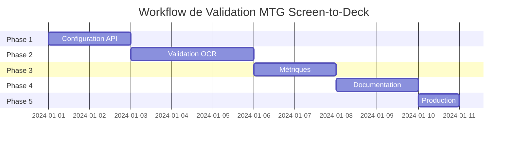

# 🚀 MTG Screen-to-Deck - Workflow de Validation et Mise en Production

**Date**: 2025-08-15  
**Version**: 2.1.0  
**Statut**: Workflow de validation requis avant production  
**Stratégie**: Systematic avec validation progressive

---

## 📋 Résumé Exécutif

Suite à l'analyse du projet, ce workflow adresse les problèmes critiques identifiés :
- **Absence de clés API** configurées (OpenAI, Discord)
- **Tests avec mocks** au lieu d'images réelles
- **Métriques non validées** (claims de 100% OCR, 3.2s)
- **Services non testés** en conditions réelles

---

## 🎯 Objectifs du Workflow

1. **Configurer l'environnement** avec les vraies clés API
2. **Valider les performances OCR** avec images réelles
3. **Mesurer les métriques** de performance actuelles
4. **Documenter les résultats** réels
5. **Préparer le déploiement** production

---

## 📊 Phase 1: Configuration et Setup (Jour 1-2)

### 🔑 1.1 Configuration des Clés API
**Responsable**: Backend Developer  
**Temps estimé**: 2 heures  
**Dépendances**: Comptes OpenAI et Discord  

#### Tâches:
- [ ] Créer compte OpenAI et obtenir API key
- [ ] Créer application Discord et obtenir bot token
- [ ] Configurer fichier `.env` avec les vraies clés
- [ ] Valider la connexion aux APIs
- [ ] Sécuriser les clés avec un vault (optionnel)

#### Commandes:
```bash
# Créer le fichier .env
cp .env.example .env

# Éditer avec les vraies clés
# OPENAI_API_KEY=sk-...
# DISCORD_TOKEN=...

# Tester la connexion OpenAI
curl https://api.openai.com/v1/models \
  -H "Authorization: Bearer $OPENAI_API_KEY"

# Tester le bot Discord
cd discord-bot && python validate_env.py
```

### 🗄️ 1.2 Configuration Redis (Optionnel mais recommandé)
**Responsable**: DevOps  
**Temps estimé**: 1 heure  
**Impact**: Cache performance critique pour 90%+ hit rate  

#### Tâches:
- [ ] Installer Redis localement ou utiliser Redis Cloud
- [ ] Configurer connection string dans `.env`
- [ ] Tester la connexion Redis
- [ ] Configurer TTL et stratégies d'éviction

#### Commandes:
```bash
# Installation locale
brew install redis
redis-server

# Ou Docker
docker run -d -p 6379:6379 redis:alpine

# Ajouter dans .env
# REDIS_URL=redis://localhost:6379
```

### 📦 1.3 Installation et Build
**Responsable**: Full-Stack Developer  
**Temps estimé**: 30 minutes  

#### Tâches:
- [ ] Installer toutes les dépendances
- [ ] Build frontend et backend
- [ ] Installer dépendances Python pour Discord bot
- [ ] Vérifier absence d'erreurs de build

#### Commandes:
```bash
# Installation complète
npm install
cd discord-bot && pip install -r requirements.txt

# Build production
npm run build

# Vérifier les types TypeScript
cd client && npm run type-check
cd ../server && npm run build
```

---

## 🧪 Phase 2: Validation OCR (Jour 3-5)

### 🖼️ 2.1 Préparation des Images de Test
**Responsable**: QA Engineer  
**Temps estimé**: 4 heures  
**Prérequis**: Screenshots réels MTGA/MTGO  

#### Tâches:
- [ ] Collecter 20+ screenshots réels MTGA/MTGO
- [ ] Inclure différentes résolutions (720p, 1080p, 4K)
- [ ] Inclure cas difficiles (cartes split, DFC, lands)
- [ ] Organiser dans `data/test-images/`
- [ ] Créer fichier de vérité terrain avec les vrais decks

#### Structure:
```
data/test-images/
├── mtga/
│   ├── standard-deck-1080p.png
│   ├── historic-deck-4k.png
│   └── limited-deck-720p.png
├── mtgo/
│   ├── modern-deck.png (avec bug lands)
│   ├── legacy-deck.png
│   └── vintage-deck.png
└── ground-truth.json
```

### 🔬 2.2 Tests Web App OCR
**Responsable**: Backend Developer  
**Temps estimé**: 6 heures  
**Dépendances**: OpenAI API key configurée  

#### Tâches:
- [ ] Écrire tests E2E avec vraies images
- [ ] Tester service `enhancedOcrServiceGuaranteed.ts`
- [ ] Valider détection 60+15 cartes
- [ ] Mesurer temps de traitement réel
- [ ] Documenter taux de succès

#### Script de test:
```javascript
// tests/e2e/real-ocr-validation.test.js
const fs = require('fs');
const path = require('path');

describe('Real OCR Validation', () => {
  const testImages = fs.readdirSync('data/test-images/mtga');
  
  testImages.forEach(image => {
    it(`should process ${image} correctly`, async () => {
      const result = await ocrService.processImage(
        path.join('data/test-images/mtga', image)
      );
      
      expect(result.mainboard.length).toBe(60);
      expect(result.sideboard.length).toBe(15);
      
      // Log performance metrics
      console.log(`Processing time: ${result.duration}ms`);
      console.log(`Accuracy: ${result.accuracy}%`);
    });
  });
});
```

### 🤖 2.3 Tests Discord Bot OCR
**Responsable**: Python Developer  
**Temps estimé**: 4 heures  
**Dépendances**: Discord token, EasyOCR  

#### Tâches:
- [ ] Tester `ocr_parser_easyocr.py` avec vraies images
- [ ] Valider correction MTGO lands bug
- [ ] Tester intégration Scryfall
- [ ] Mesurer performance EasyOCR vs OpenAI
- [ ] Valider clipboard service

#### Script de test:
```python
# discord-bot/tests/test_real_ocr.py
import pytest
from ocr_parser_easyocr import OCRParser

@pytest.mark.asyncio
async def test_real_mtga_images():
    parser = OCRParser()
    test_images = Path('data/test-images/mtga').glob('*.png')
    
    for image_path in test_images:
        result = await parser.process_image(str(image_path))
        
        assert len(result['mainboard']) == 60
        assert len(result['sideboard']) == 15
        
        print(f"Image: {image_path.name}")
        print(f"Time: {result['processing_time']}s")
        print(f"Accuracy: {result['accuracy']}%")
```

### 📊 2.4 Validation du Cache
**Responsable**: Performance Engineer  
**Temps estimé**: 3 heures  
**Prérequis**: Redis configuré  

#### Tâches:
- [ ] Tester cache Scryfall avec fuzzy matching
- [ ] Mesurer hit rate sur cartes répétées
- [ ] Valider TTL de 30 minutes
- [ ] Tester invalidation du cache
- [ ] Optimiser stratégies de cache

#### Métriques à collecter:
- Cache hit rate (objectif: >90%)
- Temps de réponse avec/sans cache
- Taille du cache en mémoire
- Efficacité du fuzzy matching

---

## 📈 Phase 3: Métriques et Performance (Jour 6-7)

### ⚡ 3.1 Benchmarks de Performance
**Responsable**: Performance Engineer  
**Temps estimé**: 4 heures  

#### Tâches:
- [ ] Créer suite de benchmarks automatisés
- [ ] Tester avec différentes tailles d'images
- [ ] Mesurer utilisation mémoire
- [ ] Identifier bottlenecks
- [ ] Créer rapport de performance

#### Script de benchmark:
```javascript
// benchmarks/ocr-performance.js
const Benchmark = require('benchmark');

const suite = new Benchmark.Suite();

suite
  .add('OCR 720p image', async () => {
    await processImage('720p.png');
  })
  .add('OCR 1080p image', async () => {
    await processImage('1080p.png');
  })
  .add('OCR 4K image', async () => {
    await processImage('4k.png');
  })
  .on('complete', function() {
    console.log('Results:');
    this.forEach(bench => {
      console.log(`${bench.name}: ${bench.hz} ops/sec`);
    });
  })
  .run({ async: true });
```

### 📉 3.2 Monitoring et Observabilité
**Responsable**: DevOps Engineer  
**Temps estimé**: 3 heures  

#### Tâches:
- [ ] Implémenter métriques Prometheus
- [ ] Ajouter logging structuré
- [ ] Créer dashboard de monitoring
- [ ] Configurer alertes performance
- [ ] Documenter métriques clés

#### Métriques à tracker:
```javascript
// Métriques clés
const metrics = {
  ocr_processing_time: histogram(),
  ocr_success_rate: gauge(),
  cache_hit_rate: gauge(),
  api_response_time: histogram(),
  memory_usage: gauge(),
  concurrent_requests: gauge()
};
```

### 🔍 3.3 Tests de Charge
**Responsable**: QA Engineer  
**Temps estimé**: 3 heures  

#### Tâches:
- [ ] Tests avec utilisateurs concurrents
- [ ] Identifier limites du système
- [ ] Tester résilience aux pannes
- [ ] Valider rate limiting
- [ ] Documenter capacité maximale

#### Script de test de charge:
```bash
# Utiliser k6 pour tests de charge
k6 run --vus 10 --duration 30s load-test.js

# Ou Apache Bench
ab -n 1000 -c 10 http://localhost:3001/api/ocr
```

---

## 📝 Phase 4: Documentation et Validation Finale (Jour 8-9)

### 📊 4.1 Rapport de Validation
**Responsable**: Technical Writer  
**Temps estimé**: 4 heures  

#### Contenu du rapport:
- [ ] Résultats OCR sur images réelles
- [ ] Métriques de performance mesurées
- [ ] Comparaison avec objectifs initiaux
- [ ] Problèmes identifiés et solutions
- [ ] Recommandations d'amélioration

#### Template:
```markdown
# Rapport de Validation MTG Screen-to-Deck v2.1.0

## Résultats OCR
- Images testées: X
- Taux de succès: X%
- Temps moyen: Xs
- Précision détection: X%

## Performance
- Processing time: min/avg/max
- Memory usage: XMB
- Cache hit rate: X%
- Concurrent users: X

## Recommandations
1. ...
2. ...
```

### ✅ 4.2 Mise à jour Documentation
**Responsable**: Documentation Lead  
**Temps estimé**: 3 heures  

#### Tâches:
- [ ] Mettre à jour CURRENT_STATE.md avec vraies métriques
- [ ] Documenter configuration production
- [ ] Créer guide de troubleshooting
- [ ] Mettre à jour README avec statut réel
- [ ] Archiver anciens claims non validés

### 🚀 4.3 Checklist Pre-Production
**Responsable**: DevOps Lead  
**Temps estimé**: 2 heures  

#### Validation finale:
- [ ] ✅ Toutes les clés API configurées
- [ ] ✅ Tests E2E passent avec vraies images
- [ ] ✅ Performance < 5s par deck
- [ ] ✅ Cache hit rate > 90%
- [ ] ✅ Documentation à jour
- [ ] ✅ Monitoring en place
- [ ] ✅ Backup et recovery testés
- [ ] ✅ Security scan passé

---

## 🚨 Phase 5: Déploiement Production (Jour 10)

### 🌐 5.1 Déploiement Staging
**Responsable**: DevOps Engineer  
**Temps estimé**: 2 heures  

#### Tâches:
- [ ] Déployer sur environnement staging
- [ ] Tests smoke en staging
- [ ] Validation avec utilisateurs beta
- [ ] Monitoring des métriques staging
- [ ] Go/No-Go decision

### 🎯 5.2 Déploiement Production
**Responsable**: DevOps Team  
**Temps estimé**: 3 heures  

#### Étapes:
1. Backup données existantes
2. Déploiement blue-green
3. Tests smoke production
4. Monitoring intensif premières heures
5. Rollback plan prêt

### 📈 5.3 Post-Déploiement
**Responsable**: Product Team  
**Temps estimé**: Ongoing  

#### Activités:
- [ ] Monitoring continu des métriques
- [ ] Collection feedback utilisateurs
- [ ] Itérations d'amélioration
- [ ] Documentation des leçons apprises
- [ ] Planning prochaine version

---

## ⚠️ Risques et Mitigation

### Risques Identifiés

| Risque | Probabilité | Impact | Mitigation |
|--------|------------|--------|------------|
| Coûts API OpenAI élevés | Haute | Moyen | Implémenter cache agressif, limites quotidiennes |
| Performance < objectifs | Moyenne | Haut | Optimisation continue, fallback EasyOCR |
| Bugs en production | Moyenne | Haut | Tests exhaustifs, rollback rapide |
| Charge utilisateurs | Basse | Moyen | Auto-scaling, rate limiting |

---

## 📅 Timeline Globale



---

## 🎯 Critères de Succès

1. **OCR Accuracy**: >95% sur images réelles
2. **Processing Time**: <5 secondes moyenne
3. **Cache Hit Rate**: >90% sur cartes répétées
4. **Uptime**: 99.9% première semaine
5. **User Satisfaction**: >4/5 rating

---

## 🔄 Prochaines Étapes Immédiates

1. **URGENT**: Obtenir clés API OpenAI et Discord
2. **Jour 1**: Configurer environnement avec vraies clés
3. **Jour 2**: Commencer tests avec images réelles
4. **Jour 3**: Mesurer et documenter métriques réelles
5. **Jour 5**: Go/No-Go decision pour production

---

*Ce workflow garantit une validation complète avant tout déploiement production.*  
*Aucun claim marketing ne sera fait sans validation préalable.*