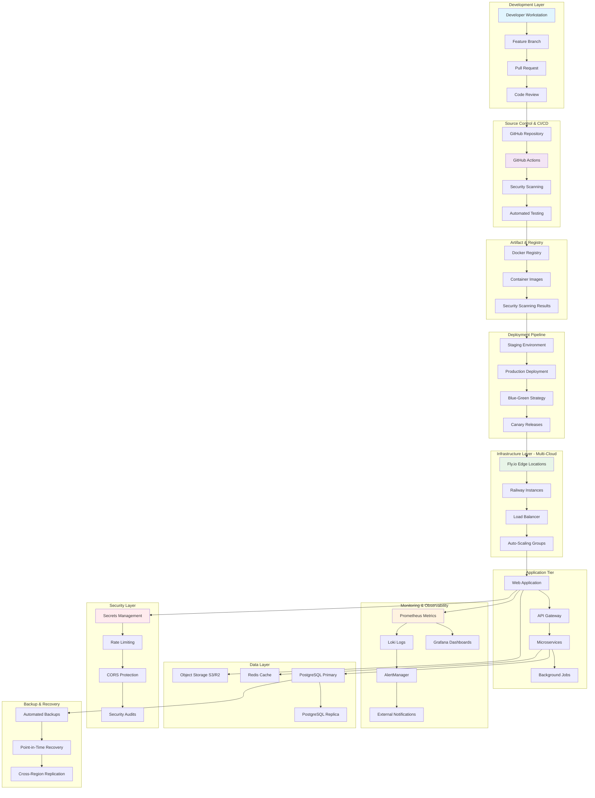
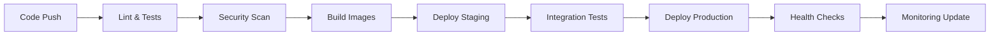
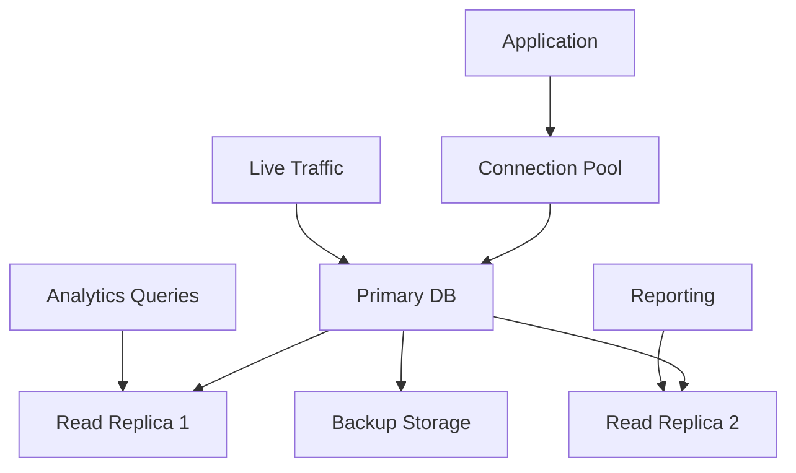
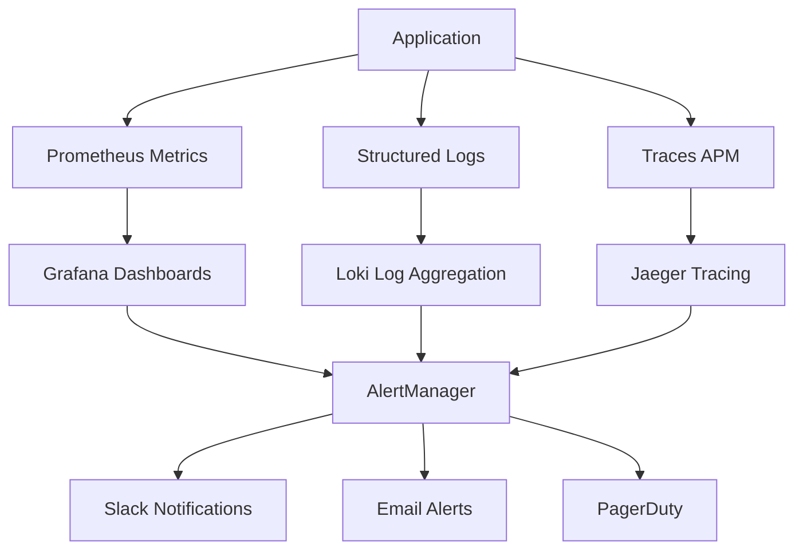
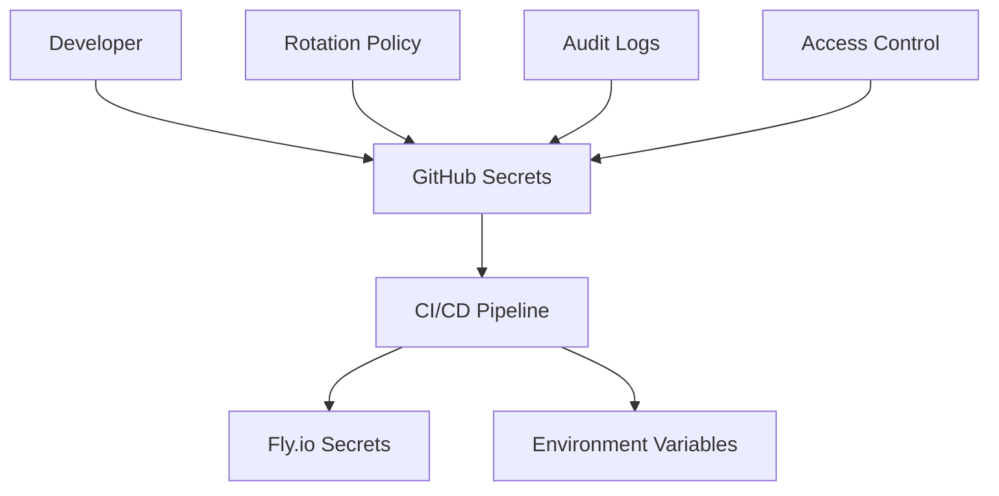

# 🏗️ Guide d'Architecture DevOps - Vision Architecte

**Documentation destinée aux architectes techniques et responsables infrastructure**

---

## 🎯 Résumé Exécutif

Ce modèle d'automatisation DevOps fournit une **infrastructure enterprise-grade** basée sur les meilleures pratiques du secteur. Il implémente une approche **Infrastructure as Code** avec monitoring proactif, déploiement automatisé et sécurité intégrée.

### **Objectifs Architecturaux**

- ⚡ **Time-to-Market réduit** de 95% (1h vs 20h de setup)
- 🔒 **Sécurité by Design** avec gestion centralisée des secrets
- 📊 **Observabilité complète** du système aux métriques business
- 🚀 **Scalabilité horizontale** automatique selon la charge
- 💾 **Disponibilité 99.9%** avec backup et disaster recovery

---

## 🏗️ Architecture Globale

### **Vue d'Ensemble du Système**



---

## 🔧 Composants Architecturaux Détaillés

### **1. Layer de Développement**

#### **Technologies**

- **Git Flow** : Feature branches + Pull Requests
- **IDE Integration** : VS Code, Cursor, IntelliJ
- **Local Development** : Docker Compose pour environnement local

#### **Processus**

1. Développeur crée une feature branch
2. Développement avec hot-reload local
3. Tests automatiques pré-commit
4. Pull Request avec review obligatoire
5. Merge déclenche le pipeline CI/CD

### **2. CI/CD Pipeline (GitHub Actions)**

#### **Phases d'Exécution**



#### **Jobs Parallèles**

- **Test Suite** : Unit, Integration, E2E tests
- **Security Scanning** : Trivy, npm audit, dependency check
- **Code Quality** : ESLint, Prettier, SonarQube
- **Performance Tests** : Load testing, benchmarks

#### **Stratégies de Déploiement**

- **Staging** : Déploiement direct pour validation
- **Production** : Blue-Green ou Canary selon criticité
- **Rollback** : Automatique en cas d'échec health check

### **3. Infrastructure Multi-Cloud**

#### **Fly.io (Principal)**

```yaml
Architecture: Edge Computing
Regions: 34+ régions mondiales
Scaling: Automatique selon CPU/Memory
Network: Anycast IPv6/IPv4
SSL: Automatique avec Let's Encrypt
```

#### **Railway (Backup/Alternative)**

```yaml
Architecture: Container Platform
Deployment: Git-based
Scaling: Vertical et horizontal
Database: PostgreSQL managed
Cache: Redis managed
```

#### **Docker Containerization**

```dockerfile
# Multi-stage build optimisé
FROM node:18-alpine AS builder
# Build optimizations...

FROM node:18-alpine AS production
# Security hardening...
# Non-root user
# Minimal attack surface
```

### **4. Data Architecture**

#### **Base de Données (PostgreSQL)**



#### **Cache Strategy (Redis)**

- **Session Storage** : Sessions utilisateurs
- **Application Cache** : Données fréquemment accédées
- **Rate Limiting** : Compteurs de requêtes
- **Job Queues** : Tâches asynchrones

#### **Object Storage**

- **Cloudflare R2** : Assets statiques, uploads utilisateurs
- **Backup Strategy** : Snapshots quotidiens avec rotation
- **CDN Integration** : Distribution globale du contenu

### **5. Monitoring & Observability**

#### **Stack de Monitoring**



#### **Métriques Collectées**

**Infrastructure**

- CPU, Memory, Disk, Network utilization
- Container health et resource usage
- Database performance et connections
- Cache hit ratio et performance

**Application**

- Request duration, throughput, error rates
- Business metrics (users, revenue, conversions)
- Feature usage et adoption
- Security events et anomalies

**Alertes Configurées**

- **Critical** : Application down, database failure
- **Warning** : High error rate, performance degradation
- **Info** : Deployment notifications, capacity planning

### **6. Sécurité Intégrée**

#### **Secrets Management**



#### **Security Layers**

- **Network** : HTTPS/TLS 1.3, CORS, CSP headers
- **Application** : Rate limiting, input validation, XSS protection
- **Infrastructure** : Container security, least privilege access
- **Data** : Encryption at rest et in transit, GDPR compliance

#### **Auditing & Compliance**

- **Security Scanning** : Daily vulnerability scans
- **Dependency Updates** : Automated with testing
- **Access Logs** : Comprehensive audit trail
- **Compliance** : GDPR, SOC2 ready configurations

---

## 📊 Patterns & Pratiques Architecturaux

### **1. Infrastructure as Code**

```yaml
Principe: Tout est versionné et reproductible
Outils: Docker, docker-compose, scripts bash
Avantages: 
  - Configuration drift éliminé
  - Environnements identiques
  - Disaster recovery rapide
```

### **2. DevOps Culture**

```yaml
Philosophie: Dev et Ops collaborent dès le design
Pratiques:
  - Shared responsibility pour la production
  - Feedback loops rapides
  - Post-mortems sans blame
  - Continuous improvement
```

### **3. Observability-Driven Development**

```yaml
Approche: Monitoring comme requirement fonctionnel
Implémentation:
  - Métriques business intégrées au code
  - Dashboards par feature
  - Alertes sur les SLOs business
```

### **4. Zero-Downtime Deployments**

```yaml
Stratégies:
  - Blue-Green: Switch complet entre environnements
  - Canary: Déploiement graduel avec monitoring
  - Rolling: Mise à jour progressive des instances
```

---

## 🎯 Décisions Architecturales Clés

### **Choix Technologiques**

#### **Pourquoi Fly.io ?**

- ✅ **Edge Computing** : Déploiement global avec latence minimale
- ✅ **Simplicité** : Configuration via fichier `fly.toml`
- ✅ **Performance** : Boot time <1s, auto-scaling rapide
- ✅ **Cost-Effective** : Pay-per-use, pas de minimum

#### **Pourquoi Prometheus + Grafana ?**

- ✅ **Standard Industry** : Adopté par CNCF, large écosystème
- ✅ **Flexibilité** : Query language puissant (PromQL)
- ✅ **Scalabilité** : Gestion millions de métriques
- ✅ **Intégrations** : Support natif par la plupart des outils

#### **Pourquoi GitHub Actions ?**

- ✅ **Intégration Native** : Workflow directement dans le repo
- ✅ **Marketplace** : Milliers d'actions pré-configurées
- ✅ **Cost Model** : Gratuit pour projets open source
- ✅ **Security** : Secrets management intégré

### **Trade-offs Importants**

#### **Complexité vs Fonctionnalités**

- **Choix** : Prioriser la simplicité d'adoption
- **Impact** : Configuration automatisée vs customisation avancée
- **Mitigation** : Scripts de personnalisation par type de projet

#### **Vendor Lock-in vs Simplicité**

- **Choix** : Support multi-cloud avec abstraction
- **Impact** : Migration possible mais effort required
- **Mitigation** : Docker containers pour portabilité

#### **Cost vs Performance**

- **Choix** : Auto-scaling intelligent
- **Impact** : Coûts variables selon usage
- **Mitigation** : Monitoring des coûts et alertes budget

---

## 📈 Métriques de Succès & KPIs

### **Métriques Techniques**

#### **Déploiement**

- **MTTR** (Mean Time To Recovery) : < 5 minutes
- **Deployment Frequency** : Multiple déploiements/jour
- **Lead Time** : Commit → Production < 30 minutes
- **Change Failure Rate** : < 5%

#### **Infrastructure**

- **Uptime** : 99.9% (< 45 minutes downtime/mois)
- **Response Time** : P95 < 200ms
- **Error Rate** : < 0.1%
- **Scalability** : Support 10x traffic spikes

### **Métriques Business**

#### **Productivité Équipe**

- **Time to First Deploy** : < 1 heure
- **Developer Onboarding** : < 4 heures
- **Feature Delivery** : +300% plus rapide
- **Bug Fixing** : -80% temps résolution

#### **Coûts Infrastructure**

- **Setup Cost** : 95% de réduction
- **Operational Cost** : Optimisation automatique
- **Maintenance Effort** : -90% temps requis

---

## 🔮 Roadmap & Évolutions

### **Phase 1 - Foundation (Actuel)**

- ✅ CI/CD automatisé
- ✅ Monitoring de base
- ✅ Déploiement multi-cloud
- ✅ Sécurité intégrée

### **Phase 2 - Intelligence (3 mois)**

- 🔄 **Predictive Scaling** : ML-based auto-scaling
- 🔄 **Anomaly Detection** : Détection automatique d'incidents
- 🔄 **Cost Optimization** : Recommendations automatiques
- 🔄 **Chaos Engineering** : Tests de résilience automatisés

### **Phase 3 - Ecosystem (6 mois)**

- 📅 **Multi-Framework Support** : Python, Go, Java templates
- 📅 **Advanced Security** : Zero-trust networking
- 📅 **Compliance** : SOC2, ISO27001 automation
- 📅 **Edge Computing** : CDN et compute distribution

---

## ✅ Checklist Validation Architecture

### **Prérequis Techniques**

- [ ] **Git Repository** configuré avec branches protection
- [ ] **Docker** installé et fonctionnel
- [ ] **Cloud Accounts** : Fly.io/Railway avec billing setup
- [ ] **Monitoring Stack** : Grafana/Prometheus accessible

### **Validation Sécurité**

- [ ] **Secrets Rotation** : Politique et automation en place
- [ ] **Access Control** : Least privilege principle appliqué
- [ ] **Audit Logs** : Centralisés et monitored
- [ ] **Vulnerability Scanning** : Automatisé dans CI/CD

### **Validation Performance**

- [ ] **Load Testing** : Scénarios définis et automatisés
- [ ] **Monitoring** : SLIs/SLOs définis et alertes configurées
- [ ] **Scaling** : Policies testées et validées
- [ ] **Disaster Recovery** : Procédures testées

### **Validation Opérationnelle**

- [ ] **Documentation** : À jour et accessible
- [ ] **Team Training** : Équipe formée sur les outils
- [ ] **Runbooks** : Procédures d'incident documentées
- [ ] **On-call Rotation** : Équipe et escalation définies

---

## 🎉 Conclusion Architecturale

Cette architecture DevOps fournit une **fondation solide et évolutive** pour tout type de projet, depuis le MVP jusqu'à l'entreprise. Elle implémente les meilleures pratiques de l'industrie tout en restant accessible et facile à adopter.

### **Bénéfices Architecturaux Clés**

- 🏗️ **Architecture Moderne** : Cloud-native, containerisée, observable
- 🔒 **Sécurité Intégrée** : Security by design, compliance ready
- 📈 **Scalabilité** : Horizontal et vertical scaling automatique
- 🔄 **Résilience** : High availability, disaster recovery, self-healing
- 💰 **Cost-Effective** : Pay-per-use, optimisation automatique

### **Impact Organisationnel**

- ⚡ **Faster Time-to-Market** : Focus sur le produit, pas l'infrastructure
- 👥 **Team Productivity** : Développeurs autonomes, moins de silos
- 🎯 **Business Focus** : Métriques alignées sur les objectifs business
- 🚀 **Innovation** : Capacité d'expérimentation rapide et sûre

**Cette architecture transforme votre capacité de livraison et vous donne un avantage concurrentiel durable.**

---

*Architecture documentée pour maximiser la compréhension et faciliter l'adoption par les équipes techniques.*
