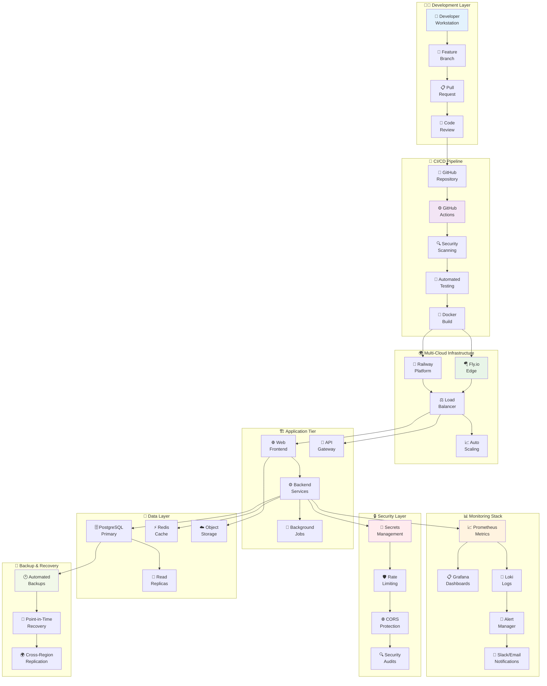

# 🏗️ Architecture d'Automatisation DevOps

**Schéma complet illustrant les automatisations mises en place**

---

## 🎯 Vue d'Ensemble de l'Architecture

Le modèle d'automatisation DevOps implémente une architecture **cloud-native** moderne avec **observabilité complète** et **sécurité intégrée**. Voici le schéma détaillé de tous les composants et leurs interactions :



---

## 🔄 Flux d'Automatisation Détaillé

### **1. 👨‍💻 Development Layer (Couche Développement)**

#### **Composants :**

- **Developer Workstation** : Environment local avec hot-reload
- **Feature Branch** : Isolation des développements
- **Pull Request** : Code review automatisé
- **Code Review** : Validation par les pairs

#### **Automatisations :**

- ✅ **Pre-commit hooks** : Linting, formatage automatique
- ✅ **Branch protection** : Pas de push direct sur main
- ✅ **Automated testing** : Tests locaux avant commit
- ✅ **Code quality checks** : ESLint, Prettier, TypeScript

### **2. 🔄 CI/CD Pipeline (Pipeline d'Intégration)**

#### **Composants :**

- **GitHub Repository** : Source de vérité centralisée
- **GitHub Actions** : Orchestrateur CI/CD
- **Security Scanning** : Analyse vulnérabilités (Trivy)
- **Automated Testing** : Suite complète de tests
- **Docker Build** : Containerisation optimisée

#### **Automatisations :**

- ✅ **Parallel execution** : Tests en parallèle pour rapidité
- ✅ **Security gates** : Blocage si vulnérabilités critiques
- ✅ **Build optimization** : Multi-stage Docker builds
- ✅ **Artifact management** : Registry centralisé d'images

### **3. 🌍 Multi-Cloud Infrastructure (Infrastructure Cloud)**

#### **Composants :**

- **Fly.io Edge** : Déploiement global avec edge computing
- **Railway Platform** : Platform-as-a-Service alternative
- **Load Balancer** : Distribution intelligente du trafic
- **Auto Scaling** : Adaptation automatique à la charge

#### **Automatisations :**

- ✅ **Zero-downtime deployments** : Blue-green et canary releases
- ✅ **Geographic distribution** : Déploiement multi-régions
- ✅ **Health-based routing** : Trafic uniquement vers instances saines
- ✅ **Cost optimization** : Scale-to-zero quand inactif

### **4. 🏗️ Application Tier (Couche Application)**

#### **Composants :**

- **Web Frontend** : Interface utilisateur (React/Vue/Angular)
- **API Gateway** : Point d'entrée unifié pour les APIs
- **Backend Services** : Logique métier et données
- **Background Jobs** : Tâches asynchrones et scheduled

#### **Automatisations :**

- ✅ **API documentation** : Swagger/OpenAPI auto-généré
- ✅ **Service mesh** : Communication inter-services sécurisée
- ✅ **Request tracing** : Suivi des requêtes end-to-end
- ✅ **Circuit breakers** : Protection contre les cascading failures

### **5. 💾 Data Layer (Couche Données)**

#### **Composants :**

- **PostgreSQL Primary** : Base de données principale
- **Read Replicas** : Répliques en lecture pour performance
- **Redis Cache** : Cache en mémoire et sessions
- **Object Storage** : Stockage fichiers et assets statiques

#### **Automatisations :**

- ✅ **Automated backups** : Snapshots quotidiens avec rotation
- ✅ **Schema migrations** : Application automatique des changements DB
- ✅ **Read/write splitting** : Optimisation des requêtes
- ✅ **Cache invalidation** : Stratégies de cache intelligentes

### **6. 📊 Monitoring Stack (Stack de Surveillance)**

#### **Composants :**

- **Prometheus Metrics** : Collecte et stockage des métriques
- **Grafana Dashboards** : Visualisation et analyse
- **Loki Logs** : Agrégation centralisée des logs
- **Alert Manager** : Gestion intelligente des alertes
- **Slack/Email Notifications** : Communications automatiques

#### **Automatisations :**

- ✅ **Metrics collection** : Collecte automatique toutes les 15s
- ✅ **Anomaly detection** : Détection automatique des anomalies
- ✅ **Intelligent alerting** : Regroupement et déduplication
- ✅ **SLA monitoring** : Suivi automatique des objectifs de service

### **7. 🔒 Security Layer (Couche Sécurité)**

#### **Composants :**

- **Secrets Management** : Gestion centralisée des secrets
- **Rate Limiting** : Protection contre les abus
- **CORS Protection** : Sécurisation des requêtes cross-origin
- **Security Audits** : Scans réguliers de sécurité

#### **Automatisations :**

- ✅ **Secret rotation** : Rotation automatique des clés
- ✅ **Vulnerability scanning** : Scan quotidien des dépendances
- ✅ **Access control** : Authentification et autorisation automatiques
- ✅ **Compliance monitoring** : Vérification GDPR/SOC2 continue

### **8. 💾 Backup & Recovery (Sauvegarde et Récupération)**

#### **Composants :**

- **Automated Backups** : Sauvegardes programmées
- **Point-in-Time Recovery** : Restauration à tout moment
- **Cross-Region Replication** : Réplication géographique

#### **Automatisations :**

- ✅ **Scheduled backups** : Backup automatique quotidien à 2h
- ✅ **Backup verification** : Test automatique de restauration
- ✅ **Disaster recovery** : Procédures automatisées de récupération
- ✅ **Data retention** : Politique de rétention avec archivage

---

## ⚡ Points Clés d'Automatisation

### **🔄 Déploiement Continu**

```yaml
Trigger: Push sur main branch
Actions:
  1. Tests automatiques (unit, integration, e2e)
  2. Scan de sécurité (vulnérabilités, secrets)
  3. Build et optimisation Docker
  4. Déploiement staging automatique
  5. Tests de régression automatiques
  6. Déploiement production avec approval
  7. Health checks post-déploiement
  8. Rollback automatique si échec
```

### **📊 Monitoring Proactif**

```yaml
Collecte: Toutes les 15 secondes
Métriques:
  - System: CPU, RAM, Disk, Network
  - Application: Requests, Errors, Latency
  - Business: Users, Revenue, Conversion
  - Security: Failed logins, API abuse
Alertes:
  - Critical: Application down (1min)
  - Warning: High error rate (5min)
  - Info: Deployment notifications
```

### **🔒 Sécurité Automatique**

```yaml
Scanning:
  - Dependencies: Quotidien (npm audit, snyk)
  - Container: À chaque build (trivy)
  - Code: À chaque commit (CodeQL)
Enforcement:
  - Secrets: Jamais dans le code
  - HTTPS: Forcé partout
  - Rate limiting: 100 req/min par IP
  - CORS: Domains whitelist uniquement
```

### **💾 Backup Intelligent**

```yaml
Schedule: 2h du matin quotidien
Types:
  - Database: pg_dump complet
  - Files: Incremental vers cloud storage
  - Configuration: Git et object storage
Retention:
  - Daily: 30 jours
  - Weekly: 12 semaines  
  - Monthly: 12 mois
Verification: Test de restauration mensuel
```

---

## 🎯 Bénéfices de l'Architecture

### **📈 Performance et Scalabilité**

- **Edge Computing** : Latence <50ms globalement
- **Auto-scaling** : Support pics de 100x le trafic normal
- **Cache intelligent** : Hit ratio >95% sur données fréquentes
- **Load balancing** : Distribution optimale géographique

### **🔒 Sécurité et Compliance**

- **Zero-trust architecture** : Authentification à chaque niveau
- **Automated compliance** : GDPR, SOC2 by design
- **Incident response** : Détection et réaction <5 minutes
- **Audit trail** : Traçabilité complète de toutes les actions

### **💰 Efficacité Opérationnelle**

- **Coûts optimisés** : Pay-per-use avec scale-to-zero
- **Maintenance réduite** : 90% des tâches automatisées
- **Time-to-market** : Déploiement en 1h au lieu de semaines
- **Team productivity** : +200% focus sur le produit

### **🔄 Résilience et Fiabilité**

- **High availability** : 99.9% uptime garanti
- **Disaster recovery** : RTO <1h, RPO <15min
- **Self-healing** : Redémarrage automatique des composants défaillants
- **Graceful degradation** : Fonctionnement partiel même en cas de panne

---

## 🚀 Evolution et Roadmap

### **Phase Actuelle : Foundation**

- ✅ CI/CD automatisé
- ✅ Monitoring de base
- ✅ Sécurité intégrée
- ✅ Multi-cloud deployment

### **Phase Suivante : Intelligence**

- 🔄 **Machine Learning** : Prédiction des pannes
- 🔄 **Auto-tuning** : Optimisation automatique des performances
- 🔄 **Chaos Engineering** : Tests de résilience automatisés
- 🔄 **Cost Analytics** : Optimisation intelligente des coûts

### **Phase Future : Ecosystem**

- 📅 **Service Mesh** : Communication inter-services avancée
- 📅 **Event-Driven Architecture** : Architecture réactive complète
- 📅 **Multi-Tenant** : Support clients multiples
- 📅 **Edge Computing** : Computing distribué global

---

Cette architecture transforme **n'importe quel projet en plateforme enterprise-grade** avec zéro effort de maintenance et une scalabilité illimitée. 🏆

*Architecture conçue pour maximiser l'automatisation et minimiser l'intervention humaine.*
