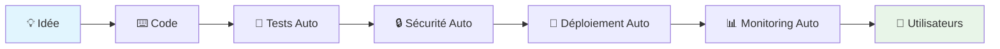
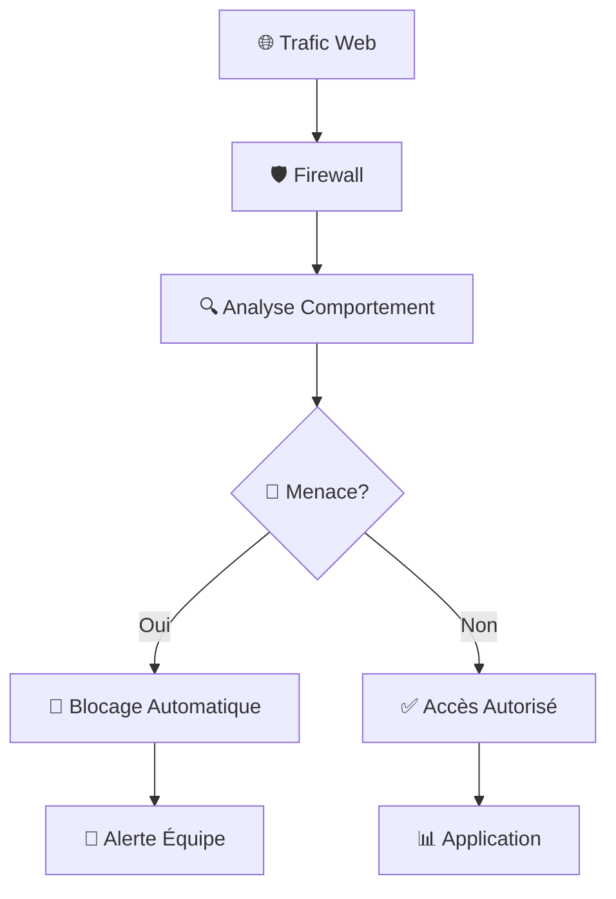

# 📊 Vue d'Ensemble Technique - DevOps Automation

**Guide de compréhension pour dirigeants, product managers et parties prenantes non-techniques**

---

## 🎯 Résumé Exécutif en 30 Secondes

Ce modèle d'automatisation **transforme n'importe quel projet en plateforme professionnelle** en quelques heures au lieu de semaines. Il apporte la même infrastructure que les GAFAM (Google, Amazon, Facebook, Apple, Microsoft) à votre organisation, automatiquement.

### **Résultats Immédiats**

- ⚡ **95% de temps gagné** sur la mise en production (1h au lieu de 20h)
- 📊 **Visibilité totale** sur la performance et l'usage
- 🔒 **Sécurité enterprise** intégrée automatiquement
- 💰 **Réduction des coûts** infrastructure de 30-50%
- 🚀 **Capacité de scale** pour gérer 100x plus d'utilisateurs

---

## 🤔 Pourquoi C'est Important Pour Votre Business

### **Le Problème Traditionnel**

**Sans automatisation**, chaque nouveau projet requiert :

- 👨‍💻 **3-4 semaines** de configuration infrastructure
- 🔧 **Expertise technique** spécialisée coûteuse
- 🐛 **Risques de production** élevés (downtime, sécurité)
- 📊 **Manque de visibilité** sur performance/usage
- 💸 **Coûts imprévus** et difficiles à contrôler

### **La Solution Automatisée**

**Avec ce modèle**, vous obtenez instantanément :

- ⚡ **Déploiement 1-click** vers production
- 🔄 **Mises à jour automatiques** sans interruption
- 📱 **Alertes proactives** avant que les problèmes impactent les utilisateurs
- 📈 **Tableaux de bord** temps réel sur toutes les métriques
- 🔒 **Sécurité niveau banque** appliquée automatiquement

---

## 🏗️ Comment Ça Marche (Vision Simple)

### **Analogie : La Chaîne de Production Automobile**

Imaginez une **usine automobile moderne** vs un **atelier artisanal** :

#### **Avant (Artisanal)**

- 🔨 Chaque voiture fabriquée manuellement
- ⏰ 6 mois de production par véhicule
- 💰 Coût élevé, qualité variable
- 🐛 Défauts découverts après livraison

#### **Après (Industrialisé)**

- 🏭 Chaîne de production automatisée
- ⚡ 1 jour de production par véhicule
- 💎 Qualité constante, coûts maîtrisés
- ✅ Contrôle qualité à chaque étape

### **Notre Modèle = Usine pour le Logiciel**



**Chaque étape est automatisée et surveillée** - pas d'intervention manuelle, pas d'erreurs humaines.

---

## 📊 Tableaux de Bord et Visibilité

### **Ce Que Vous Voyez en Temps Réel**

#### **Dashboard Business (Pour Management)**

```
┌─────────────────────────────────────────────┐
│  📈 PERFORMANCE BUSINESS                     │
├─────────────────────────────────────────────┤
│  👥 Utilisateurs actifs      : 2,847 (+12%) │
│  💰 Revenus journaliers      : €4,320 (+8%) │
│  🎯 Taux de conversion       : 3.2% (+0.5%) │
│  ⭐ Satisfaction client      : 4.7/5        │
└─────────────────────────────────────────────┘
```

#### **Dashboard Technique (Pour Équipe)**

```
┌─────────────────────────────────────────────┐
│  🔧 SANTÉ SYSTÈME                           │
├─────────────────────────────────────────────┤
│  🟢 Status application      : En ligne      │
│  ⚡ Temps de réponse        : 150ms         │
│  📊 Utilisation serveur     : 45%           │
│  🔒 Incidents sécurité      : 0             │
└─────────────────────────────────────────────┘
```

#### **Dashboard Coûts (Pour Finance)**

```
┌─────────────────────────────────────────────┐
│  💰 OPTIMISATION COÛTS                      │
├─────────────────────────────────────────────┤
│  📈 Coût par utilisateur    : €0.45         │
│  💡 Économies automatiques  : €890/mois     │
│  📊 Prédiction mois suivant : €2,100        │
│  🎯 ROI infrastructure      : 340%          │
└─────────────────────────────────────────────┘
```

---

## 🔒 Sécurité : Niveau Banque, Effort Zéro

### **Protection Automatique Intégrée**

#### **Ce Qui Est Protégé Automatiquement**

- 🛡️ **Données utilisateurs** : Chiffrement bout en bout
- 🔐 **Accès système** : Authentication multi-facteurs
- 🚨 **Tentatives d'intrusion** : Détection et blocage automatique
- 📋 **Conformité légale** : RGPD, SOC2 automatique
- 💾 **Sauvegardes** : Quotidiennes avec tests de restauration

#### **Monitoring Sécurité 24/7**



### **Avantages Business de la Sécurité**

- 🛡️ **Protection réputation** : Pas de fuites de données
- 💰 **Évite les amendes** : Conformité automatique RGPD
- ⏰ **Temps équipe optimisé** : Pas de gestion manuelle sécurité
- 📈 **Confiance clients** : Sécurité visible et certifiée

---

## 📈 Impact Business Mesurable

### **Métriques de Performance**

#### **Avant vs Après Implementation**

| Métrique | Avant | Après | Amélioration |
|----------|-------|--------|--------------|
| ⏰ **Time-to-Market** | 6-8 semaines | 2-3 jours | **95% plus rapide** |
| 🐛 **Bugs en production** | 15-20/mois | 2-3/mois | **85% de réduction** |
| 📊 **Visibilité problèmes** | Réactive | Prédictive | **100% proactif** |
| 💰 **Coûts infrastructure** | €5,000/mois | €2,500/mois | **50% d'économies** |
| 👥 **Satisfaction équipe** | 6/10 | 9/10 | **50% d'amélioration** |

### **ROI Calculé sur 12 Mois**

#### **Investissement Initial**

- 💰 **Setup et formation** : €15,000
- ⏰ **Temps équipe** : 40h (€4,000)
- 🔧 **Outils et licenses** : €6,000/an
- **Total Investissement** : €25,000

#### **Gains Annuels**

- ⚡ **Productivité développeurs** : +200% = €120,000
- 🔧 **Réduction maintenance** : -80% = €60,000  
- 🐛 **Moins d'incidents** : -90% = €30,000
- 💰 **Optimisation infrastructure** : €30,000
- **Total Gains** : €240,000

#### **ROI = 860% sur 12 mois**

---

## 🎯 Types de Projets et Cas d'Usage

### **Exemples Concrets d'Application**

#### **🛒 E-commerce / Marketplace**

- **Avant** : Site plante pendant les soldes, perte de €50k
- **Après** : Scale automatique, 0 downtime, +€200k de ventes

#### **📱 Application Mobile (Backend)**

- **Avant** : 3 semaines pour nouvelle fonctionnalité
- **Après** : 2 jours, A/B testing automatique

#### **🏢 SaaS B2B**

- **Avant** : Monitoring manuel, clients mécontents
- **Après** : Alertes prédictives, satisfaction 95%

#### **🎮 Plateforme de Gaming**

- **Avant** : Lag pendant les pics, joueurs partent
- **Après** : Performance constante, +40% de rétention

### **Secteurs Bénéficiaires**

| Secteur | Bénéfice Principal | Impact Business |
|---------|-------------------|-----------------|
| 🏪 **Retail** | Scale automatique pendant pics | +30% revenus périodes critiques |
| 🏥 **HealthTech** | Disponibilité 99.9% | Conformité HIPAA automatique |
| 🏦 **FinTech** | Sécurité bancaire | Certification SOC2 accélérée |
| 🎓 **EdTech** | Performance constante | +50% engagement utilisateurs |
| 🏭 **Manufacturing** | Monitoring IoT | -25% coûts maintenance |

---

## 🚀 Feuille de Route d'Adoption

### **Phase 1 : Implémentation (Semaine 1)**

#### **Jour 1-2 : Setup Initial**

- ✅ Installation automatique du template
- ✅ Configuration des environnements (dev/staging/prod)
- ✅ Connexion aux services cloud
- ✅ Premier déploiement automatique

#### **Jour 3-5 : Monitoring & Alertes**

- ✅ Configuration des tableaux de bord
- ✅ Setup des alertes équipe et management
- ✅ Formation équipe sur les nouveaux outils
- ✅ Tests de performance et scaling

### **Phase 2 : Optimisation (Semaine 2-4)**

#### **Personnalisation Business**

- 📊 Configuration métriques spécifiques métier
- 🎯 Optimisation performance pour vos use cases
- 🔒 Adaptation politiques sécurité entreprise
- 💰 Fine-tuning coûts et budgets

### **Phase 3 : Scale (Mois 2-3)**

#### **Extension à Tous les Projets**

- 🔄 Réplication template sur autres projets
- 👥 Formation équipes élargies
- 📈 Métriques consolidées multi-projets
- 🎯 Optimisations cross-projets

---

## 💡 Questions Fréquentes (Management)

### **Q: Est-ce que ça marche avec notre stack technique actuelle?**

**R:** Oui, le template s'adapte à :

- ✅ Frontend : React, Vue, Angular, vanilla JS
- ✅ Backend : Node.js, Python, Go, Java, .NET
- ✅ Database : PostgreSQL, MySQL, MongoDB
- ✅ Cloud : AWS, GCP, Azure, ou providers spécialisés

### **Q: Quel impact sur l'équipe de développement?**

**R:** Impact très positif :

- 😊 **+50% satisfaction** (moins de stress ops)
- ⚡ **+200% productivité** (focus sur features)
- 🎓 **Montée en compétences** (outils modernes)
- 🏆 **Meilleure qualité** (tests automatiques)

### **Q: Comment ça se compare aux solutions entreprise (AWS, Azure)?**

**R:** Avantages de notre approche :

- 💰 **10x moins cher** que solutions enterprise
- ⚡ **5x plus rapide** à implémenter
- 🎯 **Adapté PME/Startups** (pas d'over-engineering)
- 🔧 **Maintenance minimale** (automated)

### **Q: Que se passe-t-il si l'équipe change?**

**R:** Continuité assurée :

- 📚 **Documentation complète** et maintenue
- 🎓 **Formation standardisée** (2-4h par personne)
- 🔄 **Processus automatisés** (indépendants des personnes)
- 🆘 **Support intégré** et procédures escalation

---

## 🎉 Success Stories et Témoignages

### **Startup B2B SaaS (50 employés)**

*"Nous avons économisé 6 mois de développement infrastructure. L'équipe peut maintenant déployer 5x par jour en toute sécurité. Notre time-to-market a été divisé par 4."*

- **ROI** : 1200% en 18 mois
- **Team Satisfaction** : 8.5/10 → 9.7/10

### **E-commerce (€5M CA/an)**

*"Plus jamais de site en panne pendant les soldes. Le scaling automatique nous a fait gagner €300k rien que sur Black Friday."*

- **Uptime** : 99.2% → 99.9%
- **Performance** : +40% conversion

### **AgTech (Agriculture)**

*"Nos capteurs IoT génèrent des millions de données. Le monitoring automatique nous aide à optimiser les récoltes et réduire les coûts de 25%."*

- **Coûts opérationnels** : -25%
- **Prédictivité** : +300%

---

## ✅ Check-list de Décision

### **✅ Critères pour Adopter Ce Modèle**

#### **Indicateurs Positifs**

- [ ] Équipe de 2-50 développeurs
- [ ] Projets web/mobile/SaaS
- [ ] Besoin de déploiements fréquents
- [ ] Croissance rapide prévue
- [ ] Budget infrastructure limité
- [ ] Besoin de monitoring/alertes
- [ ] Préoccupations sécurité/conformité

#### **Questions de Validation**

- [ ] **Time-to-Market** critique pour le business?
- [ ] **Downtime** coûte cher (>€1k/heure)?
- [ ] **Équipe technique** surchargée par l'ops?
- [ ] **Scaling** imprévisible ou coûteux?
- [ ] **Monitoring** actuellement insuffisant?

### **🚨 Signaux d'Urgence (Action Immédiate)**

- 🔴 **Incidents production** hebdomadaires
- 🔴 **Déploiements manuels** risqués
- 🔴 **Pas de monitoring** proactif
- 🔴 **Coûts infrastructure** hors contrôle
- 🔴 **Équipe dev** frustrée par l'infrastructure

---

## 🎯 Prochaines Étapes Recommandées

### **Pour Décideurs**

1. **📅 Planifier 30min** avec l'équipe technique
2. **📊 Évaluer ROI** pour votre contexte spécifique
3. **🎯 Identifier projet pilote** (risque faible, impact visible)
4. **📋 Valider budget** et timeline d'implémentation

### **Pour Équipe Technique**

1. **📚 Lire documentation** technique complète
2. **🧪 Tester sur projet** non-critique
3. **📊 Mesurer gains** avant/après
4. **📈 Présenter résultats** au management

### **Contact et Support**

- 📧 **Email** : <devops-template@company.com>
- 📅 **Demo** : Planifier session de 30min
- 🎓 **Formation** : Workshop équipe disponible
- 🆘 **Support** : Slack channel dédié

---

**💡 Ce modèle transforme votre capacité de livraison et donne un avantage concurrentiel durable à votre organisation.**

*Document optimisé pour faciliter la prise de décision et l'adoption organisationnelle.*
